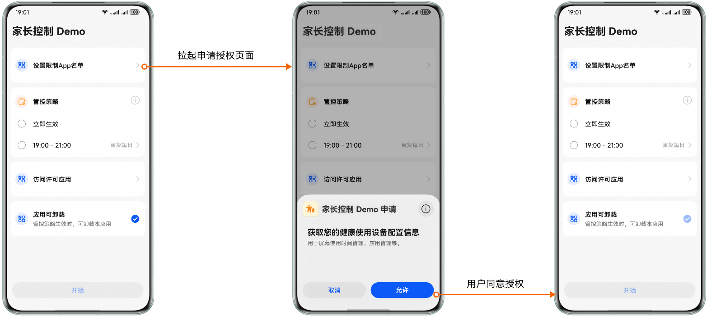
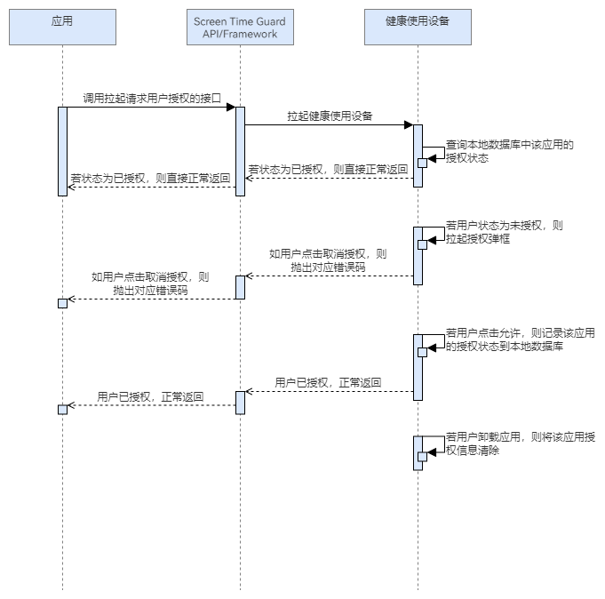

# 请求用户授权

更新时间：2026-04-30 02:41:24

来源：https://developer.huawei.com/consumer/cn/doc/harmonyos-guides/screentimeguard-request-user-auth

## 场景介绍

Screen Time Guard Kit支持对用户设备的时间管理和应用限制，因此在功能启用前，必须获得用户的明确授权。应用可以调用请求用户授权接口，系统会弹出授权请求界面，明确告知用户功能的作用和必要性，并在用户允许之后，才可正常访问。如果用户未同意授权，则无法再提供相关管控能力，此时如果继续调用管控相关接口，会抛出用户未授权使用的错误码。

## 用户体验设计



## 业务流程


流程说明： 应用请求访问Screen Time Guard Kit的权限，需要调用拉起请求用户授权的接口，拉起健康使用设备查询本地数据库中该应用的授权状态。 若状态为已授权，则直接正常返回；若状态为未授权，则拉起授权弹框。 若用户取消授权，则抛出对应错误码，若用户允许授权，则正常返回。

## 接口说明

请求用户授权关键接口如下表所示：
| 接口名 | 描述 |
| --- | --- |
| [requestUserAuth](https://developer.huawei.com/consumer/cn/doc/harmonyos-references/screentimeguard-guardservice#requestuserauth)(context: [common.UIAbilityContext](https://developer.huawei.com/consumer/cn/doc/harmonyos-references/js-apis-inner-application-uiabilitycontext)): Promise | 请求用户授权访问Screen Time Guard Kit的相关管控接口。 |
| [requestUserAuth](https://developer.huawei.com/consumer/cn/doc/harmonyos-references/screentimeguard-guardservice#requestuserauth)(context: [common.UIAbilityContext](https://developer.huawei.com/consumer/cn/doc/harmonyos-references/js-apis-inner-application-uiabilitycontext), appConfig: [AppConfig](https://developer.huawei.com/consumer/cn/doc/harmonyos-references/screentimeguard-guardservice#appconfig)): Promise | 请求用户授权访问Screen Time Guard Kit的相关管控接口，同时设置授权应用相关配置。 |
| [getUserAuthStatus](https://developer.huawei.com/consumer/cn/doc/harmonyos-references/screentimeguard-guardservice#getuserauthstatus)(): Promise | 获取用户授权状态。 |


> [!NOTE]
> 若需更改授权应用配置信息，需要取消用户授权后，重新调用接口请求用户授权，同时设置授权应用相关配置。


## 开发步骤

导入相关模块。
```text
import { guardService } from '@kit.ScreenTimeGuardKit';
import { hilog } from '@kit.PerformanceAnalysisKit';
import { BusinessError } from '@kit.BasicServicesKit';
import { common } from '@kit.AbilityKit';
```

调用requestUserAuth，请求用户授权。
```text
const context = this.getUIContext().getHostContext() as common.UIAbilityContext;
guardService.requestUserAuth(context, { isSupportAppUninstall: this.isUninstallable })
   .then(async () => {
      // ...
   })
   .catch((error: BusinessError) => {
      hilog.error(this.domainId, this.logTag,
      `requestUserAuth fail, errCode is ${error.code}, errMessage is ${error.message}`);
   })
```

获取用户授权状态。
```text
public async getUserAuthStatus(): Promise {
   try {
      const status = await guardService.getUserAuthStatus();
      hilog.info(0x0000, 'GuardService', `user auth status: ${status}`);
   } catch (error) {
      let err: BusinessError = error as BusinessError;
      hilog.error(0x0000, 'GuardService',
         `removeGuardStrategy failed, errCode is ${err.code}, errMessage is ${err.message}`);
   }
}
```
