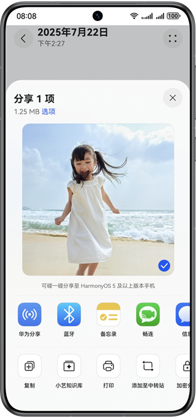
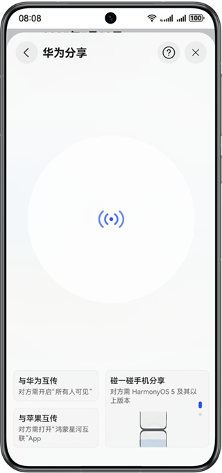

# 内容分享

更新时间：2026-04-28 03:31:56

来源：https://developer.huawei.com/consumer/cn/doc/harmonyos-guides/knock-share-between-phones-content

##### 注册碰一碰事件

当用户进入支持碰一碰分享的界面或场景时，给出适当的引导和提示，可有效提升用户分享意愿。

引导方式参考以下效果图：

 - 文本提示**可碰一碰分享至 HarmonyOS 5 及以上版本手机**。

  


 - 动图提示**可碰一碰分享**。

  



  Share Kit提供统一的动图资源文件以方便应用接入。

  
下载地址：[碰一碰引导资源](https://gitcode.com/harmonyos_samples/share-kit_-sample-code_-clientdemo_-arkts/tree/master/entry/src/main/resources/rawfile)，请完整下载knock_share_guide目录所有文件，并放置于应用entry/src/main/resources/rawfile目录下。
 - 示例代码：[碰一碰引导示例代码](https://gitcode.com/harmonyos_samples/share-kit_-sample-code_-clientdemo_-arkts/blob/master/entry/src/main/ets/components/subpages/KnockShareTips.ets)。


##### 设置分享预览

接入碰一碰分享时，需根据不同的分享数据类型，适配相应的卡片模板。详细参见：[碰一碰分享设计指南](https://developer.huawei.com/consumer/cn/doc/design-guides/onehop-0000002354602581)。


##### 设置配套的卡片样式

为保证碰一碰分享用户体验，Share Kit支持三种卡片模板供手机发起碰一碰分享时选择。

| 卡片模板类型 | 说明 | 效果图 |
| --- | --- | --- |
| 纯图片布局 | 纯图片布局只包括预览图。 当分享数据为文件、图片等无需添加标题及描述的场景，推荐使用此卡片模板。 使用方法 构造分享数据时，仅传递预览图（thumbnailUri）字段，即可生成此卡片模板。 布局要求 预览图：支持最小宽高比1:4，超出部分将被裁剪。 |  |
| 沉浸式大卡布局 | 沉浸式大卡布局包括预览图、标题、描述、应用图标。 当分享数据为链接类型时，需要向用户传递链接的内容，推荐使用此卡片模板。 使用方法 需同时满足以下2个条件： 1. 构造分享数据时，需同时传入标题（title）、描述（description）字段和预览图（thumbnailUri）字段。 2. 预览图宽高比小于1:1。 布局要求 1. 预览图：支持最小宽高比1:4，超出部分将被裁剪。 2. 标题：最大可显示2行，当文本超过2行时，未能正常在屏幕显示的文本用省略号代替。如果标题末尾有重要信息显示，需应用自行控制字数约20个中文左右。 3. 描述：仅可显示1行，文本超过1行时，未能正常在屏幕上显示的文本用省略号代替。 4. 应用图标：无需配置，系统将默认获取应用图标用于显示在卡片底部。 |  |
| 白卡上下布局 | 白卡上下布局包括预览图、标题、描述、应用图标。当分享数据为链接类型时，需要向用户传递链接的内容，推荐使用此卡片模板。 使用方法 需同时满足以下2个条件： 1. 构造分享数据时，需同时传入标题(title)、描述(description)字段和预览图(thumbnailUri)字段。 2. 预览图宽高比大于1:1。 布局要求 1. 预览图：仅显示在卡片上方，不会铺满整个卡片。 2. 标题：最大可显示2行，当文本超过2行时，未能正常在屏幕显示的文本用省略号代替。如果标题末尾有重要信息显示，需应用自行控制字数约20个中文左右。 3. 描述：仅可显示1行，文本超过1行时，未能正常在屏幕上显示的文本用省略号代替。 4. 应用图标：无需配置，系统将默认获取应用图标用于显示在卡片底部。 |  |


##### 设置合适的预览图

预览图的质量直接影响碰一碰卡片的显示效果。预览图太大或太小，会导致加载较慢或显示模糊等体验问题，建议开发者按照下表的推荐比例和分辨率设置合适的预览图。

| 预览图来源 | 推荐比例 | 推荐分辨率（单位：px） |
| --- | --- | --- |
| 应用创作的海报 | 3:4 | 最小分辨率：600*800 最大分辨率：3000*4000 |
| 用户上传的图片 | 不限制 | 最小分辨率：不限制 最大分辨率：3000*4000 |


##### 使用预览图更新能力

当应用使用云端存储的图片作为预览图时，碰一碰分享的回调触发时，可能存在无法及时下载到本地，而导致超时失败的情况。

针对以上场景，Share Kit提供预览图延迟更新的能力。
1. 开发者在接到碰一碰事件触发的回调时，可仅发送分享的核心数据内容，建立连接。
2. Share Kit会提供默认的预览图用于卡片展示。
3. 待云端存储的图片下载完成时，调用[sharableTarget.updateShareData](https://developer.huawei.com/consumer/cn/doc/harmonyos-references/share-harmony-share#updatesharedata)接口更新预览图信息。

```text
import { uniformTypeDescriptor as utd } from '@kit.ArkData';
import { systemShare, harmonyShare } from '@kit.ShareKit';
import { fileUri } from '@kit.CoreFileKit';

@Component
export default struct Index {
  aboutToAppear(): void {
    let capabilityRegistry: harmonyShare.SendCapabilityRegistry = {
      windowId: 999, // 此值仅为示例 实际使用时请替换正确的windowId
    }
    harmonyShare.on('knockShare', capabilityRegistry, (sharableTarget: harmonyShare.SharableTarget) => {
      let shareData: systemShare.SharedData = new systemShare.SharedData({
        utd: utd.UniformDataType.HYPERLINK,
        content: 'https://sharekitdemo.drcn.agconnect.link/ZB3p',
        // 根据title,description,thumbnailUri会生成不同的卡片模板，具体可参考设置配套的卡片样式。
        title: '碰一碰分享卡片标题',
        description: '碰一碰分享卡片描述'
      });
      // 若云端预览图无法及时下载 可先发送数据
      sharableTarget.share(shareData);

      setTimeout(() => {
        // 待预览图下载完成后 补充更新预览图
        let uiContext: UIContext = this.getUIContext();
        let contextFaker: Context = uiContext.getHostContext() as Context;
        let filePath = contextFaker.filesDir + '/exampleKnock1.jpg'; // 仅为示例 请替换正确的文件路径
        sharableTarget.updateShareData({
          thumbnailUri: fileUri.getUriFromPath(filePath)
        });
      }, 5000);
    });
  }

  aboutToDisappear(): void {
    let capabilityRegistry: harmonyShare.SendCapabilityRegistry = {
      windowId: 999, // 此值仅为示例 实际使用时请替换正确的windowId
    }
    // 解除碰一碰分享'knockShare'监听事件
    harmonyShare.off('knockShare', capabilityRegistry);
  }

  build() {
  }
}
```


##### 安全策略

鉴于保护碰一碰发送端/接收端的信息安全考虑，在HarmonyOS NEXT 5.0.0.123 SP16及以上版本，碰一碰分享增加了对端华为账号或设备标识，帮助用户识别分享发送端/接收端的身份。具体规则如下：

| 设备 | 对端已登录华为账号 | 对端未登录华为账号 |
| --- | --- | --- |
| 碰一碰发送端 | 若对端已登录华为账号，将展示接收端华为账号昵称和头像。 | 若对端未登录华为账号，将展示接收端设备信息。 |
| 碰一碰接收端 | 若对端已登录华为账号，将展示发送端华为账号昵称和头像。 说明： 若发送端为HarmonyOS NEXT 5.0.0.123 SP16之前的版本，则不会展示任何信息。 | 若对端未登录华为账号，将展示发送端设备信息。 说明： 若发送端为HarmonyOS NEXT 5.0.0.123 SP16之前的版本，则不会展示任何信息。 |


##### 发送分享数据

通过链接形式指定应用跳转，通常有2种方式：[使用App Linking实现应用间跳转](https://developer.huawei.com/consumer/cn/doc/harmonyos-guides/app-linking-startup)和[使用Deep Linking实现应用间跳转](https://developer.huawei.com/consumer/cn/doc/harmonyos-guides/deep-linking-startup)。

指定应用跳转时，utd类型需配置为"general.hyperlink"，确保Share Kit以正确的方式处理链接。


##### App Linking

使用App Linking进行跳转时，无论应用是否已安装，用户都可以访问到链接对应的内容。

结合[App Linking Kit（应用链接服务）](https://developer.huawei.com/consumer/cn/doc/harmonyos-guides/applinking-introduction)能力，在指定应用未安装时，可实现直达应用市场等能力，进一步提升用户体验。

 - 当应用已安装时，App Linking可直接拉起应用。
 - 当应用未安装时，App Linking的默认行为是通过系统浏览器打开链接对应的网页。通过App Linking Kit的直达应用市场能力，可以实现在应用未安装时直接跳转应用市场。详情参见：[直达应用市场能力](https://developer.huawei.com/consumer/cn/doc/harmonyos-guides/applinking-direct-to-ag)。配合[延迟链接能力](https://developer.huawei.com/consumer/cn/doc/harmonyos-guides/applinking-deferredlink)，即便触发碰一碰分享时应用未安装，待下载启动后仍能获取之前分享的链接，提升了用户体验，也提升了链接转换率。


示例代码：

```text
import { uniformTypeDescriptor as utd } from '@kit.ArkData';
import { harmonyShare, systemShare } from '@kit.ShareKit';
import { fileUri } from '@kit.CoreFileKit';

@Component
export struct HarmonyShareScenes {
  // Entry Component 代码片段
  onPageHide(): void {
    let uiContext: UIContext = this.getUIContext();
    let context: Context = uiContext.getHostContext() as Context;
    context.eventHub.emit('onBackGround');
  }

  aboutToAppear(): void {
    this.immersiveListening();
    let uiContext: UIContext = this.getUIContext();
    let context: Context = uiContext.getHostContext() as Context;
    context.eventHub.on('onBackGround', this.onBackGround);
  }

  aboutToDisappear(): void {
    this.immersiveDisablingListening();
    let uiContext: UIContext = this.getUIContext();
    let context: Context = uiContext.getHostContext() as Context;
    context.eventHub.off('onBackGround', this.onBackGround);
  }

  build() {
  }

  private onBackGround = () => {
    this.immersiveDisablingListening();
  }

  private immersiveCallback = (sharableTarget: harmonyShare.SharableTarget) => {
    let uiContext: UIContext = this.getUIContext();
    let contextFaker: Context = uiContext.getHostContext() as Context;
    let filePath = contextFaker.filesDir + '/exampleKnock1.jpg'; // 仅为示例 请替换正确的文件路径
    let shareData: systemShare.SharedData = new systemShare.SharedData({
      utd: utd.UniformDataType.HYPERLINK,
      content: 'https://sharekitdemo.drcn.agconnect.link/ZB3p',
      // 根据title,description,thumbnailUri会生成不同的卡片模板，具体可参考设置配套的卡片样式。
      thumbnailUri: fileUri.getUriFromPath(filePath),
      title: '碰一碰分享卡片标题',
      description: '碰一碰分享卡片描述'
    });
    sharableTarget.share(shareData);
  }

  private immersiveListening() {
    harmonyShare.on('knockShare', this.immersiveCallback);
  }

  private immersiveDisablingListening() {
    harmonyShare.off('knockShare', this.immersiveCallback);
  }
}
```


##### Deep Linking

使用Deep Linking进行跳转时，系统仅会在本地已安装的应用中寻找到符合条件的应用。未找到时将弹出提示**暂无可用打开方式**。


##### 异常场景需终止分享

进入需要分享的页面，通过[harmonyShare.on('knockShare')](https://developer.huawei.com/consumer/cn/doc/harmonyos-references/share-harmony-share#onknockshare)注册碰一碰分享事件，当宿主应用接收到系统发出的碰一碰事件回调时，可能由于某些原因无法发起分享，此时为保证用户体验，需及时终止分享，避免用户的长时间等待。

根据应用的实际场景，参考以下方式处理：


##### 当前界面无可分享内容

从6.0.2(22)版本开始，当前界面的内容不支持碰一碰分享时，开发者可通过[sharableTarget.clarifyNonShare()](https://developer.huawei.com/consumer/cn/doc/harmonyos-references/share-harmony-share#clarifynonshare)终止本次分享，并引导用户前往可分享界面再次尝试。

效果图：


示例代码：

```text
import { harmonyShare } from '@kit.ShareKit';

aboutToAppear(): void {
  harmonyShare.on('knockShare', (sharableTarget: harmonyShare.SharableTarget) => {
    sharableTarget.clarifyNonShare({ message: '请在支持碰一碰分享的界面再试' });
  });
}
```


##### 分享内容下载失败等其他异常场景

从5.0.3(15)版本开始，由于网络或者业务原因无法发起分享时，开发者可通过[sharableTarget.reject()](https://developer.huawei.com/consumer/cn/doc/harmonyos-references/share-harmony-share#reject)终止本次分享，并提示用户终止的原因。

示例代码：

```text
import { harmonyShare } from '@kit.ShareKit';

aboutToAppear(): void {
  harmonyShare.on('knockShare', (sharableTarget: harmonyShare.SharableTarget) => {
    sharableTarget.reject(harmonyShare.SharableErrorCode.DOWNLOAD_ERROR);
  });
}
```
