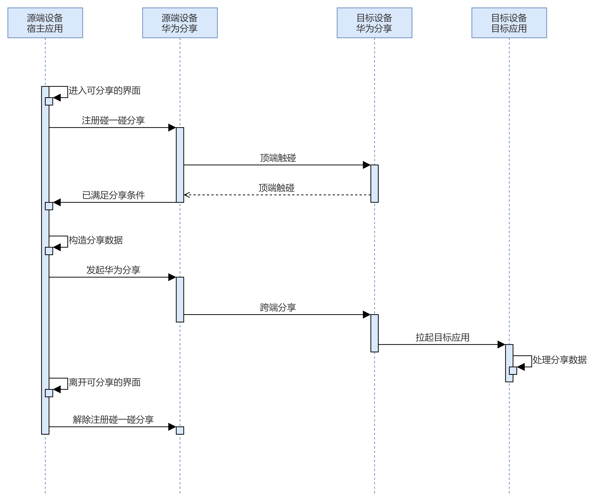
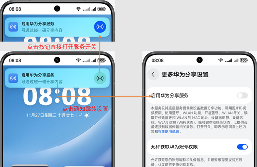

# 概述

更新时间：2026-04-20 06:34:33

来源：https://developer.huawei.com/consumer/cn/doc/harmonyos-guides/knock-share-between-phones-overview

Share Kit推出碰一碰分享，支持用户通过碰一碰发起跨端分享，可实现传输图片、共享Wi-Fi等。
  

##### 场景介绍

- 宿主应用进入一个可以分享的界面，比如打开或者选中的一个文件、一条备忘录、一个联系人详情，或个人热点/Wi-Fi等。
- 宿主应用可以分享多个内容，如选中的多张图片等。

 


 
  

##### 业务流程




 
流程说明：
 1. 宿主应用注册碰一碰分享事件，并与亮屏且解锁的对端设备碰一碰。
2. 宿主应用发现设备，调用碰一碰分享事件回调，在回调事件中构造分享数据并发送。
3. 目标设备接收并处理分享数据。
4. 宿主应用解除注册碰一碰分享事件。
 
  

##### 使用约束

手机应用发起碰一碰分享时，双端设备需要在**亮屏、且解锁**的状态下并且都已开启华为分享服务（系统默认开启），设备顶部轻碰即可触发。如果用户已手动关闭华为分享服务开关，轻碰事件触发时，用户会接收到系统通知提示开启。
 



 
Share Kit的处理机制：
 
- 任意一端设备不支持碰一碰能力时，轻碰无任何响应。
- 宿主应用无法获得分享结果，Share Kit会通过系统通知消息告知用户对端接收或拒绝。

 
  

##### 环境要求

- 支持的手机系统：[HarmonyOS NEXT Release](https://developer.huawei.com/consumer/cn/doc/harmonyos-releases/overview-500#section62333015377)及以上版本，可使用[canIUse](https://developer.huawei.com/consumer/cn/doc/harmonyos-references/js-apis-syscap#caniuse)判断系统能力是否支持。

  
```text
if (canIUse('SystemCapability.Collaboration.HarmonyShare')) {
  // 支持一碰分享的能力.
}
```

- 集成开发环境：[DevEco Studio NEXT Beta1](https://developer.huawei.com/consumer/cn/doc/harmonyos-releases/overview-500#section1457031563711)及以上版本。
