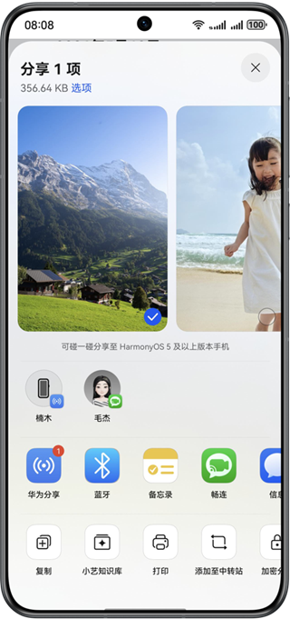
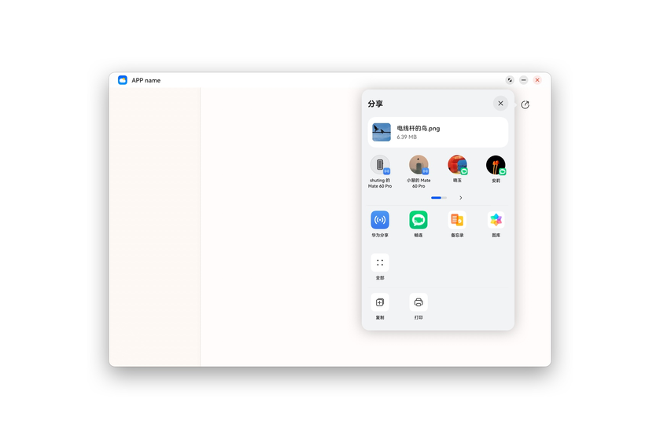
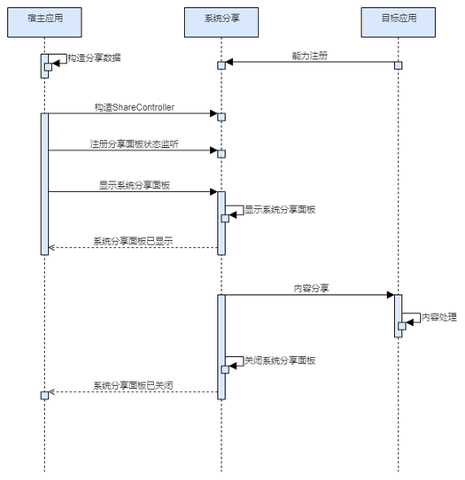

# 概述

更新时间：2026-04-20 06:34:33

来源：https://developer.huawei.com/consumer/cn/doc/harmonyos-guides/system-share-overview

## 场景介绍

在手机设备中，分享框通过模态弹窗方式被拉起，效果如下图所示。

在2in1设备上分享框通过Popup形式展示，效果如图所示：

宿主应用可以分享一段文本、一个文件或一条备忘录到其他应用。  宿主应用可以分享多个内容，如文本、图片等到其他应用。

## 业务流程

流程说明： 1、宿主应用构造分享数据、构造ShareController以及注册分享面板状态监听（可选）。 2、宿主应用拉起系统分享面板。 3、用户可选择目标设备或者应用。 4、目标应用处理分享数据，并关闭系统分享面板。

## 设计规范

宿主应用接入系统分享时，根据不同的内容类型，应选择恰当的分享方式。详细参见：[系统分享设计指南](https://developer.huawei.com/consumer/cn/doc/design-guides/share-0000001957076313)。
