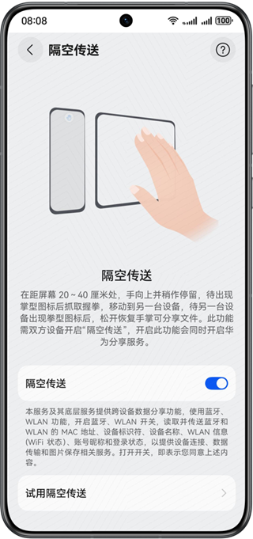
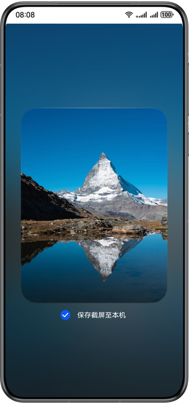

# 打开设备侧隔空传送开关

更新时间：2026-04-20 06:34:33

来源：https://developer.huawei.com/consumer/cn/doc/harmonyos-guides/gestures-share-open

使用隔空传送功能前，需要先打开隔空传送开关。
 
开启路径：设置 > 系统 > 快捷启动和手势 > 隔空传送。
 

  

##### 隔空传送与隔空截屏的联动

隔空传送与隔空截屏使用相同的手势触发，开关是否开启影响如下：
  
| 隔空传送开启 | 隔空传送关闭 |
| --- | --- |
| 隔空截屏开启：图库场景传输原图；其他场景传送截屏。 隔空截屏关闭：图库场景传送原图；其他场景无截屏，不传送。 | 隔空截屏开启：仅截屏，不传送。 隔空截屏关闭：无截屏，不传送。 |
 
 
当隔空传送和隔空截屏开关同时开启，且当前界面已注册隔空传送事件时，用户抓取握拳会同时触发隔空传送和隔空截屏，此时隔空传送的卡片下方同步出现保存截屏的提示（首次默认不保存）。
 
用户可手动勾选“保存截屏至本机”，则传送的同时截屏图片会被保存至图库。系统会记录本次选择结果，并作为下次操作的默认值。
 

