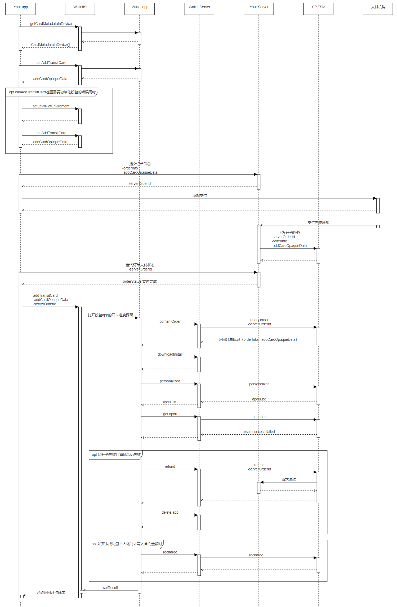

# 交通卡开通

更新时间：2026-04-20 06:34:33

来源：https://developer.huawei.com/consumer/cn/doc/harmonyos-guides/wallet-transport-operation

交通卡的开通过程分为：获取卡片开通入口、确认卡片是否支持添加、生成并支付订单和完成开卡四个步骤，整体流程如下图，相关接口定义请参考[钱包服务API](https://developer.huawei.com/consumer/cn/doc/harmonyos-references/wallet-wallettransitcard)。




## 开发步骤

获取设备上支持开通的交通卡列表。 初始化TransitCardClient时，构造方法的第二个入参callerId是接口调用方ID。开发者可以联系钱包运营申请交通卡服务时获取。
```text
import { common } from '@kit.AbilityKit';
import { walletTransitCard } from '@kit.WalletKit';
import { BusinessError } from '@kit.BasicServicesKit';

@Entry
@Component
struct Index {
  private transitCardClient: walletTransitCard.TransitCardClient = new walletTransitCard.TransitCardClient(this.getUIContext().getHostContext() as common.UIAbilityContext, 'callerId');

  async getCardMetadataInDevice() {
    this.transitCardClient.getCardMetadataInDevice(walletTransitCard.DeviceType.DEVICE_PHONE).then((result) => {
      console.info(`Succeeded in getting cardMetadataInDevice`);
    }).catch((err: BusinessError) => {
      console.error(`Failed to get CardMetadataInDevice, code:${err.code}, message:${err.message}`);
    })
  }

  build() {
    // your application UI
  }
}
```

获取开卡addCardOpaqueData。 选中一张交通卡，调用[canAddTransitCard](https://developer.huawei.com/consumer/cn/doc/harmonyos-references/wallet-wallettransitcard#canaddtransitcard)接口，获取开卡addCardOpaqueData。
```text
import { common } from '@kit.AbilityKit';
import { walletTransitCard } from '@kit.WalletKit';
import { BusinessError } from '@kit.BasicServicesKit';

@Entry
@Component
struct Index {
  private transitCardClient: walletTransitCard.TransitCardClient = new walletTransitCard.TransitCardClient(this.getUIContext().getHostContext() as common.UIAbilityContext, 'callerId');

  async canAddTransitCard() {
    // the issuerId returned by the getCardMetadataInDevice interface
    const issuerId = 'issuerId';
    // the specifiedDeviceId returned by the getCardMetadataInDevice interface
    const specifiedDeviceId = 'specifiedDeviceId';
    this.transitCardClient.canAddTransitCard(issuerId, specifiedDeviceId).then((result) => {
      console.info(`Succeeded in canning AddTransitCard`);
      // save the result as the input parameter addCardOpaqueData of addTransitCard.
    }).catch((err: BusinessError) => {
      console.error(`Failed to can AddTransitCard, code:${err.code}, message:${err.message}`);
    })
  }

  build() {
    // your application UI
  }
}
```

开通交通卡。 使用步骤2获取到的addCardOpaqueData，调用[addTransitCard](https://developer.huawei.com/consumer/cn/doc/harmonyos-references/wallet-wallettransitcard#addtransitcard)接口开通交通卡。
```text
import { common } from '@kit.AbilityKit';
import { walletTransitCard } from '@kit.WalletKit';
import { BusinessError } from '@kit.BasicServicesKit';

@Entry
@Component
struct Index {
  private transitCardClient: walletTransitCard.TransitCardClient = new walletTransitCard.TransitCardClient(this.getUIContext().getHostContext() as common.UIAbilityContext, 'callerId');

  async addTransitCard() {
    // order ID generated after payment in a developer's app, which is implemented by the developer
    let serverOrderId = 'serverOrderId';
    // the addCardOpaqueData returned by step 2
    let addCardOpaqueData = 'addCardOpaqueData';
    this.transitCardClient.addTransitCard(addCardOpaqueData, serverOrderId).then((result) => {
      console.info(`Succeeded in adding TransitCard`);
    }).catch((err: BusinessError) => {
      console.error(`Failed to add TransitCard, code:${err.code}, message:${err.message}`);
    })
  }

  build() {
    // your application UI
  }
}
```
