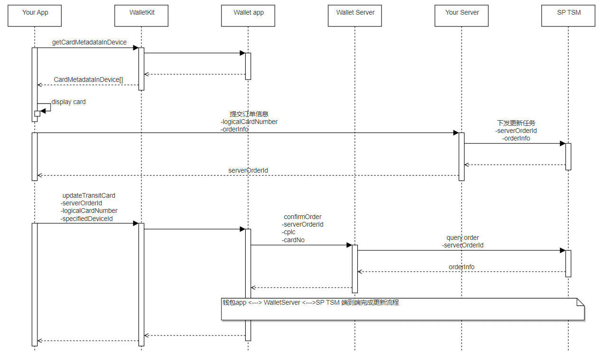

# 交通卡更新

更新时间：2026-04-20 06:34:33

来源：https://developer.huawei.com/consumer/cn/doc/harmonyos-guides/wallet-transport-update

交通卡的更新可以用在更新卡片有效期等卡内数据的场景，其过程分为：卡片展示、生成更新业务订单和发起更新三个步骤，整体流程如下图，相关接口定义请参照[钱包服务API](https://developer.huawei.com/consumer/cn/doc/harmonyos-references/wallet-wallettransitcard)。




## 开发步骤

获取设备上已开通的交通卡列表。 初始化TransitCardClient时，构造方法的第二个入参callerId是接口调用方ID。开发者可以联系钱包运营申请交通卡服务时获取。
```text
import { common } from '@kit.AbilityKit';
import { walletTransitCard } from '@kit.WalletKit';
import { BusinessError } from '@kit.BasicServicesKit';

@Entry
@Component
struct Index {
  private transitCardClient: walletTransitCard.TransitCardClient = new walletTransitCard.TransitCardClient(this.getUIContext().getHostContext() as common.UIAbilityContext, 'callerId');

  async getCardMetadataInDevice() {
    this.transitCardClient.getCardMetadataInDevice(walletTransitCard.DeviceType.DEVICE_PHONE).then((result) => {
      console.info(`Succeeded in getting cardMetadataInDevice`);
    }).catch((err: BusinessError) => {
      console.error(`Failed to get CardMetadataInDevice, code:${err.code}, message:${err.message}`);
    })
  }

  build() {
    // your application UI
  }
}
```

更新交通卡。
```text
import { common } from '@kit.AbilityKit';
import { walletTransitCard } from '@kit.WalletKit';
import { BusinessError } from '@kit.BasicServicesKit';

@Entry
@Component
struct Index {
  private transitCardClient: walletTransitCard.TransitCardClient = new walletTransitCard.TransitCardClient(this.getUIContext().getHostContext() as common.UIAbilityContext, 'callerId');

  async updateTransitCard() {
    // number of the enabled traffic card returned by the step 1
    const logicalCardNumber = 'logicalCardNumber';
    // the specifiedDeviceId returned by the step 1
    const specifiedDeviceId = 'specifiedDeviceId';
    // order ID generated after payment in a developer's app, which is implemented by the developer
    const serverOrderId = 'serverOrderId';
    this.transitCardClient.updateTransitCard(logicalCardNumber, specifiedDeviceId, serverOrderId).then(() => {
      console.info(`Succeeded in updating TransitCard`);
    }).catch((err: BusinessError) => {
      console.error(`Failed to update TransitCard, code:${err.code}, message:${err.message}`);
    })
  }

  build() {
    // your application UI
  }
}
```
