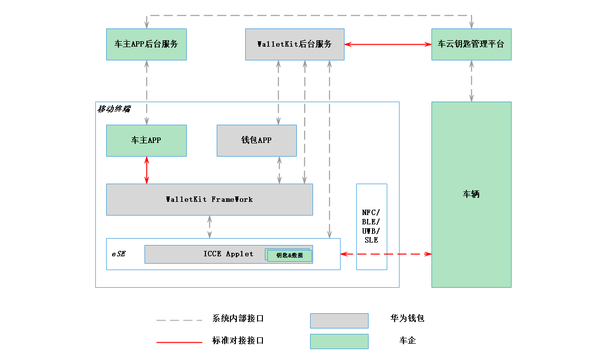

# 概述

更新时间：2026-07-28 11:23:46

来源：https://developer.huawei.com/consumer/cn/doc/harmonyos-guides/wallet-carkey-overview

华为数字车钥匙基于华为钱包"芯-端-云"一体化安全能力，集成SE、TEE等安全芯片能力，满足ICCE标准，支持NFC、蓝牙、星闪等多种连接方式，可将车钥匙功能数字化集成至移动终端，无需实体钥匙即可实现车辆开门、启动、无感解闭锁等功能。
  

#### 系统架构

  
| 角色 | 说明 |
| --- | --- |
| 开发者服务器 | 负责车辆管理和车主身份认证的云侧实现。 |
| Wallet Kit服务器 | 提供服务器接口，用于开发者进行云云对接，推送车钥匙数据。 |
| 车云钥匙管理平台 | 负责车钥匙的管理和发卡。 |
| 车主App | 负责车辆管理和车主身份认证的端侧实现。 |
| 钱包App | 实现车钥匙业务能力，提供刷卡、车控、无感解闭锁等功能。 |
| Wallet Kit框架 | 提供Wallet Kit对外接口。 |
| ICCE Applet | 安全存储车钥匙数据，支持nfc刷卡和无感钥匙认证。 |
| 车辆 | 负责车钥匙系统的车端实现。 |
 
 
  

#### UI设计

  

#### 车钥匙开通

 
  

#### 车钥匙展示

 
  

#### 典型交互场景

**用户持手机在车主App申请开通车钥匙：**
 
DK服务器将钥匙卡片信息通过钱包服务器传递给华为钱包，同时写入到手机安全芯片的车钥匙 Applet实例。
 
**车辆和移动终端的通信方式：**
 
- 车辆NFC模块（通常位于主驾后视镜，主驾B柱）使用NFC通道和终端设备安全芯片通信。
- 车辆BLE模块通过蓝牙通道与终端设备的安全芯片通信。
- 车辆SLE模块通过星闪通道与终端设备的安全芯片通信。

 
  

#### 接入流程

开发者可以参考以下接入流程，完成数字车钥匙业务相关准备及场景化能力开发。
  
| 序号 | 步骤 | 说明 |
| --- | --- | --- |
| 1 | 应用开发准备 | 请先参考应用开发准备完成企业应用基本准备工作和指纹配置，再继续以下开发活动。 |
| 2 | 准备信息 | 参考开发准备，准备相关图片素材及配置信息。 |
| 3 | 创建Wallet Kit服务 | 在AGC上创建Wallet Kit服务。 |
| 4 | 开通车钥匙 | 开通数字车钥匙，包括添加前检查、申请车钥匙、激活车钥匙等。 |
| 5 | 查看车钥匙 | 查看本设备开通的数字车钥匙。 |
| 6 | 更新车钥匙 | 更新数字车钥匙实例。 |
| 7 | 使用车钥匙 | 使用数字车钥匙，包括查询连接状态、配对连接、发送车控指令等。 |
| 8 | 迁移车钥匙 | 数字车钥匙从旧设备迁移至新设备。 |
| 9 | 删除车钥匙 | 删除本设备开通的数字车钥匙。 |
| 10 | 上传车端数据到DK服务器 | 通过钱包提供的通道上传车端数据，实现车端与DK服务器之间的通信能力。 |
