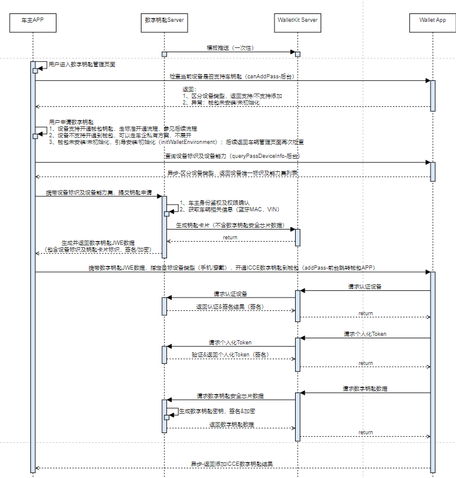
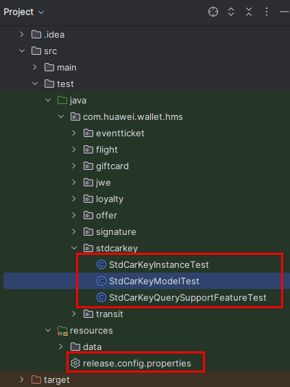
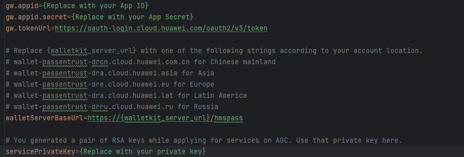
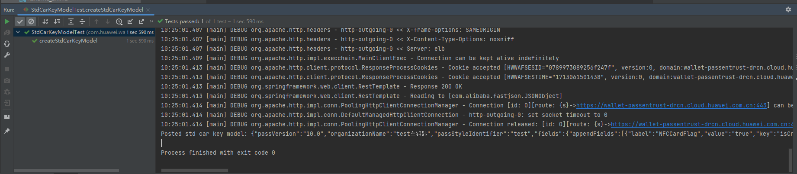
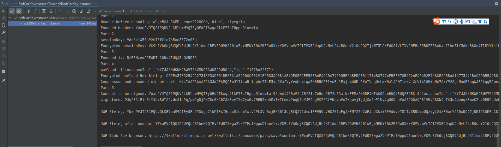
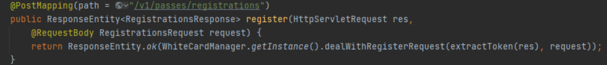
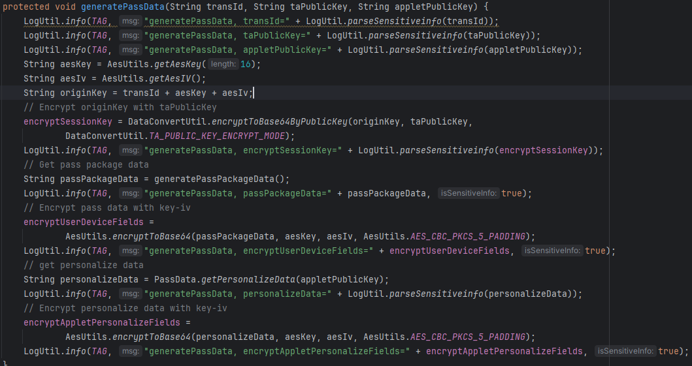

# 钥匙开通

更新时间：2026-04-20 06:34:33

来源：https://developer.huawei.com/consumer/cn/doc/harmonyos-guides/wallet-carkey-operation

钥匙开通分为添加钥匙和激活钥匙两步，整体交互流程图如下。相关接口定义请参照[钱包服务API](https://developer.huawei.com/consumer/cn/doc/harmonyos-references/wallet-walletpass)。




1. 车主APP调用[queryPass](https://developer.huawei.com/consumer/cn/doc/harmonyos-references/wallet-walletpass#querypass)接口检查当前设备车钥匙的开通情况。
2. 如果[queryPass](https://developer.huawei.com/consumer/cn/doc/harmonyos-references/wallet-walletpass#querypass)接口返回[1010220501 查询卡券不存在](https://developer.huawei.com/consumer/cn/doc/harmonyos-references/wallet-error-code#section1010220501-查询卡券不存在)，则调用[canAddPass](https://developer.huawei.com/consumer/cn/doc/harmonyos-references/wallet-walletpass#canaddpass)接口检查当前设备是否支持添加车钥匙。
3. 如果[queryPass](https://developer.huawei.com/consumer/cn/doc/harmonyos-references/wallet-walletpass#querypass)接口或是[canAddPass](https://developer.huawei.com/consumer/cn/doc/harmonyos-references/wallet-walletpass#canaddpass)接口返回[1010200003 访问钱包的前置环境没有准备好](https://developer.huawei.com/consumer/cn/doc/harmonyos-references/wallet-error-code#section1010200003-访问钱包的前置环境没有准备好)，则调用[initWalletEnvironment](https://developer.huawei.com/consumer/cn/doc/harmonyos-references/wallet-walletpass#initwalletenvironment)接口初始化钱包开通车钥匙的同意协议或是登录账号等必要条件，引导用户跳转钱包App完成应用初始化。
4. 车主APP调用[queryPassDeviceInfo](https://developer.huawei.com/consumer/cn/doc/harmonyos-references/wallet-walletpass#querypassdeviceinfo)接口查询设备类型，指定目标设备标识，提升安全性。
5. 车主服务器预置模板后申请钥匙卡片以及JWE数据，参考[车主服务器开发](#车主服务器开发)。
6. 用户主动发起开卡时，车主APP跳转钱包应用，调用[addPass](https://developer.huawei.com/consumer/cn/doc/harmonyos-references/wallet-walletpass#addpass)接口携带上述流程中生成的编码后的JWE数据，开通车钥匙到钱包。
7. 卡片激活的过程中钱包服务器需要和DK业务管理服务进行交互的包括：设备的认证（和车钥匙管理台交换证书信息）、获取请求个人化数据时的token（用于向车钥匙管理台请求Applet个人化数据）、以及最后的请求Applet个人化数据，最后写入安全芯片，参考[车主服务器激活卡片](#车主服务器激活卡片)。
8. 车主APP可通过[viewPass](https://developer.huawei.com/consumer/cn/doc/harmonyos-references/wallet-walletpass#viewpass)接口跳转钱包查看已开通的车钥匙详情页。


##### 开发步骤
1. 车主APP使用[创建Wallet Kit服务](https://developer.huawei.com/consumer/cn/doc/harmonyos-guides/wallet-preparations)时注册的服务号和[申请钥匙卡片](https://developer.huawei.com/consumer/cn/doc/harmonyos-references/wallet-rest-api-carkey#申请钥匙卡片)时定义的卡券唯一标识，车主APP调用[queryPass](https://developer.huawei.com/consumer/cn/doc/harmonyos-references/wallet-walletpass#querypass)接口检查当前设备车钥匙的开通情况。

  
```json
import { common } from '@kit.AbilityKit';
import { walletPass } from '@kit.WalletKit';
import { BusinessError } from '@kit.BasicServicesKit';

@Entry
@Component
struct Index {
  private walletPassClient: walletPass.WalletPassClient = new walletPass.WalletPassClient(this.getUIContext().getHostContext() as common.UIAbilityContext);
  // 创建Wallet Kit服务时注册的服务号
  private passType: string = '';
  // 申请钥匙卡片时定义的卡券唯一标识
  private serialNumber: string = '';

  async queryPass() {
    let passStr = JSON.stringify({
      passType: this.passType,
      serialNumber: this.serialNumber
    });
    this.walletPassClient.queryPass(passStr).then((result: string) => {
      console.info(`Succeeded in querying pass, result: ${result}`);
    }).catch((err: BusinessError) => {
      console.error(`Failed to query pass, code:${err.code}, message:${err.message}`);
    })
  }

  build() {
    // your application UI
  }
}
```

2. 如果[queryPass](https://developer.huawei.com/consumer/cn/doc/harmonyos-references/wallet-walletpass#querypass)接口返回[1010220501 查询卡券不存在](https://developer.huawei.com/consumer/cn/doc/harmonyos-references/wallet-error-code#section1010220501-查询卡券不存在)，则调用[canAddPass](https://developer.huawei.com/consumer/cn/doc/harmonyos-references/wallet-walletpass#canaddpass)接口检查当前设备是否支持添加车钥匙。

  
```json
import { common } from '@kit.AbilityKit';
import { walletPass } from '@kit.WalletKit';
import { BusinessError } from '@kit.BasicServicesKit';

@Entry
@Component
struct Index {
  private walletPassClient: walletPass.WalletPassClient = new walletPass.WalletPassClient(this.getUIContext().getHostContext() as common.UIAbilityContext);
  // 创建Wallet Kit服务时注册的服务号
  private passType: string = '';
  // 目标设备类型 phone: 手机
  private targetDeviceType: string = '';

  async canAddPass() {
    let passStr = JSON.stringify({
      passType: this.passType,
      targetDeviceType: this.targetDeviceType
    });
    this.walletPassClient.canAddPass(passStr).then((result: string) => {
      console.info(`Succeeded in checking addPass, result:${result}`);
    }).catch((err: BusinessError) => {
      console.error(`Failed to check addPass, code:${err.code}, message:${err.message}`);
    })
  }

  build() {
    // your application UI
  }
}
```

3. 如果[queryPass](https://developer.huawei.com/consumer/cn/doc/harmonyos-references/wallet-walletpass#querypass)接口或是[canAddPass](https://developer.huawei.com/consumer/cn/doc/harmonyos-references/wallet-walletpass#canaddpass)接口返回[1010200003 访问钱包的前置环境没有准备好](https://developer.huawei.com/consumer/cn/doc/harmonyos-references/wallet-error-code#section1010200003-访问钱包的前置环境没有准备好)，则调用[initWalletEnvironment](https://developer.huawei.com/consumer/cn/doc/harmonyos-references/wallet-walletpass#initwalletenvironment)接口初始化钱包开通车钥匙的同意协议或是登录账号等必要条件，引导用户跳转钱包App完成应用初始化。

  
```json
import { common } from '@kit.AbilityKit';
import { walletPass } from '@kit.WalletKit';
import { BusinessError } from '@kit.BasicServicesKit';

@Entry
@Component
struct Index {
  private walletPassClient: walletPass.WalletPassClient = new walletPass.WalletPassClient(this.getUIContext().getHostContext() as common.UIAbilityContext);
  // 目标设备类型 phone: 手机
  private targetDeviceType: string = '';

  async initWalletEnvironment() {
    let passStr = JSON.stringify({
      targetDeviceType: this.targetDeviceType
    });
    this.walletPassClient.initWalletEnvironment(passStr).then(() => {
      console.info(`Succeeded in initiating walletEnvironment`);
    }).catch((err: BusinessError) => {
      console.error(`Failed to initiate walletEnvironment, code:${err.code}, message:${err.message}`);
    })
  }

  build() {
    // your application UI
  }
}
```

4. 车主APP调用[queryPassDeviceInfo](https://developer.huawei.com/consumer/cn/doc/harmonyos-references/wallet-walletpass#querypassdeviceinfo)接口查询设备类型，指定目标设备标识。

  
```json
import { common } from '@kit.AbilityKit';
import { walletPass } from '@kit.WalletKit';
import { BusinessError } from '@kit.BasicServicesKit';

@Entry
@Component
struct Index {
  private walletPassClient: walletPass.WalletPassClient = new walletPass.WalletPassClient(this.getUIContext().getHostContext() as common.UIAbilityContext);
  // 创建Wallet Kit服务时注册的服务号
  private passType: string = '';
  // 目标设备类型 phone: 手机
  private targetDeviceType: string = '';

  async queryPassDeviceInfo() {
    let passStr = JSON.stringify({
      passType: this.passType,
      targetDeviceType: this.targetDeviceType
    });
    this.walletPassClient.queryPassDeviceInfo(passStr).then((result: string) => {
      console.info(`Succeeded in querying passDeviceInfo, result:${result}`);
    }).catch((err: BusinessError) => {
      console.error(`Failed to query passDeviceInfo, code:${err.code}, message:${err.message}`);
    })
  }

  build() {
    // your application UI
  }
}
```

5. 车主服务器预置模板后申请钥匙卡片以及JWE数据，参考[车主服务器开发](#车主服务器开发)。
6. 用户主动发起开卡时，车主APP跳转钱包应用，调用[addPass](https://developer.huawei.com/consumer/cn/doc/harmonyos-references/wallet-walletpass#addpass)接口携带上述流程中生成的编码后的JWE数据，开通车钥匙到钱包。

  
```json
import { common } from '@kit.AbilityKit';
import { walletPass } from '@kit.WalletKit';
import { BusinessError } from '@kit.BasicServicesKit';

@Entry
@Component
struct Index {
  private walletPassClient: walletPass.WalletPassClient = new walletPass.WalletPassClient(this.getUIContext().getHostContext() as common.UIAbilityContext);
  // 参考车主服务器开发生成的JWE数据
  private jweContent: string = '';

  async addPass() {
    let passStr = JSON.stringify({
      jweContent: this.jweContent
    });
    this.walletPassClient.addPass(passStr).then((result: string) => {
      console.info(`Succeeded in adding pass, result:${result}`);
    }).catch((err: BusinessError) => {
      console.error(`Failed to add pass, code:${err.code}, message:${err.message}`);
    })
  }

  build() {
    // your application UI
  }
}
```

7. 卡片激活的过程中钱包服务器需要和DK业务管理服务进行交互的包括：设备的认证（和车钥匙管理台交换证书信息）、获取请求个人化数据时的token（用于向车钥匙管理台请求Applet个人化数据）、以及最后的请求Applet个人化数据，最后写入安全芯片，参考[车主服务器激活卡片](#车主服务器激活卡片)。
8. 车主APP可通过[viewPass](https://developer.huawei.com/consumer/cn/doc/harmonyos-references/wallet-walletpass#viewpass)接口跳转钱包查看已开通的车钥匙详情页。

  
```json
import { common } from '@kit.AbilityKit';
import { walletPass } from '@kit.WalletKit';

@Entry
@Component
struct Index {
  private walletPassClient: walletPass.WalletPassClient = new walletPass.WalletPassClient(this.getUIContext().getHostContext() as common.UIAbilityContext);
  // 创建Wallet Kit服务时注册的服务号
  private passType: string = '';
  // 申请钥匙卡片时定义的卡券唯一标识
  private serialNumber: string = '';

  async viewPass() {
    let passStr = JSON.stringify({
      passType: this.passType,
      serialNumber: this.serialNumber
    });
    try {
      await this.walletPassClient.viewPass(passStr);
      console.info(`Succeeded in viewing pass`);
    } catch (err) {
      console.error(`Failed to view pass, code:${err.code}, message:${err.message}`);
    }
  }

  build() {
    // your application UI
  }
}
```


##### 车主服务器开发
1. 使用Intellij IDEA打开[钱包服务-服务端卡片开通](https://gitcode.com/harmonyos_samples/wallet-kit-sample-code-severdemo-java)的示例代码，没有请先下载Intellij IDEA的当前最新版本。示例代码和工具下载完成后，目录结构如下，我们需要关注下图框出来几个文件：

  


2. 打开resources/release.config.properties文件，替换真实的应用数据。

  



| 需替换的参数 | 参数说明 |

| --- | --- |

| gw.appid |  |

| gw.appid.secret | AppGallery Connect平台申请的Client ID和Client Secret分别填入gw.appid和gw.appid.secret |

| walletServerBaseUrl | 固定填入服务器基地址：https://wallet-passentrust-drcn.cloud.huawei.com.cn/hmspass |

| servicePrivateKey | 创建Wallet Kit服务步骤5生成的私钥 |
3. 打开resources/data/StdCarKeyModel.json文件，替换真实的应用数据，详细见[预置模板](https://developer.huawei.com/consumer/cn/doc/harmonyos-references/wallet-rest-api-carkey#预置模板)的请求参数。

  


4. 打开stdcarkey/StdCarKeyModelTest.java文件，运行createStdCarKeyModel方法，可看到控制台如下输出，详细见[预置模板](https://developer.huawei.com/consumer/cn/doc/harmonyos-references/wallet-rest-api-carkey#预置模板)的响应参数。

  


5. 打开resources/data/StdCarKeyInstance.json文件，替换真实的应用数据，详细见[申请钥匙卡片](https://developer.huawei.com/consumer/cn/doc/harmonyos-references/wallet-rest-api-carkey#申请钥匙卡片)的请求参数。
6. 打开stdcarkey/StdCarKeyInstanceTest.java文件，运行addStdCarKeyInstance方法，可看到控制台如下输出，详细见[申请钥匙卡片](https://developer.huawei.com/consumer/cn/doc/harmonyos-references/wallet-rest-api-carkey#申请钥匙卡片)的响应参数。

  



##### 车主服务器激活卡片
1. 使用 Intellij IDEA打开[钱包服务-服务端卡片激活](https://gitcode.com/harmonyos_samples/wallet-kit-sample-code-severdemo-nfc-java)的示例代码。示例代码和工具下载完成后，解决工程配置等问题后，Constants类中替换SERVER_PUBLIC_KEY和SERVER_SECRET_KEY为您在[创建Wallet Kit服务](https://developer.huawei.com/consumer/cn/doc/harmonyos-guides/wallet-preparations)步骤5生成的公钥和私钥，直接打开PassesController这个类。
2. [设备认证](https://developer.huawei.com/consumer/cn/doc/harmonyos-references/wallet-rest-api-public#设备认证)对应类中的register方法，通过此方法进行设备认证。

  


3. [获取个人化数据Token](https://developer.huawei.com/consumer/cn/doc/harmonyos-references/wallet-rest-api-public#获取个人化数据token)对应类中的requestToken方法，通过此方法获取个人化数据Token。

  


4. [获取个人化数据](https://developer.huawei.com/consumer/cn/doc/harmonyos-references/wallet-rest-api-public#获取个人化数据)对应类中的getPersonalInfo方法，重点看dealWithPersonalizeDataRequest中的getDevicePassData这个方法，查看ICCECarKeyDevicePassUnit的generatePassData方法，通过这些方法获取个人化数据。再深入打开里面的getPersonalizeData方法，根据此接口的说明进行生成。

  

