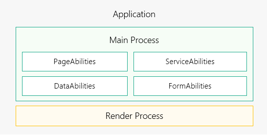

# 进程模型概述

更新时间：2026-03-09 02:50:43

来源：https://developer.huawei.com/consumer/cn/doc/harmonyos-guides/process-model-fa

系统的进程模型如下图所示：

 

 基于当前的进程模型，针对应用间存在多个进程的情况，系统提供了如下进程间通信机制：

 公共事件机制：多用于一对多的通信场景，公共事件发布者可能存在多个订阅者同时接收事件。
