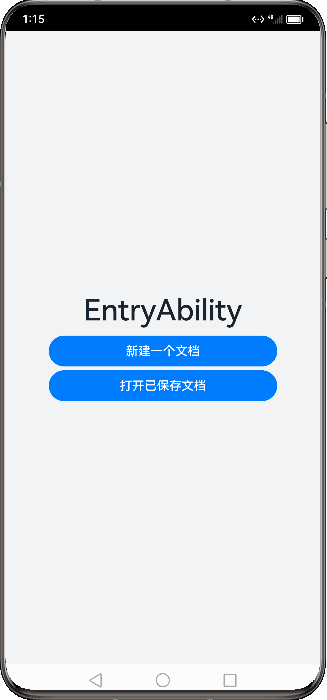
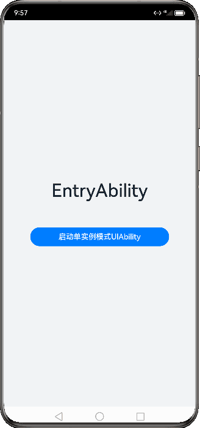
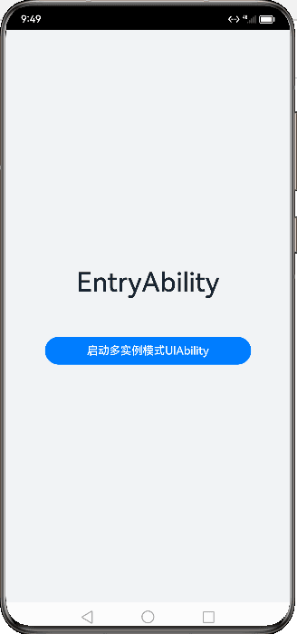

# UIAbility组件启动模式

更新时间：2026-05-26 06:48:54

来源：https://developer.huawei.com/consumer/cn/doc/harmonyos-guides/uiability-launch-type

[UIAbility](https://developer.huawei.com/consumer/cn/doc/harmonyos-references/js-apis-app-ability-uiability)的启动模式是指UIAbility实例在启动时的不同呈现状态。针对不同的业务场景，系统提供了三种启动模式：

 - [singleton（单实例模式）](#singleton启动模式)
 - [multiton（多实例模式）](#multiton启动模式)
 - [specified（指定实例模式）](#specified启动模式)


> [!NOTE]
> standard是multiton的曾用名，效果与多实例模式一致。


##### singleton启动模式

singleton启动模式为单实例模式，也是默认情况下的启动模式。

每次调用[startAbility()](https://developer.huawei.com/consumer/cn/doc/harmonyos-references/js-apis-inner-application-uiabilitycontext#startability)方法时，如果应用进程中该类型的[UIAbility](https://developer.huawei.com/consumer/cn/doc/harmonyos-references/js-apis-app-ability-uiability)实例已经存在，则复用系统中的UIAbility实例。系统中只存在唯一一个该UIAbility实例，即在最近任务列表中只存在一个该类型的UIAbility实例。

**图1** 单实例模式演示效果


> [!NOTE]
> 应用的UIAbility实例已创建，该UIAbility配置为单实例模式，再次调用 startAbility() 方法启动该UIAbility实例。由于启动的还是原来的UIAbility实例，并未重新创建一个新的UIAbility实例，此时只会进入该UIAbility的 onNewWant() 回调，不会进入其 onCreate() 和 onWindowStageCreate() 生命周期回调。如果已经创建的实例仍在启动过程中，调用startAbility()方法启动该实例，将收到错误码16000082。


如果需要使用singleton启动模式，在[module.json5配置文件](https://developer.huawei.com/consumer/cn/doc/harmonyos-guides/module-configuration-file)中的launchType字段配置为singleton即可。

```json
{
  "module": {
    // ···
    "abilities": [
    // ···
      {
        "launchType": "singleton",
        // ···
      }
    // ···
    ]
  }
}
```


##### multiton启动模式

multiton启动模式为多实例模式，每次调用[startAbility()](https://developer.huawei.com/consumer/cn/doc/harmonyos-references/js-apis-inner-application-uiabilitycontext#startability)方法时，都会在应用进程中创建一个新的该类型[UIAbility](https://developer.huawei.com/consumer/cn/doc/harmonyos-references/js-apis-app-ability-uiability)实例。即在最近任务列表中可以看到有多个该类型的UIAbility实例。这种情况下可以将UIAbility配置为multiton（多实例模式）。

**图2** 多实例模式演示效果





multiton启动模式的开发使用，在[module.json5配置文件](https://developer.huawei.com/consumer/cn/doc/harmonyos-guides/module-configuration-file)中的launchType字段配置为multiton即可。

```json
{
  "module": {
    // ···
    "abilities": [
    // ···
      {
        "launchType": "multiton",
        // ···
      }
    // ···
    ]
  }
}
```


##### specified启动模式

specified启动模式为指定实例模式，针对一些特殊场景使用（例如文档应用中每次新建文档希望都能新建一个文档实例，重复打开一个已保存的文档希望打开的都是同一个文档实例）。

**图3** 指定实例启动模式原理





假设应用有两个[UIAbility](https://developer.huawei.com/consumer/cn/doc/harmonyos-references/js-apis-app-ability-uiability)实例，即EntryAbility和SpecifiedAbility。EntryAbility以specified模式启动SpecifiedAbility。基本原理如下：
1. EntryAbility调用[startAbility()](https://developer.huawei.com/consumer/cn/doc/harmonyos-references/js-apis-inner-application-uiabilitycontext#startability)方法，并在[Want](https://developer.huawei.com/consumer/cn/doc/harmonyos-references/js-apis-app-ability-want)的parameters字段中设置唯一的Key值，用于标识SpecifiedAbility。
2. 系统在拉起SpecifiedAbility之前，会先进入对应的[AbilityStage](https://developer.huawei.com/consumer/cn/doc/harmonyos-references/js-apis-app-ability-abilitystage)的[onAcceptWant()](https://developer.huawei.com/consumer/cn/doc/harmonyos-references/js-apis-app-ability-abilitystage#onacceptwant)生命周期回调，获取用于标识目标UIAbility的Key值。
3. 系统会根据获取的Key值来匹配UIAbility。       
 - 如果匹配到对应的UIAbility，则会启动该UIAbility实例，并进入[onNewWant()](https://developer.huawei.com/consumer/cn/doc/harmonyos-references/js-apis-app-ability-uiability#onnewwant)生命周期回调。

4. 如果无法匹配对应的UIAbility，则会创建一个新的UIAbility实例，并进入该UIAbility实例的[onCreate()](https://developer.huawei.com/consumer/cn/doc/harmonyos-references/js-apis-app-ability-uiability#oncreate)生命周期回调和[onWindowStageCreate()](https://developer.huawei.com/consumer/cn/doc/harmonyos-references/js-apis-app-ability-uiability#onwindowstagecreate)生命周期回调。

  **图4** 指定实例模式演示效果

  



1. 在SpecifiedAbility中，需要将[module.json5配置文件](https://developer.huawei.com/consumer/cn/doc/harmonyos-guides/module-configuration-file)的launchType字段配置为specified。

  
```json
{
  "module": {
    // ···
    "abilities": [
      {
        "launchType": "specified",
        // ···
      }
    // ···
    ]
  }
}
```


2. 在EntryAbility中，调用[startAbility()](https://developer.huawei.com/consumer/cn/doc/harmonyos-references/js-apis-inner-application-uiabilitycontext#startability)方法时，可以在[want](https://developer.huawei.com/consumer/cn/doc/harmonyos-references/js-apis-app-ability-want)参数中传入了自定义参数instanceKey作为唯一标识符，以此来区分不同的UIAbility实例。示例中instanceKey的value值设置为字符串'KEY'。

  
```ArkTS
// 在启动指定实例模式的UIAbility时，给每一个UIAbility实例配置一个独立的Key标识
// 例如在文档使用场景中，可以用文档路径作为Key标识
import { common, Want } from '@kit.AbilityKit';
import { hilog } from '@kit.PerformanceAnalysisKit';
import { BusinessError } from '@kit.BasicServicesKit';

const TAG: string = '[SpecifiedPage]';
const DOMAIN_NUMBER: number = 0xFF00;

function getInstance(): string {
  return 'KEY';
}

@Entry
@Component
struct SpecifiedPage {
  private KEY_NEW = 'KEY';

  build() {
    Row() {
      Column() {
        // ...
        // 请将$r('app.string.new_doc')替换为实际资源文件，在本示例中该资源文件的value值为"新建一个文档"
        Button($r('app.string.new_doc'))
        // ...
          .onClick(() => {
            let context: common.UIAbilityContext = this.getUIContext().getHostContext() as common.UIAbilityContext;
            // context为调用方UIAbility的UIAbilityContext;
            let want: Want = {
              deviceId: '', // deviceId为空表示本设备
              bundleName: 'com.samples.uiabilitylaunchtype',
              abilityName: 'SpecifiedFirstAbility',
              moduleName: 'entry', // moduleName非必选
              parameters: {
                // 自定义信息
                instanceKey: this.KEY_NEW
              }
            };
            context.startAbility(want).then(() => {
              hilog.info(DOMAIN_NUMBER, TAG, 'Succeeded in starting SpecifiedAbility.');
            }).catch((err: BusinessError) => {
              hilog.error(DOMAIN_NUMBER, TAG, `Failed to start SpecifiedAbility. Code is ${err.code}, message is ${err.message}`);
            });
            this.KEY_NEW = this.KEY_NEW + 'a';
          })

        // 请将$r('app.string.open_old_doc')替换为实际资源文件，在本示例中该资源文件的value值为"打开已保存文档"
        Button($r('app.string.open_old_doc'))
        // ...
          .onClick(() => {
            let context: common.UIAbilityContext = this.getUIContext().getHostContext() as common.UIAbilityContext;
            // context为调用方UIAbility的UIAbilityContext;
            let want: Want = {
              deviceId: '', // deviceId为空表示本设备
              bundleName: 'com.samples.uiabilitylaunchtype',
              abilityName: 'SpecifiedSecondAbility',
              moduleName: 'entry', // moduleName非必选
              parameters: {
                // 自定义信息
                instanceKey: getInstance()
              }
            };
            context.startAbility(want).then(() => {
              hilog.info(DOMAIN_NUMBER, TAG, 'Succeeded in starting SpecifiedAbility.');
            }).catch((err: BusinessError) => {
              hilog.error(DOMAIN_NUMBER, TAG, `Failed to start SpecifiedAbility. Code is ${err.code}, message is ${err.message}`);
            });
            this.KEY_NEW = this.KEY_NEW + 'a';
          })
      }
      .width('100%')
    }
    .height('100%')
  }
}
```


3. 开发者根据业务在SpecifiedAbility所对应AbilityStage的[onAcceptWant()](https://developer.huawei.com/consumer/cn/doc/harmonyos-references/js-apis-app-ability-abilitystage#onacceptwant)生命周期回调设置该UIAbility的标识。示例中标识设置为SpecifiedAbilityInstance_KEY。

  
```ArkTS
import { AbilityStage, Want } from '@kit.AbilityKit';

export default class MyAbilityStage extends AbilityStage {
  onAcceptWant(want: Want): string {
    // 在被调用方的AbilityStage中，针对启动模式为specified的UIAbility返回一个UIAbility实例对应的一个Key值
    // 当前示例指的是module1 Module的SpecifiedAbility
    if (want.abilityName === 'SpecifiedFirstAbility' || want.abilityName === 'SpecifiedSecondAbility') {
      // 返回的字符串KEY标识为自定义拼接的字符串内容
      if (want.parameters) {
        return `SpecifiedAbilityInstance_${want.parameters.instanceKey}`;
      }
    }
    return 'MyAbilityStage';
  }
}
```

> [!NOTE]
> 当应用的UIAbility实例已经被创建，并且配置为指定实例模式时，如果再次调用 startAbility() 方法启动该UIAbility实例，且 AbilityStage 的 onAcceptWant() 回调匹配到一个已创建的UIAbility实例，则系统会启动原来的UIAbility实例，并且不会重新创建一个新的UIAbility实例。此时，该UIAbility实例的onNewWant()回调会被触发，而不会触发onCreate()和onWindowStageCreate()生命周期回调。 DevEco Studio默认工程中未自动生成AbilityStage，AbilityStage文件的创建请参见 AbilityStage开发步骤 。 建议specified启动模式的UIAbility，在 module.json5配置文件 中的removeMissionAfterTerminate字段设置为true，以达到UIAbility生命周期结束即从任务列表中移除任务的目的。 否则，在应用冷启动场景下会无法复用历史任务，在任务列表中出现多个相同任务的情况。


  例如在文档应用中，可以为不同的文档实例内容绑定不同的Key值。每次新建文档时，可以传入一个新的Key值（例如可以将文件的路径作为一个Key标识），此时[AbilityStage](https://developer.huawei.com/consumer/cn/doc/harmonyos-references/js-apis-app-ability-abilitystage)中启动[UIAbility](https://developer.huawei.com/consumer/cn/doc/harmonyos-references/js-apis-app-ability-uiability)时都会创建一个新的UIAbility实例；当新建的文档保存之后，回到桌面，或者新打开一个已保存的文档，回到桌面，此时再次打开该已保存的文档，此时AbilityStage中再次启动该UIAbility时，打开的仍然是之前原来已保存的文档界面。

  以如下步骤所示进行举例说明。

  
打开文件A，对应启动一个新的UIAbility实例，例如启动UIAbility实例1。

4. 在最近任务列表中关闭文件A的任务进程，此时UIAbility实例1被销毁，回到桌面，再次打开文件A，此时对应启动一个新的UIAbility实例，例如启动UIAbility实例2。

5. 回到桌面，打开文件B，此时对应启动一个新的UIAbility实例，例如启动UIAbility实例3。

6. 回到桌面，再次打开文件A，此时仍然启动之前的UIAbility实例2，因为系统会自动匹配UIAbility实例的Key值，如果存在与之匹配的Key，则会启动与之绑定的UIAbility实例。在此例中，之前启动的UIAbility实例2与文件A绑定的Key是相同的，因此系统会拉回UIAbility实例2并让其获焦，而不会创建新的实例。


##### 示例代码

 - [UIAbility的启动方式](https://gitcode.com/HarmonyOS_Samples/ability-start-mode)
