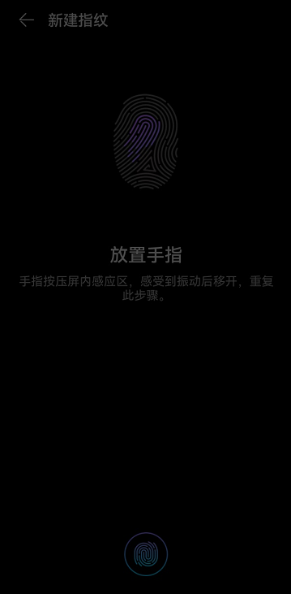

# 内容动态变化场景

更新时间：2026-03-09 02:50:43

来源：https://developer.huawei.com/consumer/cn/doc/harmonyos-guides/scenario-dynamic-content-change

##### 设计场景

界面上重要内容在动态变化后，需要实时发送变化后的朗读内容。具体地，当界面上内容发生动态变化且其内容对用户具有必要的提示/告知/指导作用，则其发生变化后需对其变化内容进行播报，可调用无障碍提供的主动播报接口进行播报。
 



 
主动播报接口相关参数说明：
 
**表1** EventInfo 说明
  
| 属性 | 类型 | 说明 | 例 |
| --- | --- | --- | --- |
| type | EventType | 主动播报事件类型 | announceForAccessibility |
| bundleName | string | 目标应用名 | 当前应用包名 |
| triggerAction | Action | 触发事件的Action | click或其他都不会有任何影响 |
| textAnnouncedForAccessibility | string | 主动播报的内容 | test123 text |
 
 
  

##### 开发实例

```json
import accessibility from '@ohos.accessibility';

@Entry
@Component
export struct Rule_2_1_7 {
  title: string = 'Rule 2.1.7';
  shortText: string = 'Button';
  longText: string = 'sendAccessibilityEvent';
  eventInfo: accessibility.EventInfo = ({
    type: 'announceForAccessibility',
    bundleName: 'com.example.pagesrouter',
    triggerAction: 'common',
    textAnnouncedForAccessibility: 'test123 text'
  });

  build() {
    NavDestination() {
      Column() {
        Blank()
        Button(this.shortText)
          .accessibilityText(this.longText)
          .align(Alignment.Center)
          .fontSize(20)
          .onClick(() => {
            accessibility.sendAccessibilityEvent(this.eventInfo).then(() => {
              console.info(`test123 Succeeded in send event, eventInfo is ${JSON.stringify(this.eventInfo)}`);
            });
          })
        Blank()
      }
      .width('100%')
      .height('100%')
    }
    .title(this.title)
  }
}
```
