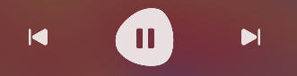

# 按钮标注场景

更新时间：2026-03-09 02:50:43

来源：https://developer.huawei.com/consumer/cn/doc/harmonyos-guides/scenario-button-annotation

##### 设计场景

对于用户可点击等操作的任何按钮，如果不是文本类控件，则须通过给出标注信息，包括用户自定义的控件中的虚拟按钮区域，否则可能会导致屏幕朗读用户无法完成对应的功能。此类控件在进行标注时，标注文本不要包含控件类型、“单指双击即可打开”之类的字符串，此部分指引由屏幕朗读根据控件类型、控件状态，并结合用户是否开启了“新手指引”自动追加朗读。
 



 
  

##### 开发实例

在下面的代码片段中，您可以看到Image组件（它实际上是一个播放/暂停按钮），通过设置accessibilityText属性提供标注信息：
 
```text
const RESOURCE_STR_PLAY = $r('app.media.play')
const RESOURCE_STR_PAUSE = $r('app.media.pause')

@Entry
@Component
export struct Rule_2_1_5 {
  title: string = 'Rule 2.1.5'
  @State isPlaying: boolean = false
  play() {
    // play audio file
  }

  pause() {
    // pause playing of audio file
  }

  build() {
    NavDestination() {
      Column() {
        Flex({
          direction: FlexDirection.Column,
          alignItems: ItemAlign.Center,
          justifyContent: FlexAlign.Center,
        }) {
          Row() {
            Image(this.isPlaying ? RESOURCE_STR_PAUSE : RESOURCE_STR_PLAY)
              .width(50)
              .height(50)
              .onClick(() => {
                this.isPlaying = !this.isPlaying
                if (this.isPlaying) {
                  this.play()
                } else {
                  this.pause()
                }
              })
              .accessibilityRole(BUTTON_TYPE)
              .accessibilityText(this.isPlaying ? 'Pause' : 'Play') // 设置注释信息
            Text('Good_morning.mp3')
              .margin({
                left: 10
              })
          }
        }
        .width('100%')
        .height('100%')
        .backgroundColor(Color.White)
      }
    }
    .title(this.title)
  }
}
```
