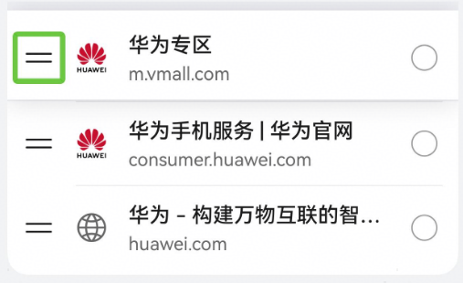

# 控件位置调整场景

更新时间：2026-03-09 02:50:43

来源：https://developer.huawei.com/consumer/cn/doc/harmonyos-guides/scenario-component-relocation

##### 设计场景

移动过程中需要实时播报即将移动到的位置，新位置的播报会打断老位置的播报，放置到确定位置后，需要再播报已经放置的位置信息，尽量保证视障用户耳朵听到的信息和我们通过眼睛看到的信息是一致的。
 
  

##### 开发实例

例如，当前展示的网页书签被托起时，会播报”华为专区已托起”，移动的过程中，根据即将放置的位置播报“移动到华为手机服务|华为官网上面”。应用可调用主动播报的接口来进行主动播报。
 



 
```json
import accessibility from '@ohos.accessibility';

@Entry
@Component
export struct Rule_2_1_11 {
  title: string = 'Rule 2.1.11';
  eventInfo: accessibility.EventInfo = ({
    type: 'announceForAccessibility',
    bundleName: 'com.example.pagesrouter',
    triggerAction: 'common',
    textAnnouncedForAccessibility: '移动到华为手机服务|华为官网上面'
  });

  build() {
    NavDestination() {
      Column() {
        Blank()
        Button('button')
          .accessibilityText('主动播报')
          .align(Alignment.Center)
          .fontSize(20)
          .id('button1')
          .onClick(() => {
            accessibility.sendAccessibilityEvent(this.eventInfo).then(() => {
              console.info(`Succeeded in send event, eventInfo is ${JSON.stringify(this.eventInfo)}`);
            });
          })
        Blank()
      }
      .width('100%')
      .height('100%')
    }
    .title(this.title)
  }
}
```
