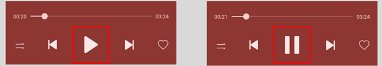

# 控件状态变化场景

更新时间：2026-03-09 02:50:43

来源：https://developer.huawei.com/consumer/cn/doc/harmonyos-guides/scenario-component-status-change

##### 开发实例

例如下图，播放暂停按钮对应着两种状态，在状态切换时需要实时变化对应的标注信息。
 



 
```text
import { PromptAction } from "@kit.ArkUI"

const RESOURCE_STR_PLAY = $r('app.media.play') // 此处为图片资源，请替换为本地图片
const RESOURCE_STR_PAUSE = $r('app.media.pause') // 此处为图片资源，请替换为本地图片

@Entry
@Component
export struct Rule_2_1_11 {
  title: string = 'Rule 2.1.8'
  @State isPlaying: boolean = true
  uiContext: UIContext = this.getUIContext();
  promptAction: PromptAction = this.uiContext.getPromptAction();
  play() {
    // play audio file
  }

  pause() {
    // pause playing of audio file
  }

  build() {
    NavDestination() {
      Column() {
        Flex({
          direction: FlexDirection.Column,
          alignItems: ItemAlign.Center,
          justifyContent: FlexAlign.Center,
        }) {
          Row() {

            Image(this.isPlaying ? RESOURCE_STR_PAUSE : RESOURCE_STR_PLAY)
              .width(50)
              .height(50)
              .onClick(() => {
                this.promptAction.showToast({
                  message :this.isPlaying ? "Play" : "Pause"
                })
                this.isPlaying = !this.isPlaying
                if (this.isPlaying) {
                  this.play()
                } else {
                  this.pause()
                }
              })
              .accessibilityText(this.isPlaying ? 'Pause' : 'Play') // 设置可访问性框架的注释信息
          }
        }
        .width('100%')
        .height('100%')
        .backgroundColor(Color.White)
      }
    }.title(this.title)
  }
}
```
