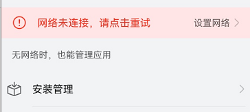

# 操作错误场景

更新时间：2026-03-09 02:50:43

来源：https://developer.huawei.com/consumer/cn/doc/harmonyos-guides/scenario-operation-error

#### 设计场景

比如网络连接错误，或者其他警告信息，不能仅仅以颜色区分，需要实时告诉用户错误提示和改进方法。
 



 
  

#### 开发实例

如下是一个将连接中断播报出来的例子。
 
```text
@Entry
@Component
export struct Rule_2_1_9 {
  title: string = 'Rule 2.1.9'

  build() {
    NavDestination() {
      Column() {
        Flex({
          direction: FlexDirection.Column,
          alignItems: ItemAlign.Center,
          justifyContent: FlexAlign.Center,
        }) {
          Row() {
            Text('Connection state').fontSize(30)
          }
          Row() {
            Radio({ value: 'Radio1', group: 'radioGroup' }).checked(true)
              .radioStyle({
                checkedBackgroundColor: Color.Red
              })
              .height(50)
              .width(50)
              .onChange((isChecked: boolean) => {
                console.log('Radio1 status is ' + isChecked)
              })
            Text('Connection interrupted').fontColor(Color.Red)
          }.width('80%')
          .accessibilityGroup(true) //将单选和文本合并到单个对象中
        }
        .width('100%')
        .height('100%')
        .backgroundColor(Color.White)
      }
    }.title(this.title)
  }
}
```
