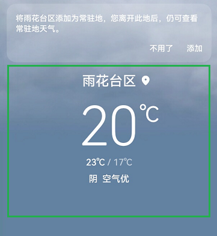

# 组合场景

更新时间：2026-03-09 02:50:43

来源：https://developer.huawei.com/consumer/cn/doc/harmonyos-guides/scenario-multicomponent

#### 设计场景

在一些场景中，一个功能上完整的UI对象可能是由若干个更小的UI组件组合而成的。若每一个小的UI组件都可以获焦并朗读，则会造成信息冗余和效率降低。同时由于可聚焦的组件过多过细，也会影响触摸浏览时走焦的性能体验。在这种情况下，将它们在功能或语义上聚合成一个自然组并作为一个独立可获焦的UI元素来向视障用户表达内容更加合理，且更加高效。总体原则是：对于表示同一个对象信息的多个组件，需要进行组合标注，对外只暴露一个无障碍焦点。
 



 
  

#### 开发实例

如下，可以将多个控件设置为一个组，通过对组设置朗读标签，达到整组播报的效果，组内的子控件设置不可获取焦点。
 
```text
@Entry
@Component
export struct Rule_2_1_4 {
  title: string = 'Rule 2.1.4'

  build() {
    NavDestination() {
      Column() {

        Row() {
          //默认只有子组件才能获取焦点
          //日期、天气、温度等信息在每个组件独立获取焦点时分别朗读
          //在组合式组件规范里是不正确的。
          Text("23 Dec 2023") // 日期信息。组件可独立对焦和朗读
            .fontSize(32)
            .fontColor(Color.Red)
            .fontWeight(FontWeight.Bold)
            .textAlign(TextAlign.Center)
            .margin({ right: 20 })

          Column() // 天气信息。组件可独立对焦和朗读
            .backgroundColor(Color.Blue)
            .width(50)
            .height(50)
            .accessibilityText("Snow") // 当该组件被屏幕阅读器选中时，该组件不包含文本信息，因此将读取此文本
            .margin({ right: 20 })

          Text("-1") // 温度信息。组件可独立对焦和朗读
            .fontSize(20)
            .fontColor(Color.Green)
            .fontWeight(FontWeight.Bold)
            .textAlign(TextAlign.Center)
        }
        .height(50)
        .margin({ bottom: 20 })

        Row() {
          //因为accessibilityGroup属性设置为true，子组件无法获取焦点。
          //获取焦点时，日期、天气、温度信息一起朗读
          //此时只有Row可以获取焦点，这是符合组合式组件规范的。
          Text("24 Dec 2023") //日期信息。组件无法聚焦，无法朗读，因为父组件的accessibilityGroup属性设置为true
            .fontSize(32)
            .fontColor(Color.Red)
            .fontWeight(FontWeight.Bold)
            .textAlign(TextAlign.Center)
            .margin({ right: 20 })

          Column() //天气信息组件无法聚焦，无法朗读，因为父组件的accessibilityGroup为true
            .backgroundColor(Color.Yellow)
            .width(50)
            .height(50)
            .accessibilityText("Sunny") // 组件不包含文本信息，当组件被屏幕阅读器选中时，因此将读取此文本
            .margin({ right: 20 })

          Text("-7") // //温度信息。组件无法聚焦，无法朗读因为父组件的accessibilityGroup为true
            .fontSize(20)
            .fontColor(Color.Green)
            .fontWeight(FontWeight.Bold)
            .textAlign(TextAlign.Center)
        }
        .height(50)
        .margin({ bottom: 20 })
        .accessibilityGroup(true) // 将accessibilityGroup属性设置为true
      }
      .alignItems(HorizontalAlign.Start)
      .padding(10)
    }
    .title(this.title)
  }
}
```
