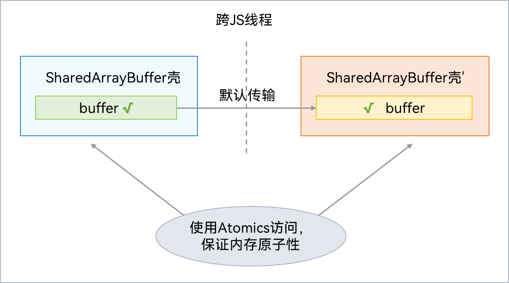

# SharedArrayBuffer对象

更新时间：2026-05-26 06:48:54

来源：https://developer.huawei.com/consumer/cn/doc/harmonyos-guides/shared-arraybuffer-object

SharedArrayBuffer内部包含一块Native内存，其JS对象壳被分配在虚拟机本地堆（LocalHeap）。支持跨并发实例间共享Native内存，但是对共享Native内存的访问及修改需要采用Atomics类，防止数据竞争。SharedArrayBuffer可用于多个并发实例间的状态或数据共享。通信过程如下图所示：
 



  

#### 使用示例

使用TaskPool传递Int32Array对象，实现如下：
 
```ArkTS
import { taskpool } from '@kit.ArkTS';

@Concurrent
function transferAtomics(arg1: Int32Array) {
  console.info('wait begin::');
  // 使用Atomics进行操作
  let res = Atomics.wait(arg1, 0, 0, 3000);
  return res;
}

@Entry
@Component
struct sharedArrayBuffer {
  @State message: string = 'Hello World';

  build() {
    RelativeContainer() {
      Text(this.message)
        .id('HelloWorld')
        .fontSize(50)
        .fontWeight(FontWeight.Bold)
        .alignRules({
          center: { anchor: '__container__', align: VerticalAlign.Center },
          middle: { anchor: '__container__', align: HorizontalAlign.Center }
        })
        .onClick(() => {
          // 定义可共享对象
          let sab: SharedArrayBuffer = new SharedArrayBuffer(20);
          let int32 = new Int32Array(sab);
          let task: taskpool.Task = new taskpool.Task(transferAtomics, int32);
          taskpool.execute(task).then((res) => {
            console.info('this res is: ' + res);
          });
          setTimeout(() => {
            Atomics.notify(int32, 0, 1);
          }, 1000);
          this.message = 'success';
        })
    }
    .height('100%')
    .width('100%')
  }
}
```
