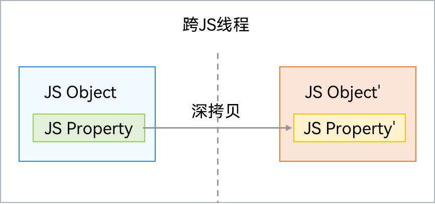

# 普通对象

更新时间：2026-04-30 02:41:24

来源：https://developer.huawei.com/consumer/cn/doc/harmonyos-guides/normal-object

普通对象跨线程时通过拷贝（序列化）形式传递，两个线程的对象内容一致，但指向各自线程的隔离内存区间，被分配在各自线程的虚拟机本地堆（LocalHeap）。序列化支持类型包括：除Symbol之外的基础类型、Date、String、RegExp、Array、Map、Set、Object（仅限简单对象，比如通过"{}"或者"new Object"创建，普通对象仅支持传递属性，不支持传递其原型及方法）、ArrayBuffer、TypedArray。通信过程如图所示：

 


> [!NOTE]
> 普通类实例对象跨线程通过拷贝形式传递，只能传递数据，类方法会丢失。使用@Sendable装饰器标识为Sendable类后，类实例对象跨线程传递后，可携带类方法。


## 使用示例

此处提供了一个传递普通对象的示例，具体实现如下：
```text
// 自定义class TestA
export class TestA {
  constructor(name: string) {
    this.name = name;
  }
  name: string = 'ClassA';
}
```


```text
import { taskpool } from '@kit.ArkTS';
import { BusinessError } from '@kit.BasicServicesKit';
import { TestA } from './Test';

@Concurrent
async function test1(arg: TestA) {
  console.info('TestA name is: ' + arg.name);
}

@Entry
@Component
struct Index {
  @State message: string = 'Hello World';

  build() {
    RelativeContainer() {
      Text(this.message)
        .id('HelloWorld')
        .fontSize(50)
        .fontWeight(FontWeight.Bold)
        .alignRules({
          center: { anchor: '__container__', align: VerticalAlign.Center },
          middle: { anchor: '__container__', align: HorizontalAlign.Center }
        })
        .onClick(() => {
          // 1. 创建Test实例objA
          let objA = new TestA('TestA');
          // 2. 创建任务task，将objA传递给该任务，objA非sendable对象，通过序列化传递给子线程
          let task = new taskpool.Task(test1, objA);
          // 3. 执行任务
          taskpool.execute(task).then(() => {
            console.info('taskpool: execute task success!');
          }).catch((e:BusinessError) => {
            console.error(`taskpool: execute task: Code: ${e.code}, message: ${e.message}`);
          })
          this.message = 'success';
        })
    }
    .height('100%')
    .width('100%')
  }
}
```
