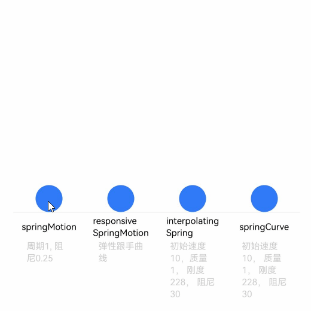

# 弹簧曲线

更新时间：2026-04-30 02:41:24

来源：https://developer.huawei.com/consumer/cn/doc/harmonyos-guides/arkts-spring-curve

阻尼弹簧曲线（以下简称弹簧曲线）对应的阻尼弹簧系统中，偏离平衡位置的物体一方面受到弹簧形变产生的反向作用力，被迫发生振动。另一方面，阻尼的存在为物体振动提供阻力。除阻尼为0的特殊情况，物体在振动过程中振幅不断减小，且最终趋于0，其轨迹对应的动画曲线自然连续。

采用弹簧曲线的动画在达终点时动画速度为0，不会产生动画“戛然而止”的观感，以避免影响用户体验。

ArkUI提供了四种阻尼弹簧曲线接口。


关于弹簧曲线完整的使用示例和参考效果如下，开发者也可参考[动画衔接](https://developer.huawei.com/consumer/cn/doc/harmonyos-guides/arkts-animation-smoothing)，掌握使用responsiveSpringMotion和springMotion进行手势和动画之间的衔接。

弹簧曲线的示例代码和效果如下。


```text
import { curves } from '@kit.ArkUI';
import { common } from '@kit.AbilityKit';

class Spring {
  public title: string;
  public subTitle: ResourceStr;
  public iCurve: ICurve;

  constructor(title: string, subTitle: ResourceStr, iCurve: ICurve) {
    this.title = title;
    this.iCurve = iCurve;
    this.subTitle = subTitle;
  }
}

// 弹簧组件
@Component
struct Motion {
  @Prop dRotate: number = 0;
  private title: string = '';
  private subTitle: ResourceStr = '';
  private iCurve: ICurve | undefined = undefined;

  build() {
    Column() {
      Circle()
        .translate({ y: this.dRotate })
        .animation({ curve: this.iCurve, iterations: -1 })
        .foregroundColor('#317AF7')
        .width(30)
        .height(30)

      Column() {
        Text(this.title)
          .fontColor(Color.Black)
          .fontSize(10).height(30)
        Text(this.subTitle)
          .fontColor(0xcccccc)
          .fontSize(10).width(50)
      }
      .borderWidth({ top: 1 })
      .borderColor(0xf5f5f5)
      .width(80)
      .alignItems(HorizontalAlign.Center)
      .height(100)

    }
    .height(110)
    .margin({ bottom: 5 })
    .alignItems(HorizontalAlign.Center)
  }
}

@Entry
@Component
export struct SpringCurve {
  private context = this.getUIContext().getHostContext() as common.UIAbilityContext;
  @State dRotate: number = 0;
  private springs: Spring[] = [
    // 请将$r('app.string.springCurve_text1')替换为实际资源文件，在本示例中该资源文件的value值为"周期1, 阻尼0.25"
    new Spring('springMotion', $r('app.string.springCurve_text1'), curves.springMotion(1, 0.25)),
    // 请将$r('app.string.springCurve_text2')替换为实际资源文件，在本示例中该资源文件的value值为"弹性跟手曲线"
    new Spring('responsive' + '\n' + 'SpringMotion', $r('app.string.springCurve_text2'),
      curves.responsiveSpringMotion(1, 0.25)),
    // 请将$r('app.string.springCurve_text3')替换为实际资源文件，在本示例中该资源文件的value值为"初始速度10， 质量1， 刚度228， 阻尼30"
    new Spring('interpolating' + '\n' + 'Spring', $r('app.string.springCurve_text3'),
      curves.interpolatingSpring(10, 1, 228, 30)),
    // 请将$r('app.string.springCurve_text1')替换为实际资源文件，在本示例中该资源文件的value值为"周期1, 阻尼0.25"
    new Spring('springCurve', $r('app.string.springCurve_text1'),
      curves.springCurve(10, 1, 228, 30))
  ];

  build() {
    Row() {
      ForEach(this.springs, (item: Spring) => {
        Motion({
          title: item.title,
          subTitle: item.subTitle,
          iCurve: item.iCurve,
          dRotate: this.dRotate
        })
      })
    }
    .justifyContent(FlexAlign.Center)
    .alignItems(VerticalAlign.Bottom)
    .width('100%')
    .height(437)
    .margin({ top: 20 })
    .onClick(() => {
      this.dRotate = -50;
    })
  }
}
```


