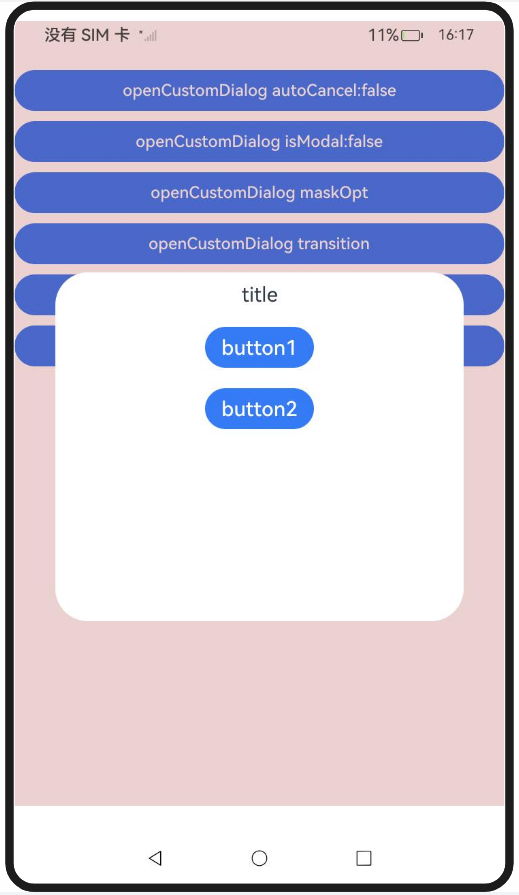
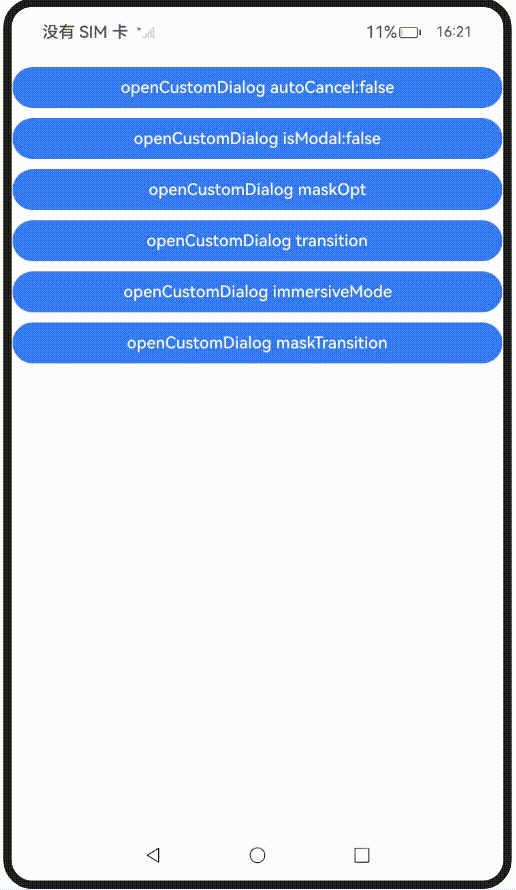
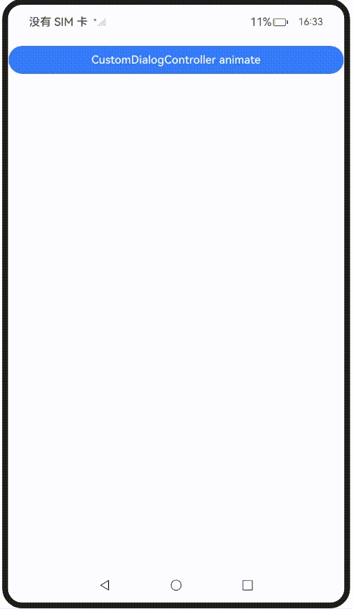
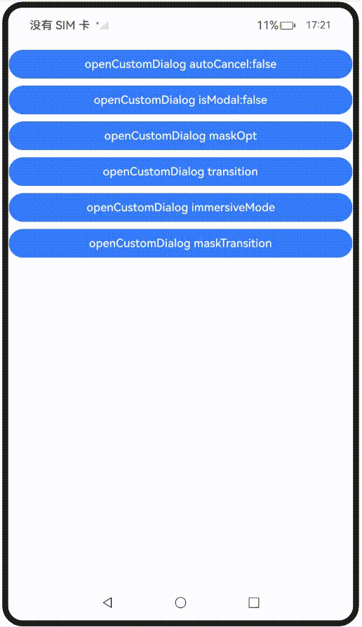

# 弹出框蒙层控制

更新时间：2026-05-26 06:48:54

来源：https://developer.huawei.com/consumer/cn/doc/harmonyos-guides/arkts-dialog-mask

开发者对弹出框的定制不仅限于弹出框里的内容，对弹出框蒙层的定制需求也逐渐增加。本文介绍ArkUI弹出框的蒙层控制，包括点击蒙层时是否消失、蒙层区域、蒙层颜色和蒙层动画等特性。


##### 使用约束

ArkUI提供多种弹出框，不同类型的弹出框具备不同的蒙层定制能力。详情请参阅下表：

| 接口&组件 | autoCancel | maskRect | isModal | immersiveMode |
| --- | --- | --- | --- | --- |
| openCustomDialog | 支持 | 支持 | 支持 | 支持 |
| openCustomDialogWithController | 支持 | 支持 | 支持 | 支持 |
| presentCustomDialog | 支持 | 支持 | 支持 | 支持 |
| updateCustomDialog | 支持 | 不支持 | 不支持 | 不支持 |
| CustomDialog | 支持 | 支持 | 支持 | 支持 |
| showDialog | 不支持 | 支持 | 支持 | 支持 |
| showAlertDialog | 支持 | 支持 | 支持 | 支持 |
| showActionSheet | 支持 | 支持 | 支持 | 支持 |
| showActionMenu | 不支持 | 不支持 | 支持 | 支持 |
| showDatePickerDialog | 不支持 | 支持 | 不支持 | 不支持 |
| CalendarPickerDialog | 不支持 | 不支持 | 不支持 | 不支持 |
| showTimePickerDialog | 不支持 | 支持 | 不支持 | 不支持 |
| showTextPickerDialog | 不支持 | 支持 | 不支持 | 不支持 |


> [!NOTE]
> 设置autoCancel参数，可控制弹出框蒙层被点击时是否消失。 设置maskRect参数，可定制弹出框的蒙层的大小和位置。此外，蒙层范围内的事件无法透传，而蒙层范围外的事件可以透传。 设置isModal参数，可定制弹出框的模态状态：非模态弹出框无蒙层，支持与周围组件交互；模态弹出框有蒙层，禁止与周围组件交互。 从API version 15开始，当levelMode属性设置为LevelMode.EMBEDDED时，设置immersiveMode参数，可定制弹出框蒙层是否延伸至状态栏及导航栏。


| 接口&组件 | maskColor | transition | maskTransition |
| --- | --- | --- | --- |
| openCustomDialog | 支持 | 支持 | 支持 |
| openCustomDialogWithController | 支持 | 支持 | 支持 |
| presentCustomDialog | 支持 | 支持 | 支持 |
| updateCustomDialog | 支持 | 不支持 | 不支持 |
| CustomDialog | 支持 | 不支持（可由openAnimation和closeAnimation替代） | 不支持 |
| showDialog | 不支持 | 不支持 | 不支持 |
| showAlertDialog | 不支持 | 支持 | 不支持 |
| showActionSheet | 不支持 | 支持 | 不支持 |
| showActionMenu | 不支持 | 不支持 | 不支持 |
| showDatePickerDialog | 不支持 | 不支持 | 不支持 |
| CalendarPickerDialog | 不支持 | 不支持 | 不支持 |
| showTimePickerDialog | 不支持 | 不支持 | 不支持 |
| showTextPickerDialog | 不支持 | 不支持 | 不支持 |


> [!NOTE]
> 设置maskColor参数，可定制弹出框蒙层的颜色。 设置openAnimation参数，可定制弹出框的进入动画，同时影响蒙层动画。该接口仅支持简单的动画设置，不支持复杂动画定制。 设置closeAnimation参数，可定制弹出框的退出动画，同时影响蒙层动画。该接口仅支持简单的动画设置，不支持复杂动画定制。 设置transition参数，可定制弹出框的进入和退出动画，同时影响蒙层动画。 从API version 19开始，设置maskTransition参数，可定制弹出框的蒙层动画。


##### 弹出框蒙层显隐控制

通过autoCancel和isModal属性控制弹出框的蒙层显隐。

设置autoCancel为false，取消默认点击蒙层时弹窗消失。

```ArkTS
autoCancelOpt: promptAction.CustomDialogOptions = {
    builder: () => {
      this.myBuilder();
    },
    autoCancel: false,
  } as promptAction.CustomDialogOptions;
  // ···
  build() {
    NavDestination() {
      Column() {
        Button('openCustomDialog autoCancel:false')
          .width('100%')
          .margin({ top: 10 })
          .onClick(() => {
            this.getUIContext().getPromptAction().openCustomDialog(this.autoCancelOpt)
          })
         
        // ···
      }
      .width('100%')
      .height('100%')
    }
  }
```





设置isModal为false，将默认的模态弹出框变为非模态弹出框。

```ArkTS
modalOpt: promptAction.CustomDialogOptions = {
    builder: () => {
      this.myBuilder();
    },
    isModal: false,
  } as promptAction.CustomDialogOptions;
  // ···
  build() {
    NavDestination() {
      Column() {
        // ···
        Button('openCustomDialog isModal:false')
          .width('100%')
          .margin({ top: 10 })
          .onClick(() => {
            this.getUIContext().getPromptAction().openCustomDialog(this.modalOpt)
          })

        // ···
      }
      .width('100%')
      .height('100%')
    }
  }
```





##### 弹出框蒙层样式控制

该示例通过maskRect、immersiveMode和maskColor展示弹出框在蒙层样式控制方面的能力。

设置maskRect和maskColor，实现蒙层区域和蒙层颜色的设置。

```ArkTS
maskOpt: promptAction.CustomDialogOptions = {
    builder: () => {
      this.myBuilder();
    },
    maskRect: {
      x: 0,
      y: 10,
      width: '100%',
      height: '90%'
    },
    maskColor: '#33AA0000'
  } as promptAction.CustomDialogOptions;
  // ···
  build() {
    NavDestination() {
      Column() {
        // ···
        Button('openCustomDialog maskOpt')
          .width('100%')
          .margin({ top: 10 })
          .onClick(() => {
            this.getUIContext().getPromptAction().openCustomDialog(this.maskOpt)
          })

        // ···
      }
      .width('100%')
      .height('100%')
    }
  }
```


在levelMode为LevelMode.EMBEDDED下，展示不同immersiveMode对蒙层在导航栏和状态栏的延伸效果。

```ArkTS
@State immersiveMode: ImmersiveMode = ImmersiveMode.DEFAULT;
  // ···
  build() {
    NavDestination() {
      Column() {
        // ···
        Button('openCustomDialog immersiveMode')
          .width('100%')
          .margin({ top: 10 })
          .onClick(() => {
            this.immersiveMode =
              this.immersiveMode == ImmersiveMode.DEFAULT ? ImmersiveMode.EXTEND : ImmersiveMode.DEFAULT;
            this.getUIContext().getPromptAction().openCustomDialog({
              builder: () => {
                this.myBuilder();
              },
              levelMode: LevelMode.EMBEDDED,
              immersiveMode: this.immersiveMode,
            })
          })

        // ···
      }
      .width('100%')
      .height('100%')
    }
  }
```


##### 弹出框蒙层动画控制

该示例通过transition和maskTransition分别展示弹出框在蒙层动画方面的能力。

设置transition，实现弹出框与蒙层整体的动画。

```ArkTS
transitionOpt: promptAction.CustomDialogOptions = {
    builder: () => {
      this.myBuilder();
    },
    transition: TransitionEffect.OPACITY.animation({ duration: 3000 })
  } as promptAction.CustomDialogOptions;
  // ···
  build() {
    NavDestination() {
      Column() {
        // ···
        Button('openCustomDialog transition')
          .width('100%')
          .margin({ top: 10 })
          .onClick(() => {
            this.getUIContext().getPromptAction().openCustomDialog(this.transitionOpt);
          })

        // ···
      }
      .width('100%')
      .height('100%')
    }
  }
```





设置maskTransition，实现弹出框中蒙层单独的动画定制能力。

```ArkTS
Button('openCustomDialog maskTransition')
  .width('100%')
  .margin({ top: 10 })
  .onClick(() => {
    this.getUIContext().getPromptAction().openCustomDialog({
      builder: () => {
        this.myBuilder();
      },
      maskTransition: TransitionEffect.OPACITY.animation({ duration: 2000 })
        .combine(TransitionEffect.rotate({ z: 1, angle: 180 })),
    });
  })
```





[CustomDialog](https://developer.huawei.com/consumer/cn/doc/harmonyos-guides/arkts-common-components-custom-dialog)虽然不支持transition接口，但与之对应的openAnimation和closeAnimation接口在动画的打开和关闭时可进行定制，示例代码如下：

```ArkTS
// xxx.ets

@CustomDialog
@Component
struct CustomDialogAnimationBuilder {
  controller?: CustomDialogController;

  build() {
    Column() {
      Text('title')
        .margin(10)
        .fontSize(20)
      Button('button1')
        .margin(10)
        .fontSize(20)
        .onClick(() => {
          this.controller?.close();
        })
      Button('button2')
        .margin(10)
        .fontSize(20)
        .onClick(() => {
          this.controller?.close();
        })
    }.width('100%')
    .height('50%')
  }
}

@Entry
@Component
export struct CustomDialogAnimation {
  animationController: CustomDialogController | null =
    new CustomDialogController({
      builder: CustomDialogAnimationBuilder(),
      closeAnimation: { duration: 2000 },
      openAnimation: { duration: 2000 }
    });

  aboutToDisappear(): void {
    this.animationController = null;
  }

  build() {
    NavDestination() {
      Column() {
        Button('CustomDialogController animate')
          .width('100%')
          .margin({ top: 10 })
          .onClick(() => {
            this.animationController?.open();
          })
      }
    }
  }
}
```


##### 完整示例

```ArkTS
// xxx.ets
import { ImmersiveMode, LevelMode, promptAction } from '@kit.ArkUI';

@Entry
@Component
export struct CustomDialogControl {
  @State immersiveMode: ImmersiveMode = ImmersiveMode.DEFAULT;

  autoCancelOpt: promptAction.CustomDialogOptions = {
    builder: () => {
      this.myBuilder();
    },
    autoCancel: false,
  } as promptAction.CustomDialogOptions;

  modalOpt: promptAction.CustomDialogOptions = {
    builder: () => {
      this.myBuilder();
    },
    isModal: false,
  } as promptAction.CustomDialogOptions;

  maskOpt: promptAction.CustomDialogOptions = {
    builder: () => {
      this.myBuilder();
    },
    maskRect: {
      x: 0,
      y: 10,
      width: '100%',
      height: '90%'
    },
    maskColor: '#33AA0000'
  } as promptAction.CustomDialogOptions;
  
  transitionOpt: promptAction.CustomDialogOptions = {
    builder: () => {
      this.myBuilder();
    },
    transition: TransitionEffect.OPACITY.animation({ duration: 3000 })
  } as promptAction.CustomDialogOptions;

  @Builder
  myBuilder() {
    Column() {
      Text('title').margin(10).fontSize(20)
      Button('button1').margin(10).fontSize(20)
      Button('button2').margin(10).fontSize(20)
    }.width('100%').height('50%')
  }

  build() {
    NavDestination() {
      Column() {
        Button('openCustomDialog autoCancel:false')
          .width('100%')
          .margin({ top: 10 })
          .onClick(() => {
            this.getUIContext().getPromptAction().openCustomDialog(this.autoCancelOpt)
          })
         
        Button('openCustomDialog isModal:false')
          .width('100%')
          .margin({ top: 10 })
          .onClick(() => {
            this.getUIContext().getPromptAction().openCustomDialog(this.modalOpt)
          })

        Button('openCustomDialog maskOpt')
          .width('100%')
          .margin({ top: 10 })
          .onClick(() => {
            this.getUIContext().getPromptAction().openCustomDialog(this.maskOpt)
          })

        Button('openCustomDialog transition')
          .width('100%')
          .margin({ top: 10 })
          .onClick(() => {
            this.getUIContext().getPromptAction().openCustomDialog(this.transitionOpt);
          })

        Button('openCustomDialog immersiveMode')
          .width('100%')
          .margin({ top: 10 })
          .onClick(() => {
            this.immersiveMode =
              this.immersiveMode == ImmersiveMode.DEFAULT ? ImmersiveMode.EXTEND : ImmersiveMode.DEFAULT;
            this.getUIContext().getPromptAction().openCustomDialog({
              builder: () => {
                this.myBuilder();
              },
              levelMode: LevelMode.EMBEDDED,
              immersiveMode: this.immersiveMode,
            })
          })

        Button('openCustomDialog maskTransition')
          .width('100%')
          .margin({ top: 10 })
          .onClick(() => {
            this.getUIContext().getPromptAction().openCustomDialog({
              builder: () => {
                this.myBuilder();
              },
              maskTransition: TransitionEffect.OPACITY.animation({ duration: 2000 })
                .combine(TransitionEffect.rotate({ z: 1, angle: 180 })),
            });
          })
      }
      .width('100%')
      .height('100%')
    }
  }
}
```


