# 管理软键盘

更新时间：2026-04-20 06:34:33

来源：https://developer.huawei.com/consumer/cn/doc/harmonyos-guides/arkts-manage-keyboard

软键盘是用户交互的重要途径，提供文本输入功能。本文介绍在使用系统输入框组件（[TextInput](https://developer.huawei.com/consumer/cn/doc/harmonyos-references/ts-basic-components-textinput)、[TextArea](https://developer.huawei.com/consumer/cn/doc/harmonyos-references/ts-basic-components-textarea)、[Search](https://developer.huawei.com/consumer/cn/doc/harmonyos-references/ts-basic-components-search)、[RichEditor](https://developer.huawei.com/consumer/cn/doc/harmonyos-references/ts-basic-components-richeditor)）时，如何控制软键盘的弹出和收起。


## 弹出软键盘

默认情况下，当焦点转移到输入框时，软键盘将自动弹出。 焦点转移到输入框的方法主要有： 人机交互获得焦点，例如：单击、双击、长按输入框。 通过代码设置焦点，例如：使用[requestFocus](https://developer.huawei.com/consumer/cn/doc/harmonyos-references/ts-universal-attributes-focus#requestfocus9)或[defaultFocus](https://developer.huawei.com/consumer/cn/doc/harmonyos-references/ts-universal-attributes-focus#defaultfocus9)方法，将焦点转移到输入框。 使用外接键盘的按键走焦，例如：Tab键、Shift+Tab键、方向键，按下后可以转移焦点。外接键盘时输入框获焦，不会弹出系统软键盘，会显示物理键盘悬浮栏。 软键盘分为系统软键盘和自定义键盘。输入框的[enableKeyboardOnFocus](https://developer.huawei.com/consumer/cn/doc/harmonyos-references/ts-basic-components-textarea#enablekeyboardonfocus10)属性会影响系统软键盘弹出。当enableKeyboardOnFocus属性设置为false时，只有通过点击、按键走焦才能弹出系统软键盘。enableKeyboardOnFocus属性对自定义键盘的弹出无影响。外接物理键盘会阻止弹出系统软键盘，对自定义键盘无影响。

## 人机交互获得焦点

以下示例展示了单击、双击和长按输入框时，软键盘弹出效果。
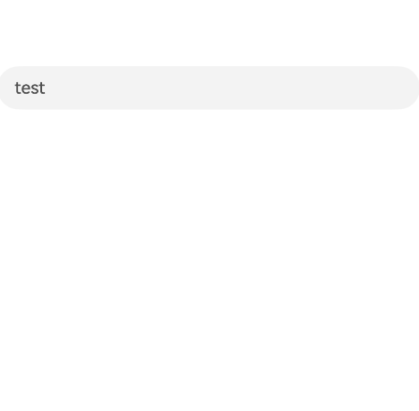

## 通过代码请求焦点

可以通过代码控制将焦点转移到输入框，包括使用[defaultFocus](https://developer.huawei.com/consumer/cn/doc/harmonyos-references/ts-universal-attributes-focus#defaultfocus9)和[requestFocus](https://developer.huawei.com/consumer/cn/doc/harmonyos-references/ts-universal-attributes-focus#requestfocus9)方法。更多细节请参见[支持焦点处理](https://developer.huawei.com/consumer/cn/doc/harmonyos-guides/arkts-common-events-focus-event)。 以下示例展示了点击按钮时，焦点转移到输入框并弹出软键盘的方法。
```text
@Entry
@Component
struct demo {
  controller: TextInputController = new TextInputController();
  @State inputValue: string = "";

  build() {
    Column({ space: 20 }) {
      Button('输入框请求焦点').onClick(() => {
        this.getUIContext().getFocusController().requestFocus("textInput1")
      })
      TextInput({ controller: this.controller, text: this.inputValue })
        .id("textInput1")
    }
    .height('100%')
    .width('80%')
    .margin('10%')
    .justifyContent(FlexAlign.Center)
  }
}
```

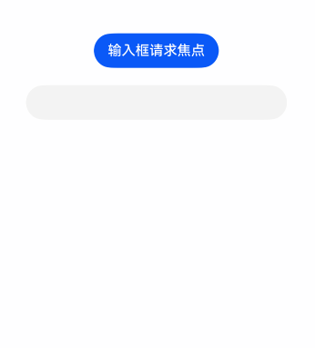

## 使用外接键盘的按键走焦

外接物理键盘时，按下物理键盘的Tab键、Shift+Tab键、方向键可以转移焦点。按键走焦到输入框时，显示物理键盘悬浮栏。更多细节请参见[支持焦点处理](https://developer.huawei.com/consumer/cn/doc/harmonyos-guides/arkts-common-events-focus-event#走焦规范)。 以下示例展示了外接键盘时，多次按下Tab键，焦点转移到TextInput并弹出软键盘的场景。当按下Tab键时，焦点在页面中的三个组件之间转移，可以从Text的蓝色边框或者TextInput中闪烁的光标观察到焦点转移。当TextInput获焦时，显示光标，同时显示物理键盘悬浮栏。
```text
@Entry
@Component
struct Index {
  build() {
    Column({ space: 20 }) {
      Text('Text.focusable(true)')
        .focusable(true)

      TextInput({ placeholder: "TextInput" })

      TextInput({ placeholder: "TextInput" })
    }
    .height('100%')
    .width('80%')
    .margin('10%')
    .justifyContent(FlexAlign.Center)
  }
}
```

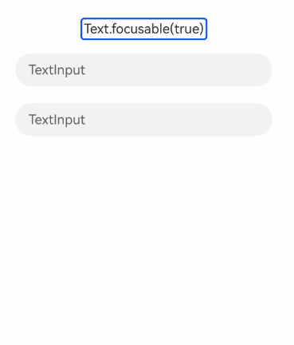

## 收起软键盘

当输入框获得焦点时，软键盘会弹出；然而，当输入框失焦时，软键盘不会自动收起，而是由下一个获得焦点的组件决定是否收起软键盘。如果该组件需要使用软键盘，软键盘将继续显示；如果该组件不需要软键盘，则软键盘将被收起。通常情况下，除输入框外的其他组件不需要软键盘。 收起软键盘的常见场景如下所示，下列场景都会将焦点转移到不需要软键盘的组件上并收起软键盘。 用户主动点击软键盘的关闭按钮。 用户正在拖拽文本。 输入框接收到了侧滑手势。 页面发生切换。 通过输入框的[TextInputController](https://developer.huawei.com/consumer/cn/doc/harmonyos-references/ts-basic-components-textinput#textinputcontroller8)退出编辑态。 焦点从输入框转移到另一个不需要软键盘的组件。

## 点击软键盘的关闭按钮

软键盘自带关闭按钮，用户点击该按钮时，软键盘将被收起。 以下示例展示了用户主动点击软键盘关闭按钮的场景。
```text
@Entry
@Component
struct Index {
  build() {
    Column({ space: 20 }) {
      Blank()
        .height(350)
      Flex({ direction: FlexDirection.Row }) {
        TextInput({ placeholder: 'TextInput' })
      }
      .width(250)
    }
    .height('100%')
    .width('90%')
    .padding('5%')
  }
}
```

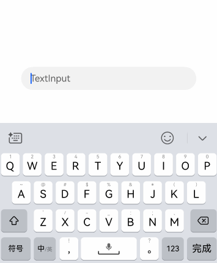

## 拖拽文本

用户主动拖拽输入框的文本，开始拖拽时，软键盘将收起。更多细节请参见[支持统一拖拽](https://developer.huawei.com/consumer/cn/doc/harmonyos-guides/arkts-common-events-drag-event)。 以下示例展示了用户主动拖拽文本时，软键盘被收起的场景。
```text
@Entry
@Component
struct Index {
  build() {
    Column({ space: 20 }) {
      Blank()
        .height(350)
      Flex({ direction: FlexDirection.Row }) {
        TextInput({ text: '用户主动拖拽文本' })
          .selectAll(true)
          .defaultFocus(true)
      }
      .width(250)
    }
    .height('100%')
    .width('90%')
    .padding('5%')
  }
}
```

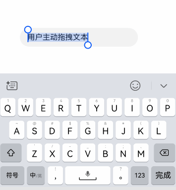

## 接收侧滑手势

下面的动图展示了“用户侧滑时软键盘收起”的场景。


## 页面发生切换

以下示例展示了页面切换过程中，软键盘收起的场景。 页面跳转写法请参考[Navigation页面路由](https://developer.huawei.com/consumer/cn/doc/harmonyos-guides/arkts-navigation-jump)。 跳转前的页面
```text
// Index.ets
@Entry
@Component
struct Index {
  // 创建一个导航控制器对象并传入Navigation
  pathStack: NavPathStack = new NavPathStack()

  build() {
    Navigation(this.pathStack) {
      Column({ space: 30 }) {
        Blank().height(150)
        TextInput({ placeholder: 'TextInput' })
        Button('跳转到下一个页面')
          .onClick(() => {
            this.pathStack.pushPath({ name: 'demo_text_1' })
          })
      }
      .height('100%')
      .width('80%')
      .margin('10%')
    }
    .title('用Navigation实现页面跳转')
  }
}
```

跳转后的页面
```text
// demo_text_1.ets
@Builder
export function demo_text_1_Builder() {
  demo_text_1()
}

@Component
struct demo_text_1 {
  pathStack: NavPathStack = new NavPathStack()
  // 跳转后的页面
  build() {
    NavDestination() {
      Column({ space: 20 }) {
        Text('跳转后的页面没有需要键盘的组件')
      }
      .width('100%')
      .height('100%')
      .justifyContent(FlexAlign.Center)
    }
    .onReady((context: NavDestinationContext) => {
      this.pathStack = context.pathStack
    })
  }
}
```

系统路由表配置 在跳转目标模块的配置文件module.json5添加路由表配置
```text
{
  "module": {
    // ...
    "routerMap": "$profile:route_map",
    // ...
  }
}
```

在工程resources/base/profile中创建route_map.json文件。添加如下配置信息。
```text
// route_map.json
{
  "routerMap": [
    {
      "name": "demo_text_1",
      "pageSourceFile": "src/main/ets/pages/demo_text_1.ets",
      "buildFunction": "demo_text_1_Builder"
    }
  ]
}
```

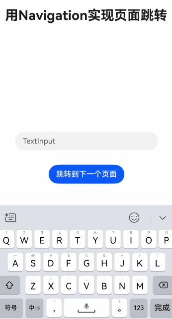

## 通过输入框的controller退出编辑态

通过输入框的[TextInputController](https://developer.huawei.com/consumer/cn/doc/harmonyos-references/ts-basic-components-textinput#textinputcontroller8)调用[stopEditing](https://developer.huawei.com/consumer/cn/doc/harmonyos-references/ts-basic-components-textinput#stopediting10)方法后，软键盘会自动收起。 以下示例展示了如何通过[TextInputController](https://developer.huawei.com/consumer/cn/doc/harmonyos-references/ts-basic-components-textinput#textinputcontroller8)收起软键盘。
```text
struct textInputControllerCloseKeyboard {
  controller: TextInputController = new TextInputController();
  @State inputValue: string = '';

  build() {
    NavDestination() {
    Column({ space: 30 }) {
      // 请将$r('app.string.close_keyboard')替换为实际资源文件，在本示例中该资源文件的value值为"close keyboard"
      Button($r('app.string.close_keyboard')).onClick(() => {
        this.controller.stopEditing()
      })
      TextInput({ controller: this.controller, text: this.inputValue })
    }
    .width('80%')
    .height('100%')
    .margin('10%')
    .justifyContent(FlexAlign.Center)
    }
  }
}
```

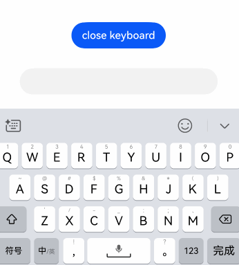

## 焦点转移到不需要软键盘的组件

焦点转移到不需要软键盘的组件时，软键盘会自动收起。 代码控制焦点转移的方法，包括[requestFocus](https://developer.huawei.com/consumer/cn/doc/harmonyos-references/ts-universal-attributes-focus#requestfocus9)、[clearFocus](https://developer.huawei.com/consumer/cn/doc/harmonyos-references/arkts-apis-uicontext-focuscontroller#clearfocus12)。更多细节请参见[支持焦点处理](https://developer.huawei.com/consumer/cn/doc/harmonyos-guides/arkts-common-events-focus-event)。 与通过输入框的controller退出编辑态方法相比，焦点转移到不需要软键盘的组件方法的优势在于，页面包含多个输入框时，开发者无需为每个输入框设置controller、再通过controller收起软键盘。 以下示例展示了点击按钮时，调用[requestFocus](https://developer.huawei.com/consumer/cn/doc/harmonyos-references/ts-universal-attributes-focus#requestfocus9)方法，焦点从输入框转移到按钮上，软键盘收起的场景。
```text
struct requestFocusCloseKeyBoard {
  controller: TextInputController = new TextInputController();
  @State inputValue: string = '';

  build() {
    NavDestination() {
    Column({ space: 20 }) {
      // 请将$r('app.string.button_get_focus')替换为实际资源文件，在本示例中该资源文件的value值为"按钮获得焦点"
      Button($r('app.string.button_get_focus')).onClick(() => {
        this.getUIContext().getFocusController().requestFocus('button')
      }).id('button')
      TextInput({ controller: this.controller, text: this.inputValue })
    }
    .justifyContent(FlexAlign.Center)
    .height('100%')
    .width('80%')
    .margin('10%')
  }
  }
}
```

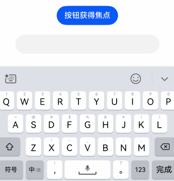
以下示例展示了滚动容器在开始滚动时收起键盘的场景。[List](https://developer.huawei.com/consumer/cn/doc/harmonyos-references/ts-container-list)开始滚动时，调用[clearFocus](https://developer.huawei.com/consumer/cn/doc/harmonyos-references/arkts-apis-uicontext-focuscontroller#clearfocus12)方法清理焦点，焦点转移到页面根容器节点，页面根容器节点不需要软键盘，从而收起软键盘。
```text
@Entry
@Component
struct Index {
  private arr: number[] = Array.from(
    { length: 100 } as ArrayLike,
    (_, i: number) => i + 1
  );

  build() {
    Column() {
      List({ space: 20, initialIndex: 0 }) {
        ForEach(this.arr, (item: number, index?: number) => {
          ListItem() {
            Flex({ direction: FlexDirection.Row, alignItems: ItemAlign.Center }) {
              TextInput({ placeholder: 'TextInput ' + item })
            }
          }
        }, (item: string) => item)
      }
      .onScrollStart(() => {
        // List开始滚动时清理焦点，达成收起键盘的目的
        this.getUIContext().getFocusController().clearFocus()
      })
      .width('80%')
      .height('80%')
      .margin('10%')
    }
    .justifyContent(FlexAlign.Center)
  }
}
```

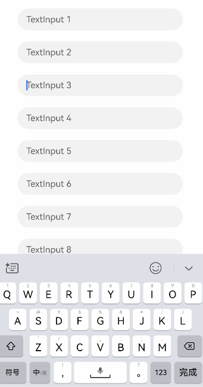

## 常见问题

在软键盘的实际应用中，开发者可能会遇到一些特殊的使用场景或个性化需求。本节将针对这些常见问题提供相应的解决方案，帮助开发者更好地控制软键盘的行为。

## 获得焦点时阻止弹出软键盘

**问题现象** 如何实现点击输入框时，不弹出软键盘？ **原因分析** 默认情况下，点击输入框后，输入框获得焦点，会自动弹出系统软键盘。通过[customKeyboard](https://developer.huawei.com/consumer/cn/doc/harmonyos-references/ts-basic-components-textinput#customkeyboard10)设置自定义键盘之后，输入框获焦时不会弹出系统软键盘，改为弹出自定义键盘。 **解决措施** 设置自定义键盘后，系统键盘不会弹出。利用此特性，设置一个空的自定义键盘，实现“点击输入框时不显示软键盘”的效果。 示例如下，单击输入框，拉起空的自定义键盘。
```text
@Entry
@Component
struct demo {
  controller: TextInputController = new TextInputController();
  @State inputValue: string = "";

  // 自定义键盘组件
  @Builder
  CustomKeyboardBuilder() {
    Column() {
    }
  }

  build() {
    Column() {
      TextInput({ placeholder: 'TextInput', controller: this.controller, text: this.inputValue })// 绑定自定义键盘
        .customKeyboard(this.CustomKeyboardBuilder())
    }
    .justifyContent(FlexAlign.Center)
    .width('80%')
    .margin('10%')
    .height('100%')
  }
}
```

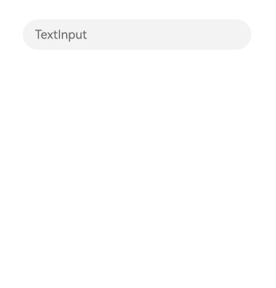

## 点击发送按钮后不收起键盘

**问题现象** 如何实现点击软键盘发送按钮之后，软键盘不收起？ **原因分析** 软键盘的[enterKeyType](https://developer.huawei.com/consumer/cn/doc/harmonyos-references/ts-basic-components-textarea#enterkeytype11)可以设置输入法回车键类型，包括发送样式。按下发送按钮实际上是按下回车键，非TV设备按下回车键时，输入框默认会失焦并且收起键盘。 **解决措施** 软键盘的[enterKeyType](https://developer.huawei.com/consumer/cn/doc/harmonyos-references/ts-basic-components-textarea#enterkeytype11)可以设置输入法回车键类型。除EnterKeyType.NEW_LINE外，enterKeyType设置其他的枚举值时，按下软键盘输入法回车键都会触发[onSubmit](https://developer.huawei.com/consumer/cn/doc/harmonyos-references/ts-basic-components-textarea#onsubmit14)事件。可以在TextArea的onSubmit回调中，通过调用[keepEditableState](https://developer.huawei.com/consumer/cn/doc/harmonyos-references/ts-basic-components-textinput#keepeditablestate11)接口保持输入框编辑态，使得点击回车键后不收起键盘。 示例如下，软键盘的回车键显示为发送样式。按下发送之后，键盘不会收起。
```text
@Entry
@Component
struct demo {
  build() {
    Column({ space: 20 }) {
      TextArea({ placeholder: '点击发送收起键盘' })
        .enterKeyType(EnterKeyType.Send)

      TextArea({ placeholder: 'onSubmit中设置keepEditableState，点击发送不收起键盘' })
        .enterKeyType(EnterKeyType.Send)
        .onSubmit((enterKey: EnterKeyType, event: SubmitEvent) => {
          // 调用keepEditableState方法，输入框保持编辑态
          event.keepEditableState();
        })
    }
    .justifyContent(FlexAlign.Center)
    .height('100%')
    .width('80%')
    .margin('10%')
  }
}
```

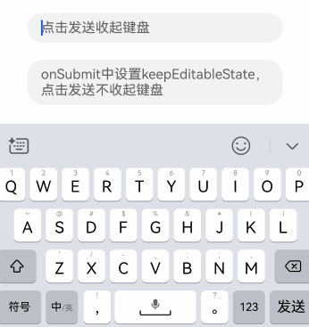
