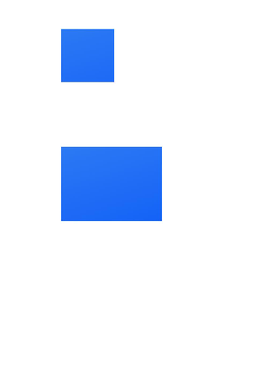

# 形状裁剪（clipShape）

更新时间：2026-05-26 06:48:54

来源：https://developer.huawei.com/consumer/cn/doc/harmonyos-guides/arkts-clip-shape

可利用[clipShape](https://developer.huawei.com/consumer/cn/doc/harmonyos-references/ts-universal-attributes-sharp-clipping#clipshape12)接口将组件裁剪为所需的形状。调用该接口后，可以保留该形状覆盖的组件部分，同时移除组件的其余部分。裁剪形状本身是不可见的。

> [!NOTE]
> 不同的形状支持的属性范围不同，路径是一种形状，除此之外还有椭圆、矩形等形状。 路径的形状不支持设置宽度和高度，具体形状支持的属性参考具体 形状 的文档。 形状中的 fill 属性对clipShape接口不生效。


#### 裁剪圆形

通过设置CircleShape，将图片裁剪为圆形。

```ArkTS
// xxx.ets
import { CircleShape } from '@kit.ArkUI';

@Entry
@Component
struct ClipShapeExample {
  build() {
    Column({ space: 15 }) {
      // 用一个280px直径的圆对图片进行裁剪
      // 请将$r('app.media.background')替换为实际资源文件
      Image($r('app.media.background'))
        .clipShape(new CircleShape({ width: '280px', height: '280px' }))
        .width('500px').height('280px')

      // 用一个350px直径的圆对图片进行裁剪
      // 请将$r('app.media.background')替换为实际资源文件
      Image($r('app.media.background'))
        .clipShape(new CircleShape({ width: '350px', height: '350px' }))
        .width('500px').height('370px')
    }
    .width('100%')
    .margin({ top: 15 })
  }
}
```


#### 裁剪椭圆形

通过设置EllipseShape，将图片裁剪为椭圆形。

```ArkTS
// xxx.ets
import { EllipseShape } from '@kit.ArkUI';

@Entry
@Component
struct ClipShapeExample {
  build() {
    Column({ space: 15 }) {
      // 请将$r('app.media.background')替换为实际资源文件
      Image($r('app.media.background'))
        .clipShape(new EllipseShape({ width: '280px', height: '200px' }))
        .width('500px').height('400px')

      // 请将$r('app.media.background')替换为实际资源文件
      Image($r('app.media.background'))
        .clipShape(new EllipseShape({ width: '380px', height: '280px' }))
        .width('500px').height('400px')
    }
    .width('100%')
    .margin({ top: 15 })
  }
}
```





#### 裁剪矩形

通过设置RectShape，将图片裁剪为矩形。

```ArkTS
// xxx.ets
import { RectShape } from '@kit.ArkUI';

@Entry
@Component
struct ClipShapeExample {
  build() {
    Column({ space: 15 }) {
      // 请将$r('app.media.background')替换为实际资源文件
      Image($r('app.media.background'))
        .clipShape(new RectShape({ width: '200px', height: '200px' }))
        .width('500px').height('400px')

      // 请将$r('app.media.background')替换为实际资源文件
      Image($r('app.media.background'))
        .clipShape(new RectShape({ width: '380px', height: '280px' }))
        .width('500px').height('400px')
    }
    .width('100%')
    .margin({ top: 15 })
  }
}
```


#### 裁剪不规则形状

通过设置PathShape，将图片裁剪为不规则形状。

```ArkTS
// xxx.ets
import { PathShape } from '@kit.ArkUI';

@Entry
@Component
struct ClipShapeExample {
  build() {
    Column({ space: 15 }) {
      Row() {
        // 请将$r('app.media.background')替换为实际资源文件
        Image($r('app.media.background'))
          .clipShape(new PathShape({ commands: 'M0 0 H400 V200 H0 Z' }))
          .width('500px').height('300px')
      }
      .clip(true)
      .borderRadius(20)
    }
    .width('100%')
    .margin({ top: 15 })
  }
}
```


