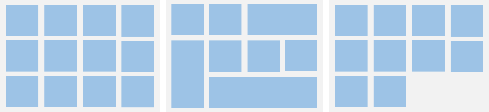
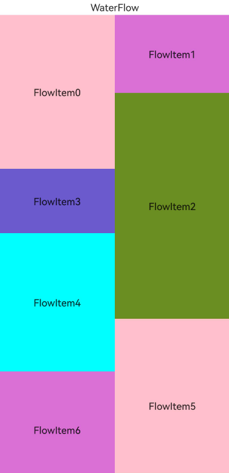
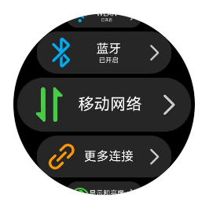

# 列表与网格概述

更新时间：2026-03-09 02:50:43

来源：https://developer.huawei.com/consumer/cn/doc/harmonyos-guides/arkts-list-grid-development-overview

许多应用存在滚动展示同类项目集合的需求，例如显示图片、视频、音乐、新闻、商品等。此类场景可以根据项目排列方式分别选择[List](https://developer.huawei.com/consumer/cn/doc/harmonyos-guides/arkts-layout-development-create-list)、[Grid](https://developer.huawei.com/consumer/cn/doc/harmonyos-guides/arkts-layout-development-create-grid)、[WaterFlow](https://developer.huawei.com/consumer/cn/doc/harmonyos-guides/arkts-layout-development-create-waterflow)实现，在圆形屏幕推荐使用[ArcList](https://developer.huawei.com/consumer/cn/doc/harmonyos-guides/arkts-layout-development-create-arclist)。

## 列表

List适合单列和多列宽度相同的场景，如通讯录、音乐列表、购物清单等。 直播评论、即时聊天等应用场景需要在列表底部插入数据时，内容应自动向上滚动，以展示新插入的节点，此功能可通过配置[List从尾部开始布局](https://developer.huawei.com/consumer/cn/doc/harmonyos-references/ts-container-list#stackfromend19)实现。

## 网格

网格布局由“行”和“列”分割的单元格组成，通过指定“项目”所在单元格实现多种布局，应用场景包括九宫格图片展示、日历、计算器等。 对于部分项目占用多行或多列的场景，可以通过在创建Grid时传入合适的[GridLayoutOptions](https://developer.huawei.com/consumer/cn/doc/harmonyos-references/ts-container-grid#gridlayoutoptions10对象说明)来实现。

## 瀑布流

瀑布流布局是一种多列等宽但高度不等的布局方式，适用于需要错落排列的场景，如图片和视频展示、商品推荐等。 同一个页面内有不同列数分段混合布局的场景，可以通过设置[WaterFlowSections](https://developer.huawei.com/consumer/cn/doc/harmonyos-references/ts-container-waterflow#waterflowoptions对象说明)实现。

## 弧形列表

弧形列表是一种专为圆形屏幕设备设计的特殊列表，支持列表项在接近屏幕上下两端自动缩放的效果。

## 能力对比

| 业务场景 | List | Grid | WaterFlow | ArcList |
| --- | --- | --- | --- | --- |
| 滚动通用能力 | 支持 | 支持 | 支持 | 支持 |
| 项目分组 | [ListItemGroup](https://developer.huawei.com/consumer/cn/doc/harmonyos-references/ts-container-listitemgroup) | [GridLayoutOptions](https://developer.huawei.com/consumer/cn/doc/harmonyos-references/ts-container-grid#gridlayoutoptions10对象说明) | [WaterFlowSections](https://developer.huawei.com/consumer/cn/doc/harmonyos-references/ts-container-waterflow#waterflowoptions对象说明) | 不支持 |
| 指定项目吸顶 | 支持通过[sticky](https://developer.huawei.com/consumer/cn/doc/harmonyos-references/ts-container-list#sticky9)属性实现吸顶 | 不支持 | 不支持 | 不支持 |
| 项目拖拽排序 | 支持[拖拽排序](https://developer.huawei.com/consumer/cn/doc/harmonyos-references/ts-universal-attributes-drag-sorting)，包括内置动画和拖动到边缘自动滚动 | 仅所有项目都占1行1列时[支持内置动画](https://developer.huawei.com/consumer/cn/doc/harmonyos-references/ts-container-grid#supportanimation8)，且不支持拖动到边缘自动滚动 | 不支持 | 不支持 |
| 项目横滑 | 支持通过[swipeAction](https://developer.huawei.com/consumer/cn/doc/harmonyos-references/ts-container-listitem#swipeaction9)属性实现横滑 | 不支持 | 不支持 | 不支持 |
| 项目间距 | 支持 | 支持 | 支持 | 支持 |
| 项目分割线 | 支持 | 不支持 | 不支持 | 不支持 |
