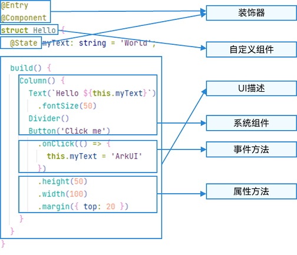

# 基本语法概述

更新时间：2026-03-26 01:02:50

来源：https://developer.huawei.com/consumer/cn/doc/harmonyos-guides/arkts-basic-syntax-overview

在初步了解ArkTS语言后，本指南将以具体的示例来说明ArkTS的基本组成。

如下图所示，点击“按钮”时，文本内容从“Hello World”变为“Hello ArkUI”。

**图1** 示例效果图

本示例中，ArkTS的基本组成如下所示。

**图2** ArkTS的基本组成

> [!NOTE]
> 自定义变量不能与基础通用属性/事件名重复。

 - [UI装饰器](https://developer.huawei.com/consumer/cn/doc/harmonyos-guides/arkts-decorator-overview)： 用于装饰类、结构、方法以及变量，并赋予其特殊的含义。如上述示例中@Entry、@Component和@State都是装饰器，[@Component](https://developer.huawei.com/consumer/cn/doc/harmonyos-guides/arkts-create-custom-components#component)表示自定义组件，[@Entry](https://developer.huawei.com/consumer/cn/doc/harmonyos-guides/arkts-create-custom-components#entry)表示该自定义组件为入口组件，[@State](https://developer.huawei.com/consumer/cn/doc/harmonyos-guides/arkts-state)表示组件中的状态变量，状态变量变化会触发UI刷新。
 - [UI描述](https://developer.huawei.com/consumer/cn/doc/harmonyos-guides/arkts-declarative-ui-description)：以声明式的方式来描述UI的结构，例如build()方法中的代码块。
 - [自定义组件](https://developer.huawei.com/consumer/cn/doc/harmonyos-guides/arkts-create-custom-components)：可复用的UI单元，可组合其他组件，如上述被@Component装饰的struct Hello。
 - 系统组件：ArkUI框架中默认内置的基础和容器组件，可以直接调用，例如示例中的Column、Text、Divider、Button。
 - [属性方法](https://developer.huawei.com/consumer/cn/doc/harmonyos-references/ts-component-general-attributes)：组件可以通过链式调用配置多项属性，如fontSize()、width()、height()、backgroundColor()等。
 - [事件方法](https://developer.huawei.com/consumer/cn/doc/harmonyos-references/ts-component-general-events)：组件可以通过链式调用设置多个事件的响应逻辑，如跟随在Button后面的onClick()。

除此之外，ArkTS扩展了多种语法范式来使开发更加便捷：

 - [@Builder](https://developer.huawei.com/consumer/cn/doc/harmonyos-guides/arkts-builder)/[@BuilderParam](https://developer.huawei.com/consumer/cn/doc/harmonyos-guides/arkts-builderparam)：特殊的封装UI描述的方法，细粒度的封装和复用UI描述。
 - [@Extend](https://developer.huawei.com/consumer/cn/doc/harmonyos-guides/arkts-extend)/[@Styles](https://developer.huawei.com/consumer/cn/doc/harmonyos-guides/arkts-style)：扩展系统组件和封装属性样式，更灵活地组合系统组件。
 - [stateStyles](https://developer.huawei.com/consumer/cn/doc/harmonyos-guides/arkts-statestyles)：多态样式，可以依据组件的内部状态的不同，设置不同样式。
