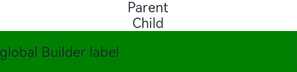
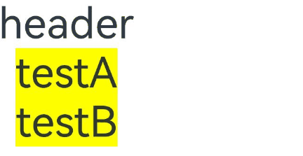
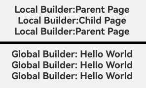

# @BuilderParam装饰器：引用@Builder函数

更新时间：2026-05-26 06:48:54

来源：https://developer.huawei.com/consumer/cn/doc/harmonyos-guides/arkts-builderparam

当开发者创建[自定义组件](https://developer.huawei.com/consumer/cn/doc/harmonyos-guides/arkts-create-custom-components)并需要为其添加特定功能（例如[Navigation](https://developer.huawei.com/consumer/cn/doc/harmonyos-references/ts-basic-components-navigation)功能）时，如果直接在组件内嵌入事件方法，会导致所有该自定义组件的实例都增加此功能。为了解决此问题，ArkUI引入了@BuilderParam装饰器。@BuilderParam用于装饰指向@Builder方法的变量，开发者可以在初始化自定义组件时，使用不同的方式（如参数修改、尾随闭包、借用箭头函数等）对@BuilderParam装饰的自定义构建函数进行传参赋值。在自定义组件内部，通过调用@BuilderParam为组件增加特定功能。

在阅读本文档前，建议提前阅读：[@Builder](https://developer.huawei.com/consumer/cn/doc/harmonyos-guides/arkts-builder)。

> [!NOTE]
> 从API version 7开始支持。 从API version 9开始，该装饰器支持在ArkTS卡片中使用。 从API version 11开始，该装饰器支持在元服务中使用。


#### 装饰器使用说明


#### 初始化@BuilderParam装饰的方法

@BuilderParam装饰的方法只能被自定义构建函数（@Builder装饰的方法）初始化。

 - 使用所属自定义组件的自定义构建函数或者全局的自定义构建函数，在本地初始化@BuilderParam装饰的方法。

  
```ArkTS
@Builder
function overBuilder() {
}

@Component
struct Child {
  @Builder
  doNothingBuilder() {
  }

  // 使用自定义组件的自定义构建函数初始化@BuilderParam装饰的方法
  @BuilderParam customBuilderParam: () => void = this.doNothingBuilder;
  // 使用全局自定义构建函数初始化@BuilderParam装饰的方法
  @BuilderParam customOverBuilderParam: () => void = overBuilder;

  build() {
  }
}
```

 - 使用父组件自定义构建函数初始化子组件@BuilderParam装饰的方法。

  
```ArkTS
@Component
struct Child {
  @Builder
  customBuilder() {
  }

  @BuilderParam customBuilderParam: () => void = this.customBuilder;

  build() {
    Column() {
      this.customBuilderParam()
    }
  }
}

@Entry
@Component
struct Parent {
  @Builder
  componentBuilder() {
    Text('Parent builder')
  }

  build() {
    Column() {
      // 使用父组件自定义构建函数初始化子组件@BuilderParam装饰的方法
      Child({ customBuilderParam: this.componentBuilder })
    }
  }
}
```


示例效果图


 - 需要注意this的指向。

  示例如下：

  
```ArkTS
@Component
struct Child {
  label: string = 'Child';

  @Builder
  customBuilder() {
  }

  @Builder
  customChangeThisBuilder() {
  }

  @BuilderParam customBuilderParam: () => void = this.customBuilder;
  @BuilderParam customChangeThisBuilderParam: () => void = this.customChangeThisBuilder;

  build() {
    Column() {
      this.customBuilderParam()
      this.customChangeThisBuilderParam()
    }
  }
}

@Entry
@Component
struct Parent {
  label: string = 'Parent';

  @Builder
  componentBuilder() {
    Text(`${this.label}`)
  }

  build() {
    Column() {
      // 调用this.componentBuilder()时，this指向当前@Entry所装饰的Parent组件，即label变量的值为'Parent'。
      this.componentBuilder()
      Child({
        // 把this.componentBuilder传给子组件Child的@BuilderParam customBuilderParam，this指向的是子组件Child，即label变量的值为'Child'。
        customBuilderParam: this.componentBuilder,
        // 把():void=>{this.componentBuilder()}传给子组件Child的@BuilderParam customChangeThisBuilderParam，
        // 因为箭头函数的this指向的是宿主对象，所以label变量的值为'Parent'。
        customChangeThisBuilderParam: (): void => {
          this.componentBuilder()
        }
      })
    }
  }
}
```


示例效果图





#### 限制条件

 - 使用@BuilderParam装饰的变量只能通过@Builder函数进行初始化。具体参考[@BuilderParam装饰器初始化的值必须为@Builder](#builderparam装饰器初始化的值必须为builder)。
 - 当[@Require装饰器](https://developer.huawei.com/consumer/cn/doc/harmonyos-guides/arkts-require)和@BuilderParam装饰器一起使用时，必须初始化@BuilderParam装饰器。具体参考[@Require装饰器和@BuilderParam装饰器联合使用](#require装饰器和builderparam装饰器联合使用)。
 - 在自定义组件尾随闭包的场景下，子组件有且仅有一个@BuilderParam用来接收此尾随闭包，且此@BuilderParam装饰的方法不能有参数。具体参考[尾随闭包初始化组件](#尾随闭包初始化组件)。


#### 使用场景


#### 参数初始化组件

@BuilderParam装饰的方法为有参数或无参数的形式，必须与指向的@Builder方法类型匹配。

```ArkTS
class Tmp {
  public label: string = '';
}

@Builder
function overBuilder($$: Tmp) {
  Text($$.label)
    .width('100%')
    .height(50)
    .backgroundColor(Color.Green)
}

@Component
struct Child {
  label: string = 'Child';

  @Builder
  customBuilder() {
  }

  // 无参数类型，指向的customBuilder也是无参数类型
  @BuilderParam customBuilderParam: () => void = this.customBuilder;
  // 有参数类型，指向的overBuilder也是有参数类型的方法
  @BuilderParam customOverBuilderParam: ($$: Tmp) => void = overBuilder;

  build() {
    Column() {
      this.customBuilderParam()
      this.customOverBuilderParam({ label: 'global Builder label' })
    }
  }
}

@Entry
@Component
struct Parent {
  label: string = 'Parent';

  @Builder
  componentBuilder() {
    Text(`${this.label}`)
  }

  build() {
    Column() {
      this.componentBuilder()
      Child({ customBuilderParam: this.componentBuilder, customOverBuilderParam: overBuilder })
    }
  }
}
```

示例效果图





#### 尾随闭包初始化组件

在自定义组件中，使用@BuilderParam装饰的属性可通过尾随闭包进行初始化。初始化时，组件后需紧跟一个大括号“{}”形成尾随闭包场景。

> [!NOTE]
> 此场景下自定义组件内仅有一个使用@BuilderParam装饰的属性。 此场景下自定义组件不支持通用属性。


开发者可将尾随闭包内的内容看作@Builder装饰的函数传给@BuilderParam。

示例1：

```ArkTS
@Component
struct CustomContainer {
  @Prop header: string = '';

  @Builder
  closerBuilder() {
  }

  // 使用父组件的尾随闭包{}(@Builder装饰的方法)初始化子组件@BuilderParam装饰的方法
  @BuilderParam closer: () => void = this.closerBuilder;

  build() {
    Column() {
      Text(this.header)
        .fontSize(30)
      this.closer()
    }
  }
}

@Builder
function specificParam(label1: string, label2: string) {
  Column() {
    Text(label1)
      .fontSize(30)
    Text(label2)
      .fontSize(30)
  }
}

@Entry
@Component
struct CustomContainerUser {
  @State text: string = 'header';

  build() {
    Column() {
      // 创建CustomContainer，在创建CustomContainer时，通过其后紧跟一个大括号“{}”形成尾随闭包
      // 作为传递给子组件CustomContainer @BuilderParam closer: () => void的参数
      CustomContainer({ header: this.text }) {
        Column() {
          specificParam('testA', 'testB')
        }.backgroundColor(Color.Yellow)
        .onClick(() => {
          this.text = 'changeHeader';
        })
      }
    }
  }
}
```

示例效果图





可以使用全局或局部@Builder通过尾随闭包的形式对[@ComponentV2](https://developer.huawei.com/consumer/cn/doc/harmonyos-guides/arkts-create-custom-components#componentv2)装饰的自定义组件中的@BuilderParam装饰的方法进行初始化。

示例2：

```ArkTS
@ComponentV2
struct ChildPage {
  @Require @Param message: string = '';

  @Builder
  customBuilder() {
  }

  @BuilderParam customBuilderParam: () => void = this.customBuilder;

  build() {
    Column() {
      Text(this.message)
        .fontSize(30)
        .fontWeight(FontWeight.Bold)
      this.customBuilderParam()
    }
  }
}

const builderValue: string = 'Hello World';

@Builder
function overBuilder() {
  Row() {
    Text(`Global Builder: ${builderValue}`)
      .fontSize(20)
      .fontWeight(FontWeight.Bold)
  }
}

@Entry
@ComponentV2
struct ParentPage {
  @Local label: string = 'Parent Page';

  @Builder
  componentBuilder() {
    Row() {
      Text(`Local Builder: ${this.label}`)
        .fontSize(20)
        .fontWeight(FontWeight.Bold)
    }
  }

  build() {
    Column() {
      ChildPage({ message: this.label }) {
        Column() { // 使用局部@Builder，通过组件后紧跟一个大括号“{}”形成尾随闭包去初始化自定义组件@BuilderParam装饰的方法
          this.componentBuilder();
        }
      }

      Line()
        .width('100%')
        .height(10)
        .backgroundColor('#000000').margin(10)
      ChildPage({ message: this.label }) { // 使用全局@Builder，通过组件后紧跟一个大括号“{}”形成尾随闭包去初始化自定义组件@BuilderParam装饰的方法
        Column() {
          overBuilder();
        }
      }
    }
  }
}
```

示例效果图


#### 使用@BuilderParam隔离多组件对@Builder跳转逻辑的调用

当@Builder封装的系统组件包含跳转逻辑时，所有调用该@Builder的自定义组件将具备该跳转功能。如果需要禁用特定组件的跳转功能，可使用@BuilderParam来隔离跳转逻辑。

> [!NOTE]
> 当前示例代码中使用了Navigation组件导航，具体实现逻辑可以查询 Navigation 指南。


```ArkTS
import { HelloWorldPageBuilder } from './helloworld';
import { hilog } from '@kit.PerformanceAnalysisKit';

const DOMAIN = 0x0000;

class NavigationParams {
  public pathStack: NavPathStack = new NavPathStack();
  public boo: boolean = true;
}

@Builder
function navigationAction(params: NavigationParams) {
  Column() {
    Navigation(params.pathStack) {
      Button('router to page', { stateEffect: true, type: ButtonType.Capsule })
        .width('80%')
        .height(40)
        .margin(20)
        .onClick(() => {
          // 通过修改@BuilderParam参数决定是否跳转。
          if (params.boo) {
            params.pathStack.pushPath({ name: 'HelloWorldPage' });
          } else {
            hilog.info(DOMAIN, 'testTag', '%{public}s', '@BuilderParam setting does not jump');
          }
        })
    }
    .navDestination(HelloWorldPageBuilder)
    .hideTitleBar(true)
    .height('100%')
    .width('100%')
  }
  .height('25%')
  .width('100%')
}

@Entry
@Component
struct ParentPage {
  @State info: NavigationParams = new NavigationParams();

  build() {
    Column() {
      Text('ParentPage')
      navigationAction({ pathStack: this.info.pathStack, boo: true })
      ChildPageOne()
      ChildPage_BuilderParam({ eventBuilder: navigationAction })
    }
    .height('100%')
    .width('100%')
  }
}

@Component
struct ChildPageOne {
  @State info: NavigationParams = new NavigationParams();

  build() {
    Column() {
      Text('ChildPage')
      navigationAction({ pathStack: this.info.pathStack, boo: true })
    }
  }
}

@Component
struct ChildPage_BuilderParam {
  @State info: NavigationParams = new NavigationParams();
  @BuilderParam eventBuilder: (param: NavigationParams) => void = navigationAction;

  build() {
    Column() {
      Text('ChildPage_BuilderParam')
      // 对传递过来的全局@Builder进行参数修改，可以实现禁用点击跳转的功能。
      this.eventBuilder({ pathStack: this.info.pathStack, boo: false })
    }
  }
}
```

```ArkTS
@Builder
export function HelloWorldPageBuilder() {
  HelloWorldPage()
}

@Component
struct HelloWorldPage {
  @State message: string = 'Hello World';
  @State pathStack: NavPathStack = new NavPathStack();

  build() {
    // 用于跳转的子页面
    NavDestination() {
      Column() {
        Text(this.message)
          .fontSize(20)
          .fontWeight(FontWeight.Bold)
      }
    }
    .height('100%')
    .width('100%')
  }
}
```

**router_map.json**

这个文件位于项目的resources/base/profile目录下。

```ArkTS
{
  "routerMap": [
    {
      "name": "HelloWorldPage",
      "buildFunction": "HelloWorldPageBuilder",
      "pageSourceFile": "src/main/ets/pages/helloworld.ets"
    }
  ]
}
```

**module.json5**

这个文件位于应用模块的根目录下，例如entry/src/main/module.json5。

```text
{
  "module": {
    "routerMap": "$profile:router_map",
    ......
  }
}
```

示例效果图


#### 使用全局和局部@Builder初始化@BuilderParam

在自定义组件中，使用@BuilderParam装饰的变量接收父组件通过@Builder传递的内容进行初始化，由于父组件的@Builder可以使用箭头函数改变当前的this指向，因此使用@BuilderParam装饰的变量会展示不同的内容。

```ArkTS
@Component
struct ChildPage {
  label: string = 'Child Page';

  @Builder
  customBuilder() {
  }

  @BuilderParam customBuilderParam: () => void = this.customBuilder;
  @BuilderParam customChangeThisBuilderParam: () => void = this.customBuilder;

  build() {
    Column() {
      this.customBuilderParam()
      this.customChangeThisBuilderParam()
    }
  }
}

const builderValue: string = 'Hello World';

@Builder
function overBuilder() {
  Row() {
    Text(`Global Builder: ${builderValue}`)
      .fontSize(20)
      .fontWeight(FontWeight.Bold)
  }
}

@Entry
@Component
struct ParentPage {
  label: string = 'Parent Page';

  @Builder
  componentBuilder() {
    Row() {
      Text(`Local Builder: ${this.label}`)
        .fontSize(20)
        .fontWeight(FontWeight.Bold)
    }
  }

  build() {
    Column() {
      // 调用this.componentBuilder()时，this指向当前@Entry所装饰的ParentPage组件，所以label变量的值为'Parent Page'。
      this.componentBuilder()
      ChildPage({
        // 把this.componentBuilder传给子组件ChildPage的@BuilderParam customBuilderParam，
        // this指向的是子组件ChildPage，所以label变量的值为'Child Page'。
        customBuilderParam: this.componentBuilder,
        // 把():void=>{this.componentBuilder()}传给子组件ChildPage的@BuilderParam customChangeThisBuilderParam，
        // 因为箭头函数的this指向的是宿主对象，所以label变量的值为'Parent Page'。
        customChangeThisBuilderParam: (): void => {
          this.componentBuilder()
        }
      })
      Line()
        .width('100%')
        .height(10)
        .backgroundColor('#000000').margin(10)
      // 调用全局overBuilder()时，this指向当前整个活动页，所以展示的内容为'Hello World'。
      overBuilder()
      ChildPage({
        // 把全局overBuilder传给子组件ChildPage的@BuilderParam customBuilderParam，
        // this指向当前整个活动页，所以展示的内容为'Hello World'。
        customBuilderParam: overBuilder,
        // 把全局overBuilder传给子组件ChildPage的@BuilderParam customChangeThisBuilderParam，
        // this指向当前整个活动页，所以展示的内容为'Hello World'。
        customChangeThisBuilderParam: overBuilder
      })
    }
  }
}
```

示例效果图


#### 在@ComponentV2装饰的自定义组件中使用@BuilderParam

使用全局或局部@Builder初始化@ComponentV2装饰的自定义组件中的@BuilderParam属性。

```ArkTS
@ComponentV2
struct ChildPage {
  @Param label: string = 'Child Page';

  @Builder
  customBuilder() {
  }

  @BuilderParam customBuilderParam: () => void = this.customBuilder;
  @BuilderParam customChangeThisBuilderParam: () => void = this.customBuilder;

  build() {
    Column() {
      this.customBuilderParam()
      this.customChangeThisBuilderParam()
    }
  }
}

const builderValue: string = 'Hello World';

@Builder
function overBuilder() {
  Row() {
    Text(`Global Builder: ${builderValue}`)
      .fontSize(20)
      .fontWeight(FontWeight.Bold)
  }
}

@Entry
@ComponentV2
struct ParentPage {
  @Local label: string = 'Parent Page';

  @Builder
  componentBuilder() {
    Row() {
      Text(`Local Builder: ${this.label}`)
        .fontSize(20)
        .fontWeight(FontWeight.Bold)
    }
  }

  build() {
    Column() {
      // 调用this.componentBuilder()时，this指向当前@Entry所装饰的ParentPage组件，所以label变量的值为'Parent Page'。
      this.componentBuilder()
      ChildPage({
        // 把this.componentBuilder传给子组件ChildPage的@BuilderParam customBuilderParam，
        // this指向的是子组件ChildPage，所以label变量的值为'Child Page'。
        customBuilderParam: this.componentBuilder,
        // 把():void=>{this.componentBuilder()}传给子组件ChildPage的@BuilderParam customChangeThisBuilderPara
        // 因为箭头函数的this指向的是宿主对象，所以label变量的值为'Parent Page'。
        customChangeThisBuilderParam: (): void => {
          this.componentBuilder()
        }
      })
      Line()
        .width('100%')
        .height(5)
        .backgroundColor('#000000').margin(10)
      // 调用全局overBuilder()时，this指向当前整个活动页，所以展示的内容为'Hello World'。
      overBuilder()
      ChildPage({
        // 把全局overBuilder传给子组件ChildPage的@BuilderParam customBuilderParam，
        // this指向当前整个活动页，所以展示的内容为'Hello World'。
        customBuilderParam: overBuilder,
        // 把全局overBuilder传给子组件ChildPage的@BuilderParam customChangeThisBuilderParam，
        // this指向当前整个活动页，所以展示的内容为'Hello World'。
        customChangeThisBuilderParam: overBuilder
      })
    }
  }
}
```

示例效果图


#### 常见问题


#### 改变内容UI不刷新

调用自定义组件ChildPage时，通过this.componentBuilder传递@Builder参数。this指向自定义组件内部，因此父组件中改变label的值时，ChildPage无法感知这一变化。

【反例】

```ArkTS
@Component
struct ChildPage {
  @State label: string = 'Child Page';

  @Builder
  customBuilder() {
  }

  @BuilderParam customChangeThisBuilderParam: () => void = this.customBuilder;

  build() {
    Column() {
      this.customChangeThisBuilderParam()
    }
  }
}

@Entry
@Component
struct ParentPage {
  @State label: string = 'Parent Page';

  @Builder
  componentBuilder() {
    Row() {
      Text(`Builder :${this.label}`)
        .fontSize(20)
        .fontWeight(FontWeight.Bold)
    }
  }

  build() {
    Column() {
      ChildPage({
        // 当前写法this指向ChildPage组件内
        customChangeThisBuilderParam: this.componentBuilder
      })
      // 请将$r('app.string.builderOpp_text1')替换为实际资源文件，在本示例中该资源文件的value值为"点击改变label内容"
      Button($r('app.string.builderOpp_text1'))
        .onClick(() => {
          this.label = 'Hello World';
        })
    }
  }
}
```

使用箭头函数将@Builder传递到自定义组件ChildPage中，this指向会停留在父组件ParentPage里。在父组件中改变label的值时，ChildPage会感知到并重新渲染UI。

【正例】

```ArkTS
@Component
struct ChildPage {
  @State label: string = 'Child Page';

  @Builder
  customBuilder() {
  }

  @BuilderParam customChangeThisBuilderParam: () => void = this.customBuilder;

  build() {
    Column() {
      this.customChangeThisBuilderParam()
    }
  }
}

@Entry
@Component
struct ParentPage {
  @State label: string = 'Parent Page';

  @Builder
  componentBuilder() {
    Row() {
      Text(`Builder :${this.label}`)
        .fontSize(20)
        .fontWeight(FontWeight.Bold)
    }
  }

  build() {
    Column() {
      ChildPage({
        customChangeThisBuilderParam: () => {
          this.componentBuilder()
        }
      })
      // 请将$r('app.string.builderOpp_text1')替换为实际资源文件，在本示例中该资源文件的value值为"点击改变label内容"
      Button($r('app.string.builderOpp_text1'))
        .onClick(() => {
          this.label = 'Hello World';
        })
    }
  }
}
```


#### @Require装饰器和@BuilderParam装饰器联合使用

由于@Require装饰器所装饰的变量需进行初始化，未初始化会导致编译报错。

【反例】

```text
@Builder
function globalBuilder() {
  Text('Hello World')
}

@Entry
@Component
struct CustomBuilderDemo {
  build() {
    Column() {
      // 由于未对@Require装饰的变量ChildBuilder进行赋值，此处无论是编译还是编辑，均会报错。
      ChildPage()
    }
  }
}

@Component
struct ChildPage {
  @Require @BuilderParam ChildBuilder: () => void = globalBuilder;

  build() {
    Column() {
      this.ChildBuilder()
    }
  }
}
```

@Require装饰的变量必须从外部初始化。

【正例】

```ArkTS
@Builder
function globalBuilder() {
  Text('Hello World')
}

@Entry
@Component
struct CustomBuilderDemo {
  build() {
    Column() {
      // childBuilder被@Require装饰，必须从外部初始化
      ChildPage({ childBuilder: globalBuilder })
    }
  }
}

@Component
struct ChildPage {
  @Require @BuilderParam childBuilder: () => void = globalBuilder;

  build() {
    Column() {
      this.childBuilder()
    }
  }
}
```


#### @BuilderParam装饰器初始化的值必须为@Builder

使用@State装饰器装饰的变量，在初始化子组件的@BuilderParam和ChildBuilder变量时，编译时会输出报错信息。

【反例】

```text
@Builder
function globalBuilder() {
  Text('Hello World')
}

@Entry
@Component
struct CustomBuilderDemo {
  @State message: string = '';

  build() {
    Column() {
      // @BuilderParam装饰的变量ChildBuilder接收@State装饰的变量，会出现编译和编辑报错
      ChildPage({ ChildBuilder: this.message })
    }
  }
}

@Component
struct ChildPage {
  @BuilderParam ChildBuilder: () => void = globalBuilder;

  build() {
    Column() {
      this.ChildBuilder()
    }
  }
}
```

使用全局@Builder装饰的globalBuilder()方法为子组件@BuilderParam装饰的ChildBuilder变量初始化，编译无报错，功能正常。

【正例】

```ArkTS
@Builder
function globalBuilder() {
  Text('Hello World')
}

@Entry
@Component
struct CustomBuilderDemo {
  build() {
    Column() {
      // 正确写法
      ChildPage({ childBuilder: globalBuilder })
    }
  }
}

@Component
struct ChildPage {
  @BuilderParam childBuilder: () => void = globalBuilder;

  build() {
    Column() {
      this.childBuilder()
    }
  }
}
```
