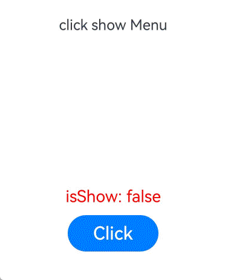

# !!语法：双向绑定

更新时间：2026-04-30 02:41:24

来源：https://developer.huawei.com/consumer/cn/doc/harmonyos-guides/arkts-new-binding

在状态管理V1中，推荐使用[\$\$](https://developer.huawei.com/consumer/cn/doc/harmonyos-guides/arkts-two-way-sync)实现系统组件的双向绑定。

在状态管理V2中，推荐使用!!语法糖统一处理双向绑定。


> [!NOTE]
> !!语法从API version 12开始支持。


## 概述

!!双向绑定语法，是一个语法糖方便开发者实现数据双向绑定，用于初始化子组件的[@Param](https://developer.huawei.com/consumer/cn/doc/harmonyos-guides/arkts-new-param)和[@Event](https://developer.huawei.com/consumer/cn/doc/harmonyos-guides/arkts-new-event)。其中@Event方法名需要声明为“\$”+ @Param属性名，详见[使用场景](#使用场景)。 如果使用了!!双向绑定语法，表明父组件的变化会同步给子组件，子组件的变化也会同步给父组件。 父组件未使用!!时，变化是单向的。

## 使用场景


## 自定义组件间双向绑定

在Index中构造Star子组件，双向绑定父子组件中的value属性，并初始化子组件的@Param value和@Event \$value。 @Param与@Event装饰器配合使用的双向绑定语法糖。
```text
Child({ value: this.value, $value: (val: number) => { this.value = val; } })
```

上述语法可以简化为!!双向绑定语法糖。
```text
Star({ value: this.value!! })
```

使用@Param value与@Event \$value语法实现自定义组件双向绑定。
```text
@Entry
@ComponentV2
struct Parent {
  @Local value: number = 0;

  build() {
    Column() {
      Text(`${this.value}`)
      // 点击Index中的Button改变value值，父组件Parent和子组件Child中的Text将同步更新。
      Button(`change value in parent component`).onClick(() => {
        this.value++;
      })
      // 使用@Param与@Event语法实现自定义组件双向绑定。
      Child({ value: this.value, $value: (val: number) => { this.value = val; } })
      // ...
    // ···
    }
  }
}

@ComponentV2
struct Child {
  @Param value: number = 0;
  @Event $value: (val: number) => void = (val: number) => {};

  build() {
    Column() {
      Text(`${this.value}`)
      // 点击子组件Child中的Button，调用`this.$value(10)`方法，父组件Parent和子组件Child中的Text将同步更新。
      Button(`change value in child component`).onClick(() => {
        this.$value(10);
      })
    }
  }
}
```

使用!!语法糖实现自定义组件双向绑定。
```text
@Entry
@ComponentV2
struct Index {
  @Local value: number = 0;

  build() {
    Column() {
      Text(`${this.value}`)
      // 点击Index中的Button改变value值，父组件Index和子组件Star中的Text将同步更新。
      Button(`change value in parent component`).onClick(() => {
        this.value++;
      })
      // 使用!!语法糖实现自定义组件双向绑定。
      Star({ value: this.value!! })
      // ...
    }
  }
}

@ComponentV2
struct Star {
  @Param value: number = 0;
  @Event $value: (val: number) => void = (val: number) => {};

  build() {
    Column() {
      Text(`${this.value}`)
      // 点击子组件Star中的Button，调用`this.$value(10)`方法，父组件Index和子组件Star中的Text将同步更新。
      Button(`change value in child component`).onClick(() => {
        this.$value(10);
      })
    }
  }
}
```

**使用限制** !!双向绑定语法不支持多层父子组件传递。 不支持与@Event混用。从API version 18开始，当使用!!双向绑定语法给子组件传递参数时，给对应的@Event方法传参会编译报错。 当使用3个或更多感叹号（!!!、!!!!、!!!!!等）时，不支持双向绑定功能。

## 系统组件参数双向绑定

!!运算符为系统组件提供TS变量的引用，使得TS变量和系统组件的内部状态保持同步。添加方式是在变量名后添加，例如isShow!!。 内部状态的含义由组件决定。例如：[bindMenu](https://developer.huawei.com/consumer/cn/doc/harmonyos-references/ts-universal-attributes-menu#bindmenu11)组件的isShow参数。
```text
import { hilog } from '@kit.PerformanceAnalysisKit';

const TAG: string = 'click show Menu';
const DOMAIN = 0xFF00;

@Entry
@ComponentV2
struct BindMenuInterface {
  @Local isShow: boolean = false;

  build() {
    Column() {
      Row() {
        Text('click show Menu')
          .bindMenu(this.isShow!!, // 双向绑定。
            [
              {
                value: 'Menu1',
                action: () => {
                  hilog.info(DOMAIN, TAG, 'handle Menu1 click');
                }
              },
              {
                value: 'Menu2',
                action: () => {
                  hilog.info(DOMAIN, TAG, 'handle Menu2 click');
                }
              },
            ])
      }.height('50%')

      Text('isShow: ' + this.isShow).fontSize(18).fontColor(Color.Red)
      Row() {
        Button('Click')
          .onClick(() => {
            this.isShow = true;
          })
          .width(100)
          .fontSize(20)
          .margin(10)
      }
    }.width('100%')
  }
}
```


**使用规则** 当前!!双向绑定支持基础类型变量，当该变量使用[@State](https://developer.huawei.com/consumer/cn/doc/harmonyos-guides/arkts-state)等状态管理V1装饰器装饰，或者[@Local](https://developer.huawei.com/consumer/cn/doc/harmonyos-guides/arkts-new-local)等状态管理V2装饰器装饰时，变量值的变化会触发UI刷新。
| 属性 | 支持的参数 | 起始API版本 |
| --- | --- | --- |
| [bindMenu](https://developer.huawei.com/consumer/cn/doc/harmonyos-references/ts-universal-attributes-menu#bindmenu11) | isShow | 18 |
| [bindContextMenu](https://developer.huawei.com/consumer/cn/doc/harmonyos-references/ts-universal-attributes-menu#bindcontextmenu12) | isShown | 18 |
| [bindPopup](https://developer.huawei.com/consumer/cn/doc/harmonyos-references/ts-universal-attributes-popup#bindpopup) | show | 18 |
| [TextInput](https://developer.huawei.com/consumer/cn/doc/harmonyos-references/ts-basic-components-textinput#textinputoptions对象说明) | text | 18 |
| [TextArea](https://developer.huawei.com/consumer/cn/doc/harmonyos-references/ts-basic-components-textarea#textareaoptions对象说明) | text | 18 |
| [Search](https://developer.huawei.com/consumer/cn/doc/harmonyos-references/ts-basic-components-search#searchoptions18对象说明) | value | 18 |
| [BindSheet](https://developer.huawei.com/consumer/cn/doc/harmonyos-references/ts-universal-attributes-sheet-transition#bindsheet) | isShow | 18 |
| [BindContentCover](https://developer.huawei.com/consumer/cn/doc/harmonyos-references/ts-universal-attributes-modal-transition#bindcontentcover) | isShow | 18 |
| [SideBarContainer](https://developer.huawei.com/consumer/cn/doc/harmonyos-references/ts-container-sidebarcontainer#sidebarwidth) | sideBarWidth | 18 |
| [Navigation](https://developer.huawei.com/consumer/cn/doc/harmonyos-references/ts-basic-components-navigation#navbarwidth9) | navBarWidth | 18 |
| [Toggle](https://developer.huawei.com/consumer/cn/doc/harmonyos-references/ts-basic-components-toggle#toggleoptions18对象说明) | isOn | 18 |
| [Checkbox](https://developer.huawei.com/consumer/cn/doc/harmonyos-references/ts-basic-components-checkbox#select) | select | 18 |
| [CheckboxGroup](https://developer.huawei.com/consumer/cn/doc/harmonyos-references/ts-basic-components-checkboxgroup#selectall) | selectAll | 18 |
| [Radio](https://developer.huawei.com/consumer/cn/doc/harmonyos-references/ts-basic-components-radio#checked) | checked | 18 |
| [Rating](https://developer.huawei.com/consumer/cn/doc/harmonyos-references/ts-basic-components-rating#ratingoptions18对象说明) | rating | 18 |
| [Slider](https://developer.huawei.com/consumer/cn/doc/harmonyos-references/ts-basic-components-slider#slideroptions对象说明) | value | 18 |
| [Select](https://developer.huawei.com/consumer/cn/doc/harmonyos-references/ts-basic-components-select#selected) | selected | 18 |
| [Select](https://developer.huawei.com/consumer/cn/doc/harmonyos-references/ts-basic-components-select#value) | value | 18 |
| [MenuItem](https://developer.huawei.com/consumer/cn/doc/harmonyos-references/ts-basic-components-menuitem#selected) | selected | 18 |
