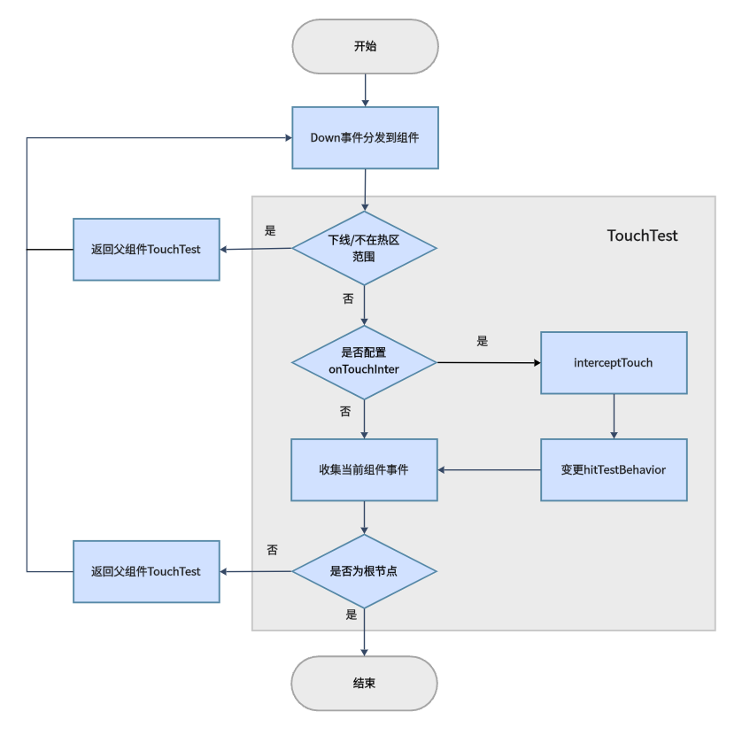
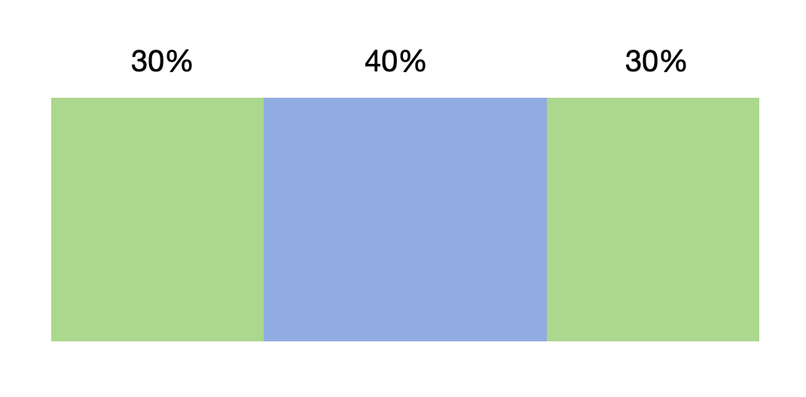
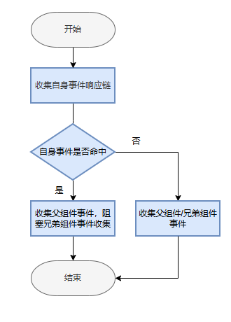
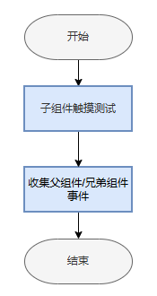
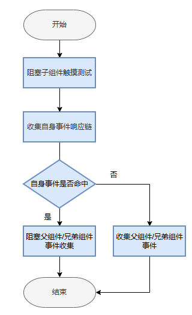

# 交互基础机制说明

更新时间：2026-06-17 08:22:21

来源：https://developer.huawei.com/consumer/cn/doc/harmonyos-guides/arkts-interaction-basic-principles

对于[触摸事件](https://developer.huawei.com/consumer/cn/doc/harmonyos-references/ts-universal-events-touch)、[鼠标事件](https://developer.huawei.com/consumer/cn/doc/harmonyos-references/ts-universal-mouse-key)、[轴事件](https://developer.huawei.com/consumer/cn/doc/harmonyos-references/ts-universal-events-axis)等指向性事件的交互，交互框架基于坐标信息进行命中测试确定事件和手势的响应目标，即收集形成响应链，系统会根据触控事件的坐标、类型等信息，结合UI布局，将事件发送给对应UI组件。多个事件可以组合触发手势或其他功能，如长按、点击、拖拽。


#### 事件交互流程

事件交互流程是指当ArkUI接收上游发送的Touch类触控事件或Mouse类触控事件后，根据开发者设定的各类参数，收集事件响应链并分发至各组件以触发回调的整个过程。该流程可以概括为以下三个步骤：
1. 事件产生

  硬件输入设备通过驱动、多模等模块，将事件上报至目标的ArkUI实例。ArkUI在渲染管线中进行统一处理。
2. 收集事件响应链并分发事件

  事件响应链是事件交互流程的核心，管线在接收事件后，将通过触摸测试建立事件响应链，通过响应链决策事件分发以及手势合成。

  （1）触摸测试

  当管线接收到起始触控事件后，将根据起始触控事件的坐标和组件位置进行触摸测试，最终建立事件响应链。开发者可以通过设置属性影响事件响应链的形成。

  （2）分发事件至Touch事件响应链

  构建事件响应链后，触控事件将根据Touch事件响应链分发至目标组件。

  （3）分发事件至手势响应链并进行手势识别

  各组件上设置的手势在通过触摸测试后，还会形成手势响应链。触控事件送入手势响应链后会与其它事件组合产生手势，手势之间再经过竞争，最终触发符合条件的手势回调。

  （4）事件拦截

  事件响应链建立前，开发者可以配置触摸测试属性从而影响到事件响应链的形成。当事件响应链建立后，开发者可以通过设置接口实现事件拦截，从而改变事件分发的流程。

  当分发事件至Touch事件响应链时，开发者可以通过设置触摸事件拦截，防止触摸事件继续传递给响应链的后续节点。

  当分发事件至手势响应链时，开发者可以通过设置手势拦截阻止手势响应。
3. 触发回调

  在收集事件响应链时，开发者绑定的回调函数将被同步收集。完成事件响应链的收集及事件分发后，符合触发条件的事件和手势对应的回调函数将被触发。


#### 事件响应链

事件响应链是指通过触摸测试收集到的、能够响应本次交互的所有组件组成的有序链条。当用户触摸屏幕时，系统会从触摸点位置开始，遵循右子树优先的后序遍历顺序（即从最内层组件开始，自下而上、从右到左逐层向外收集），形成完整的响应链。

ArkUI事件响应链收集，根据右子树（按组件布局的先后层级）优先的后序遍历流程。下面通过一个示例来介绍响应链收集的流程，示例伪代码如下：

```text
build() {
  StackA() {
    ComponentB() {
      ComponentC()
    }

    ComponentD() {
      ComponentE()
    }
  }
}
```

其中A是最外层组件，B和D是A的子组件，C是B的子组件，E是D的子组件。界面效果示例以及组件树结构图如下：


用户触摸的动作如果发生在组件C上，事件响应链收集的流程如下，根据右子树（按组件布局的先后层级）优先的后序遍历流程，因为触摸点不在右边的树上，所以事件会从左边树的C节点开始往上传，触摸事件（onTouch事件）是冒泡事件默认会向上一直传递下去，直到被消费或者丢弃，允许多个组件同时触发。最终收集到的响应链是C->B->A。


用户触摸的动作如果发生在组件E上，事件响应链收集的流程如下，根据右子树优先的后序遍历流程，所以事件会从右边树的D节点开始往上传。虽然触摸点在组件D和组件B的交集上，但组件D的[hitTestBehavior](https://developer.huawei.com/consumer/cn/doc/harmonyos-references/ts-universal-attributes-hit-test-behavior)属性默认为HitTestMode.Default，D组件收集到事件后会阻塞兄弟节点（组件B），所以没有收集组件A的左子树，最终收集到的响应链是E->D->A。


上面介绍的事件响应链是系统默认的行为，如果需要改变响应的成员，比如触摸组件E的时候，希望把事件传递给B，开发者可以通过设置D组件的hitTestBehavior属性为HitTestMode.None或者HitTestMode.Transparent来实现，比如设置为HitTestMode.Transparent，那么组件D自身进行触摸测试，同时不阻塞兄弟及父组件。最终收集到的响应链是E->D->B->A。





如果触摸组件E时，仅组件E响应触摸事件，其它组件不响应触摸事件。可以通过[TouchEvent](https://developer.huawei.com/consumer/cn/doc/harmonyos-references/ts-universal-events-touch#touchevent对象说明)的stopPropagation()方法来阻止事件冒泡，阻止触摸事件往上传递；也可以通过设置E组件的hitTestBehavior属性为HitTestMode.Block来实现，那么最终收集到的响应链成员只有组件E。





除了hitTestBehavior和stopPropagation，影响事件响应链的更多因素可以参考：[触摸测试控制](https://developer.huawei.com/consumer/cn/doc/harmonyos-references/ts-universal-attributes-hit-test-behavior)。

下图展示了组件树的层级结构与事件响应链的收集过程。图中父、子节点分别对应父组件和子组件，左子树和右子树对应兄弟组件，右子树对应的组件会显示在左子树对应组件的上方。





通过[hitTestBehavior](https://developer.huawei.com/consumer/cn/doc/harmonyos-references/ts-universal-attributes-hit-test-behavior#hittestbehavior)属性可以设置组件的触摸测试模式。在本示例中，所有组件的触摸测试模式均设置为[HitTestMode](https://developer.huawei.com/consumer/cn/doc/harmonyos-references/ts-appendix-enums#hittestmode9).Default。如果用户点按的动作发生在组件5上，则响应链收集过程如下：
1. 系统检测到触摸点落在组件5上，组件5被收集。
2. 向上冒泡至父组件3，组件3被收集。
3. 由于组件3的触摸测试模式为HitTestMode.Default，收集到事件后会阻塞兄弟节点，因此组件2不会被收集。
4. 继续向上冒泡至根组件1，组件1被收集。

因此最终收集到的响应链以及组件先后关系是5、3、1。


#### 触摸测试

触摸测试即touch test，也称为命中测试（hit test），是在用户交互开始前，系统确定哪些组件上的事件或手势能够参与此次交互响应的过程。


#### 实现原理

对于指向性基础事件的派发，系统不会直接从页面根节点递归遍历所有组件节点，而是在首次事件发生时确定能够响应此次交互的组件范围，即识别用户点击的组件。对于未被点击的组件，在此次交互中将不会有任何响应。这一过程称为命中测试（hit test/touch test）。系统依据组件响应热区是否包含事件坐标来判定是否被点击。





当用户触发按下事件时，系统将自上而下、自右向左遍历组件树，收集每个组件上绑定的手势和事件，然后将这些信息逐级向上冒泡至父组件进行整合，最终构建完整的事件响应链。

假设T点为用户按下的位置（Touch Down），则A、B、D组件将被判定为命中，这些组件组成的链条被称为本次交互的响应链。基础事件将在该响应链上进行传递，首先传递给叶子节点，随后传递给父节点，逐层向上传递，这一过程称为事件冒泡。

以下是描述命中测试过程的流程图：





如图所示，当起始事件被分发至组件时，组件会收集自身绑定的手势与事件，随后将收集结果传递给父组件，直至达到根节点。若组件透明、已从组件树中移除，或事件坐标不在组件响应热区范围内，将不会触发收集过程，父组件接收的反馈为空。除此之外，所有组件均会执行手势与事件的收集，并将结果反馈给父组件。


#### 干预命中

应用可以通过以下几种方式对命中结果进行干预，从而影响最终的响应范围，即控制哪些组件能够被收集到。

| 干预方式 | 功能描述 | 对应接口 | 说明 |
| --- | --- | --- | --- |
| 触摸热区设置 | 设置组件能够响应用户交互的热区范围。 | responseRegion | 1.热区会被用来识别用户手指落下的位置是否在热区范围内，只有在范围内的才会被收集； 2. 热区也会影响一些手势的判定，比如点击，只有当在热区范围抬手时才会被触发。 |
| 触摸热区设置 | 设置组件能够响应鼠标交互的热区范围。 | mouseResponseRegion | 设置一个或多个鼠标触摸热区。功能与responseRegion类似，但仅对鼠标事件生效。 |
| 触摸热区设置 | 设置组件的触摸热区列表。 | responseRegionList | 设置组件的触摸热区列表，可指定每个热区适用的输入工具类型（如鼠标、触摸等）。调用该接口时，responseRegion与mouseResponseRegion接口不再生效。从API version 22开始支持。 |
| 触摸测试控制 | 干预自身及其他组件收集结果。 | hitTestBehavior | 与onTouchIntercept效果相同，但是hitTestBehavior是静态配置。 |
| 自定义事件拦截 | 干预自身及其他组件收集结果。 | onTouchIntercept | 当用户触发按下事件时，系统开始收集当前位置下所有需要参与事件处理的组件时触发，应用可通过该回调返回一个HitTestMode值，进而影响系统收集子节点或兄弟节点的行为。可以通过该回调达到动态控制交互响应的效果，如某些组件，根据业务状态的变化，可能有时候需要参与交互，有时候不需要参与交互。 与hitTestBehavior效果相同，但是onTouchIntercept是动态回调。 |

1. 触摸热区设置

  默认情况下，组件的响应热区即为组件自身的位置和大小，这与用户看到的范围相一致，从而最大程度地保证用户操作的手眼一致性。在极少数情况下，应用需调整热区大小以限制或扩大组件响应的操作范围。

  ArkUI提供了以下三个接口来设置组件的触摸热区：

  
**responseRegion**：设置一个或多个触摸热区，适用于所有输入设备类型（如触摸、鼠标等）。从API version 8开始支持。
2. **mouseResponseRegion**：设置一个或多个鼠标触摸热区，仅对鼠标事件生效。从API version 10开始支持。
3. **responseRegionList**：设置组件的触摸热区列表，可为每个热区指定适用的输入工具类型。调用该接口时，responseRegion与mouseResponseRegion接口不再生效。从API version 22开始支持。
4. 触摸测试控制

  在组件上绑定[触摸测试控制](https://developer.huawei.com/consumer/cn/doc/harmonyos-references/ts-universal-attributes-hit-test-behavior)时，可能影响兄弟节点和父子节点的触摸测试。子组件对父组件的触摸测试影响程度取决于最后一个未被阻塞触摸测试的子组件状态。

  开发者可以通过配置触摸测试控制，来实现阻塞组件自身或其他组件的触摸测试。

  
HitTestMode.Default：默认不配hitTestBehavior属性，自身如果命中会阻塞兄弟组件，但是不阻塞子组件。

  


5. HitTestMode.None：自身不接收事件，但不会阻塞兄弟组件或子组件继续做触摸测试。

  


6. HitTestMode.Block：阻塞子组件的触摸测试，如果自身触摸测试命中，会阻塞兄弟组件及父组件的触摸测试。

  


7. HitTestMode.Transparent：自身进行触摸测试，同时不阻塞兄弟组件及父组件。

  


8. HitTestMode.BLOCK_HIERARCHY（从API version 20开始支持）: 自身和子节点响应触摸测试，阻止所有优先级较低的兄弟节点和父节点参与触摸测试。

  


9. HitTestMode.BLOCK_DESCENDANTS（从API version 20开始支持）: 自身不响应触摸测试，并且所有的后代（孩子，孙子等）也不响应触摸测试，不会影响祖先节点的触摸测试。

  


10. 自定义事件拦截

  当用户执行按下操作时，将触发组件上绑定的[自定义事件拦截](https://developer.huawei.com/consumer/cn/doc/harmonyos-references/ts-universal-attributes-on-touch-intercept)的回调。开发者可根据应用状态，动态调整组件的hitTestBehavior属性，进而影响触控测试的流程。


#### 禁用控制

设置了[禁用控制](https://developer.huawei.com/consumer/cn/doc/harmonyos-references/ts-universal-attributes-enable)的组件及其子组件不会发起触摸测试过程，而是直接返回组件的父组件继续触摸测试。


#### 安全组件

ArkUI包含的安全组件有：[使用粘贴控件](https://developer.huawei.com/consumer/cn/doc/harmonyos-guides/pastebutton)、[使用保存控件](https://developer.huawei.com/consumer/cn/doc/harmonyos-guides/savebutton)等。

安全组件当前对触摸测试影响：如果有组件的[z序](https://developer.huawei.com/consumer/cn/doc/harmonyos-references/ts-universal-attributes-z-order)比安全组件的z序靠前，且遮盖安全组件，则安全组件事件直接返回到父节点继续触摸测试。


#### 事件冒泡

基础事件在响应链上的传递遵循冒泡机制，即最内层组件优先处理，再逐层往父组件传递该事件，任意一层组件可主动终止本次事件的继续传递，即终止冒泡。但需要注意的是，终止冒泡并不会中断父组件对手势的响应处理。

stopPropagation可终止冒泡。如下图所示，以Touch事件为例，当一个Touch事件传递至C节点时，如果调用了该事件上的stopPropagation接口，则B节点和root节点将不再接收到此事件，但B节点上的手势对象仍能接收和处理该Touch事件。


> [!WARNING]
> stopPropagation干预事件冒泡时，应注意对同一事件的不同类型（如Down/Move/Up）采用一致的规则，避免上层节点仅接收到部分类型事件，导致事件不闭环的情况，例如B节点仅接收到Down事件，而未接收到Up事件，这会影响B节点上的事件完整性（对于指向性按下操作类交互产生的事件，确保事件的完整性是必要的）。


#### Cancel事件

当处理基础事件时，会发现存在多种具有Cancel类型的事件，如[TouchType](https://developer.huawei.com/consumer/cn/doc/harmonyos-references/ts-appendix-enums#touchtype).Cancel、[MouseAction](https://developer.huawei.com/consumer/cn/doc/harmonyos-references/ts-appendix-enums#mouseaction8).CANCEL等。系统在特定场景下发送此类事件，例如在拖拽操作中，当通过手指或鼠标拖动一个支持拖拽（onDragStart）的对象时，由于拖拽动作需达到一定位移阈值才能触发，因此在触发[onDragStart](https://developer.huawei.com/consumer/cn/doc/harmonyos-references/ts-universal-events-drag-drop#ondragstart)之前，应用将正常接收到Touch或Mouse事件。一旦拖拽动作开始，系统将发送Cancel事件，告知应用普通基础事件已结束。

Cancel的含义与Up相同，均表示事件处理结束。若在处理Up/Release的场景中，亦应同时处理Cancel。
