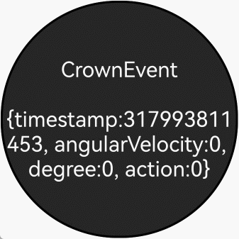

# 支持表冠输入事件

更新时间：2026-04-30 02:41:24

来源：https://developer.huawei.com/consumer/cn/doc/harmonyos-guides/arkts-common-events-crown-event

表冠事件从API version 18开始支持，是指通过旋转表冠触发的事件，通过硬件采样频率上报旋转角度的变化。

表冠事件分发依赖于应用内组件焦点，只有拥有焦点的组件才能接收到该事件。因此，接收此事件的组件应正确管理其焦点状态，并通过[onFocus](https://developer.huawei.com/consumer/cn/doc/harmonyos-references/ts-universal-focus-event#onfocus)和[onBlur](https://developer.huawei.com/consumer/cn/doc/harmonyos-references/ts-universal-focus-event#onblur)接口监听自身焦点状态变化。当正在接收表冠事件的组件失焦时，接下来的表冠事件都不会再发送给这个组件。

目前，系统中一些组件已默认支持与表冠的交互，例如，旋转手表表冠后，滚动条会根据表冠的旋转方向滚动。

当前，默认支持表冠事件的组件包括： [Slider](https://developer.huawei.com/consumer/cn/doc/harmonyos-references/ts-basic-components-slider)、[DatePicker](https://developer.huawei.com/consumer/cn/doc/harmonyos-references/ts-basic-components-datepicker)、[TextPicker](https://developer.huawei.com/consumer/cn/doc/harmonyos-references/ts-basic-components-textpicker)、 [TimePicker](https://developer.huawei.com/consumer/cn/doc/harmonyos-references/ts-basic-components-timepicker)、[Scroll](https://developer.huawei.com/consumer/cn/doc/harmonyos-references/ts-container-scroll)、[List](https://developer.huawei.com/consumer/cn/doc/harmonyos-references/ts-container-list)、[Grid](https://developer.huawei.com/consumer/cn/doc/harmonyos-references/ts-container-grid)、[WaterFlow](https://developer.huawei.com/consumer/cn/doc/harmonyos-references/ts-container-waterflow)、[ArcList](https://developer.huawei.com/consumer/cn/doc/harmonyos-references/ts-container-arclist)、[Refresh](https://developer.huawei.com/consumer/cn/doc/harmonyos-references/ts-container-refresh)和[Swiper](https://developer.huawei.com/consumer/cn/doc/harmonyos-references/ts-container-swiper)。

此外，应用也可以自行通过[onDigitalCrown](https://developer.huawei.com/consumer/cn/doc/harmonyos-references/ts-universal-events-crown#ondigitalcrown)接口感知表冠事件的上报。

其中，event参数提供表冠事件的时间戳、旋转角速度、旋转角度和[表冠动作](https://developer.huawei.com/consumer/cn/doc/harmonyos-references/ts-appendix-enums#crownaction18)信息。


> [!NOTE]
> 当前仅Wearable设备支持表冠事件。 组件对表冠事件的接收受自身获焦状态影响，接收到BEGIN后，如果失焦，则无法继续再接收到后续的UPDATE和END。

当组件需要获取旋转角度等信息时，可以通过onDigitalCrown接收表冠事件来获得上报信息。以下以Text组件为例，介绍表冠事件开发的基本步骤及开发过程中需要注意的事项。


**完整示例：**


```text
// xxx.ets
@Entry
@Component
struct Index {
  @State message: string = 'onDigitalCrown';

  build() {
    Column() {
      Row() {
        Stack() {
          Text(this.message)
            .fontSize(20)
            .fontColor(Color.White)
            .backgroundColor("#262626")
            .textAlign(TextAlign.Center)
            .focusable(true)
            .focusOnTouch(true)
            .defaultFocus(true)
            .borderWidth(2)
            .width(223)
            .height(223)
            .borderRadius(110)
            .onDigitalCrown((event: CrownEvent) => {
              event.stopPropagation();
              this.message = "CrownEvent\n\n" + JSON.stringify(event);
              hilog.debug(0x0000, 'Tag',
                "action:%{public}d, angularVelocity:%{public}f, degree:%{public}f, timestamp:%{public}f",
                event.action, event.angularVelocity, event.degree, event.timestamp);
            })
        }.width("100%").height("100%")
      }.width("100%").height("100%")
    }
  }
}
```


