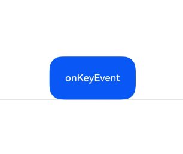
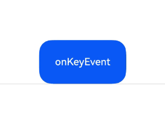
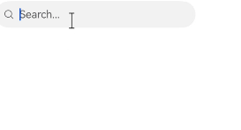
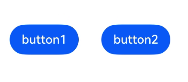
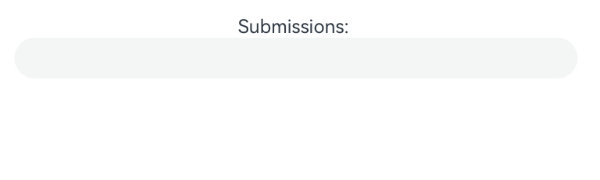
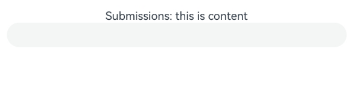

# 支持键盘输入事件

更新时间：2026-05-26 06:48:54

来源：https://developer.huawei.com/consumer/cn/doc/harmonyos-guides/arkts-interaction-development-guide-keyboard

物理按键产生的按键事件为非指向性事件，与触摸等指向性事件不同，其事件并没有坐标位置信息，所以其会按照一定次序向获焦组件进行派发，大多数文字输入场景下，按键事件都会优先派发给输入法进行处理，以便其处理文字的联想和候选词，应用可以通过[onKeyPreIme](https://developer.huawei.com/consumer/cn/doc/harmonyos-references/ts-universal-events-key#onkeypreime12)提前感知事件。

> [!NOTE]
> 一些系统按键产生的事件并不会传递给UI组件，如电源键。


#### 按键事件数据流





按键事件由外设键盘等设备触发，经驱动和多模处理转换后发送给当前获焦的窗口，窗口获取到事件后，会尝试分发三次事件。三次分发的优先顺序如下，一旦事件被消费，则跳过后续分发流程。
1. 首先分发给ArkUI框架用于触发获焦组件绑定的[onKeyPreIme](https://developer.huawei.com/consumer/cn/doc/harmonyos-references/ts-universal-events-key#onkeypreime12)回调和页面快捷键。
2. 再向输入法分发，输入法会消费按键用作输入。
3. 再次将事件发给ArkUI框架，用于响应[onKeyEventDispatch](https://developer.huawei.com/consumer/cn/doc/harmonyos-references/ts-universal-events-key#onkeyeventdispatch15)事件、获焦组件绑定的[onKeyEvent](https://developer.huawei.com/consumer/cn/doc/harmonyos-references/ts-universal-events-key#onkeyevent)回调以及走焦。

因此，当某输入框组件获焦，且打开了输入法，此时大部分按键事件均会被输入法消费。例如字母键会被输入法用来往输入框中输入对应字母字符、方向键会被输入法用来切换选中备选词。如果在此基础上给输入框组件绑定了快捷键，那么快捷键会优先响应事件，事件也不再会被输入法消费。

按键事件到ArkUI框架之后，会先找到完整的节点获焦链。从叶子节点到根节点，逐一发送按键事件，若有子组件可以处理则优先给子组件处理，若子组件无法处理，则进行冒泡寻找父组件进行处理。

Web组件的KeyEvent流程与上述过程有所不同。在[onKeyPreIme](https://developer.huawei.com/consumer/cn/doc/harmonyos-references/ts-universal-events-key#onkeypreime12)返回false时，Web组件不会匹配快捷键。而在第三次按键派发过程中，Web组件会将未消费的[KeyEvent](https://developer.huawei.com/consumer/cn/doc/harmonyos-references/ts-universal-events-key#keyevent对象说明)重新派发回ArkUI，在重新派发过程中再执行匹配快捷键等操作。


#### onKeyEvent & onKeyPreIme

```text
onKeyEvent(event: (event: KeyEvent) => void): T
onKeyEvent(event: Callback<KeyEvent, boolean>): T
onKeyPreIme(event: Callback<KeyEvent, boolean>): T
onKeyEventDispatch(event: Callback<KeyEvent, boolean>): T
```

上述四种方法的区别仅在于触发的时机（见[按键事件数据流](#按键事件数据流)）。其中onKeyPreIme的返回值决定了该按键事件后续是否会被继续分发给页面快捷键、输入法、onKeyEventDispatch和onKeyEvent。

当绑定方法的组件处于获焦状态下，外设键盘的按键事件会触发该方法，回调参数为[KeyEvent](https://developer.huawei.com/consumer/cn/doc/harmonyos-references/ts-universal-events-key#keyevent对象说明)，可由该参数获得当前按键事件的按键行为（[KeyType](https://developer.huawei.com/consumer/cn/doc/harmonyos-references/ts-appendix-enums#keytype)）、键码（[KeyCode](https://developer.huawei.com/consumer/cn/doc/harmonyos-references/js-apis-keycode#keycode)）、按键英文名称（keyText）、事件来源设备类型（[KeySource](https://developer.huawei.com/consumer/cn/doc/harmonyos-references/ts-appendix-enums#keysource)）、事件来源设备id（deviceId）、元键按压状态（metaKey）、时间戳（timestamp）、阻止冒泡设置（stopPropagation）。

```ArkTS
@Entry
@Component
struct KeyEventExample {
  @State buttonText: string = '';
  @State buttonType: string = '';
  @State columnText: string = '';
  @State columnType: string = '';

  build() {
    Column() {
      Button('onKeyEvent')
        .defaultFocus(true)
        .width(140).height(70)
        .onKeyEvent((event?: KeyEvent) => { // 给Button设置onKeyEvent事件
          if (event) {
            if (event.type === KeyType.Down) {
              this.buttonType = 'Down';
            }
            if (event.type === KeyType.Up) {
              this.buttonType = 'Up';
            }
            this.buttonText = 'Button: \n' +
              'KeyType:' + this.buttonType + '\n' +
              'KeyCode:' + event.keyCode + '\n' +
              'KeyText:' + event.keyText;
          }
        })

      Divider()
      Text(this.buttonText).fontColor(Color.Green)

      Divider()
      Text(this.columnText).fontColor(Color.Red)
    }.width('100%').height('100%').justifyContent(FlexAlign.Center)
    .onKeyEvent((event?: KeyEvent) => { // 给父组件Column设置onKeyEvent事件
      if (event) {
        if (event.type === KeyType.Down) {
          this.columnType = 'Down';
        }
        if (event.type === KeyType.Up) {
          this.columnType = 'Up';
        }
        this.columnText = 'Column: \n' +
          'KeyType:' + this.columnType + '\n' +
          'KeyCode:' + event.keyCode + '\n' +
          'KeyText:' + event.keyText;
      }
    })
  }
}
```

上述示例中给组件Button和其父容器Column绑定onKeyEvent。应用打开页面加载后，组件树上第一个可获焦的非容器组件自动获焦，设置Button为当前页面的默认焦点，由于Button是Column的子节点，Button获焦也同时意味着Column获焦。获焦机制见[支持焦点处理](https://developer.huawei.com/consumer/cn/doc/harmonyos-guides/arkts-common-events-focus-event)。





打开应用后，依次在键盘上按这些按键：空格、回车、左Ctrl、左Shift、字母A、字母Z。
1. 由于onKeyEvent事件默认是冒泡的，所以Button和Column的onKeyEvent都可以响应。
2. 每个按键都有2次回调，分别对应KeyType.Down和KeyType.Up，表示按键被按下，然后抬起。

如果要阻止冒泡，即仅Button响应键盘事件，Column不响应，在Button的onKeyEvent回调中加入event.stopPropagation()方法即可，如下：

```ArkTS
@Entry
@Component
struct KeyEventPreventBubble {
  @State buttonText: string = '';
  @State buttonType: string = '';
  @State columnText: string = '';
  @State columnType: string = '';

  build() {
    Column() {
      Button('onKeyEvent')
        .defaultFocus(true)
        .width(140).height(70)
        .onKeyEvent((event?: KeyEvent) => {
          // 通过stopPropagation阻止事件冒泡
          if (event) {
            if (event.stopPropagation) {
              event.stopPropagation();
            }
            if (event.type === KeyType.Down) {
              this.buttonType = 'Down';
            }
            if (event.type === KeyType.Up) {
              this.buttonType = 'Up';
            }
            this.buttonText = 'Button: \n' +
              'KeyType:' + this.buttonType + '\n' +
              'KeyCode:' + event.keyCode + '\n' +
              'KeyText:' + event.keyText;
          }
        })

      Divider()
      Text(this.buttonText).fontColor(Color.Green)

      Divider()
      Text(this.columnText).fontColor(Color.Red)
    }.width('100%').height('100%').justifyContent(FlexAlign.Center)
    .onKeyEvent((event?: KeyEvent) => { // 给父组件Column设置onKeyEvent事件
      if (event) {
        if (event.type === KeyType.Down) {
          this.columnType = 'Down';
        }
        if (event.type === KeyType.Up) {
          this.columnType = 'Up';
        }
        this.columnText = 'Column: \n' +
          'KeyType:' + this.columnType + '\n' +
          'KeyCode:' + event.keyCode + '\n' +
          'KeyText:' + event.keyText;
      }
    })
  }
}
```





使用OnKeyPreIme屏蔽在输入框中使用方向左键。

```ArkTS
import { KeyCode } from '@kit.InputKit';

@Entry
@Component
struct PreImeEventExample {
  @State buttonText: string = '';
  @State buttonType: string = '';
  @State columnText: string = '';
  @State columnType: string = '';

  build() {
    Column() {
      Search({
        placeholder: 'Search...'
      })
        .width('80%')
        .height('40vp')
        .border({ radius: '20vp' })
        .onKeyPreIme((event: KeyEvent) => {
          if (event.keyCode == KeyCode.KEYCODE_DPAD_LEFT) {
            return true;
          }
          return false;
        })
    }
  }
}
```





使用onKeyEventDispatch分发按键事件到子组件，子组件使用onKeyEvent。

```ArkTS
import { hilog } from '@kit.PerformanceAnalysisKit';

const TAG = '[Sample_Eventproject]';
const DOMAIN = 0xF811;
const BUNDLE = 'Eventproject_';

@Entry
@Component
struct Index {
  build() {
    Row() {
      Row() {
        Button('button1')
          .id('button1')
          .margin({ left: 70, right: 30 })
          .onKeyEvent((event) => {
            hilog.info(DOMAIN, TAG, BUNDLE + 'button1');
            return true;
          })
        Button('button2')
          .id('button2')
          .onKeyEvent((event) => {
            hilog.info(DOMAIN, TAG, BUNDLE + 'button2');
            return true;
          })
      }
      .width('100%')
      .height('100%')
      .id('Row1')
      .onKeyEventDispatch((event) => {
        let context = this.getUIContext();
        context.getFocusController().requestFocus('button1');
        return context.dispatchKeyEvent('button1', event);
      })

    }
    .height('100%')
    .width('100%')
    .onKeyEventDispatch((event) => {
      if (event.type == KeyType.Down) {
        let context = this.getUIContext();
        context.getFocusController().requestFocus('Row1');
        return context.dispatchKeyEvent('Row1', event);
      }
      return true;
    })
  }
}
```





使用OnKeyPreIme实现回车提交（建议使用物理键盘）。

```ArkTS
import { hilog } from '@kit.PerformanceAnalysisKit';

const TAG = '[Sample_Eventproject]';
const DOMAIN = 0xF811;
const BUNDLE = 'Eventproject_';

@Entry
@Component
struct TextAreaDemo {
  @State content: string = '';
  @State text: string = '';
  controller: TextAreaController = new TextAreaController();

  build() {
    Column() {
      Text('Submissions: ' + this.content)
      TextArea({ controller: this.controller, text: this.text })
        .onKeyPreIme((event: KeyEvent) => {
          hilog.info(DOMAIN, TAG, `${BUNDLE + JSON.stringify(event)}`);
          if (event.keyCode === 2054 && event.type === KeyType.Down) { // 回车键物理码
            const hasCtrl = event?.getModifierKeyState?.(['Ctrl']);
            if (hasCtrl) {
              hilog.info(DOMAIN, TAG, BUNDLE + 'Line break');
            } else {
              hilog.info(DOMAIN, TAG, BUNDLE + 'Submissions：' + this.text);
              this.content = this.text;
              this.text = '';
              event.stopPropagation();
            }
            return true;
          }
          return false;
        })
        .onChange((value: string) => {
          this.text = value;
        })
    }
  }
}
```





在输入框中输入内容后回车。


