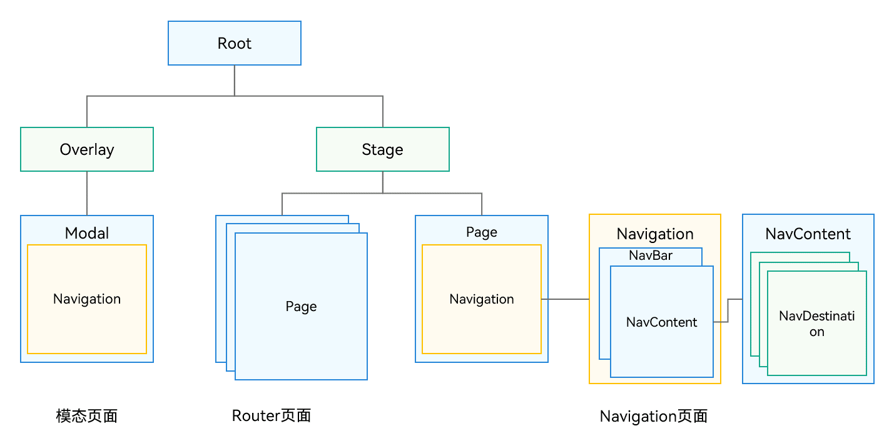

# 组件导航和页面路由概述

更新时间：2026-05-19 09:13:51

来源：https://developer.huawei.com/consumer/cn/doc/harmonyos-guides/arkts-navigation-introduction

页面是指由布局、组件、交互逻辑等构成的可视化交互单元，承载着特定功能逻辑与信息展示，是用户与应用进行操作交互的核心界面载体。一个完整的应用往往由多个页面组成，组件导航（[Navigation](https://developer.huawei.com/consumer/cn/doc/harmonyos-references/ts-basic-components-navigation)）和页面路由（[@ohos.router](https://developer.huawei.com/consumer/cn/doc/harmonyos-references/arkts-apis-uicontext-router)）均提供了应用内的页面跳转能力。
- 在组件导航（Navigation）框架下，“页面”通过[NavDestination](https://developer.huawei.com/consumer/cn/doc/harmonyos-references/ts-basic-components-navdestination)组件承载，特指一个NavDestination组件包含的内容。
- 在页面路由（@ohos.router）框架下，“页面”特指@Entry装饰的自定义组件。
相较而言，组件导航（Navigation）将页面放在Navigation组件内部进行跳转，具备更强的一次开发多端部署能力，可以进行更加灵活的页面栈操作，同时支持更丰富的动效和生命周期。因此，推荐使用组件导航（Navigation）来实现页面跳转以及组件内的跳转，以获得更佳的使用体验。

#### 架构差异
从ArkUI组件树层级上来看，原先由Router管理的Page在页面栈管理节点Stage的下面。Navigation作为导航容器组件，可以挂载在单个page节点下，也可以叠加、嵌套。Navigation管理了标题栏、内容区和工具栏，内容区用于显示用户自定义页面的内容，并支持页面的路由能力。Navigation的这种设计上有如下优势：

1. 接口上显式区分标题栏、内容区和工具栏，实现更加灵活的管理和UX动效能力；
2. 显式提供路由容器概念，由开发者决定路由容器的位置，支持在全模态、半模态、弹窗中显示；
3. 整合UX设计和一次开发多端部署能力，默认提供统一的标题显示、页面切换和单双栏适配能力；
4. 基于通用UIBuilder能力，由开发者决定页面别名和页面UI对应关系，提供更加灵活的页面配置能力；
5. 基于组件属性动效和共享元素动效能力，将页面切换动效转换为组件属性动效实现，提供更加丰富和灵活的切换动效；
6. 开放了页面栈对象，开发者可以继承，能更好的管理页面显示。

#### 能力对比

| 业务场景 | Navigation | Router |
| --- | --- | --- |
| 一次开发多端部署能力 | 支持，Auto模式自适应单栏和双栏显示。 | 不支持 |
| 跳转指定页面 | [pushPath](https://developer.huawei.com/consumer/cn/doc/harmonyos-references/ts-basic-components-navigation#pushpath10) & [pushDestination](https://developer.huawei.com/consumer/cn/doc/harmonyos-references/ts-basic-components-navigation#pushdestination11) | [pushUrl](https://developer.huawei.com/consumer/cn/doc/harmonyos-references/arkts-apis-uicontext-router#pushurl) & [pushNamedRoute](https://developer.huawei.com/consumer/cn/doc/harmonyos-references/arkts-apis-uicontext-router#pushnamedroute) |
| 跳转HSP中页面 | 支持 | 支持 |
| 跳转HAR中页面 | 支持 | 支持 |
| 跳转传参 | 支持 | 支持 |
| 获取指定页面参数 | 支持 | 不支持 |
| 传参类型 | 传参为对象形式。 | 传参为对象形式，对象中暂不支持方法变量。 |
| 跳转结果回调 | 支持 | 支持 |
| 跳转单例页面 | 支持 | 支持 |
| 页面返回 | 支持 | 支持 |
| 页面返回传参 | 支持 | 支持 |
| 返回指定路由 | 支持 | 支持 |
| 页面返回弹窗 | 支持，通过路由拦截实现。 | [showAlertBeforeBackPage](https://developer.huawei.com/consumer/cn/doc/harmonyos-references/arkts-apis-uicontext-router#showalertbeforebackpage) |
| 路由替换 | [replacePath](https://developer.huawei.com/consumer/cn/doc/harmonyos-references/ts-basic-components-navigation#replacepath11) & [replacePathByName](https://developer.huawei.com/consumer/cn/doc/harmonyos-references/ts-basic-components-navigation#replacepathbyname11) | [replaceUrl](https://developer.huawei.com/consumer/cn/doc/harmonyos-references/arkts-apis-uicontext-router#replaceurl) & [replaceNamedRoute](https://developer.huawei.com/consumer/cn/doc/harmonyos-references/arkts-apis-uicontext-router#replacenamedroute) |
| 路由栈清理 | [clear](https://developer.huawei.com/consumer/cn/doc/harmonyos-references/ts-basic-components-navigation#clear10) | [clear](https://developer.huawei.com/consumer/cn/doc/harmonyos-references/arkts-apis-uicontext-router#clear) |
| 清理指定路由 | [removeByIndexes](https://developer.huawei.com/consumer/cn/doc/harmonyos-references/ts-basic-components-navigation#removebyindexes11) & [removeByName](https://developer.huawei.com/consumer/cn/doc/harmonyos-references/ts-basic-components-navigation#removebyname11) | 不支持 |
| 转场动画 | 支持 | 支持 |
| 自定义转场动画 | 支持 | 支持，动画类型受限。 |
| 屏蔽转场动画 | 支持全局和单次。 | 支持，设置[pageTransition](https://developer.huawei.com/consumer/cn/doc/harmonyos-references/ts-page-transition-animation)方法duration为0。 |
| geometryTransition共享元素动画 | 支持（NavDestination之间共享）。 | 不支持 |
| 页面生命周期监听 | [UIObserver.on('navDestinationUpdate')](https://developer.huawei.com/consumer/cn/doc/harmonyos-references/arkts-apis-uicontext-uiobserver#onnavdestinationupdate11) | [UIObserver.on('routerPageUpdate')](https://developer.huawei.com/consumer/cn/doc/harmonyos-references/arkts-apis-uicontext-uiobserver#onrouterpageupdate11) |
| 获取页面栈对象 | 支持 | 不支持 |
| 路由拦截 | 支持通过[setInterception](https://developer.huawei.com/consumer/cn/doc/harmonyos-references/ts-basic-components-navigation#setinterception12)做路由拦截 。 | 不支持 |
| 路由栈信息查询 | 支持 | [getState()](https://developer.huawei.com/consumer/cn/doc/harmonyos-references/arkts-apis-uicontext-router#getstate) |
| 路由栈move操作 | [moveToTop](https://developer.huawei.com/consumer/cn/doc/harmonyos-references/ts-basic-components-navigation#movetotop10) & [moveIndexToTop](https://developer.huawei.com/consumer/cn/doc/harmonyos-references/ts-basic-components-navigation#moveindextotop10) | 不支持 |
| 沉浸式页面 | 支持 | 不支持，需通过window配置。 |
| 设置页面标题栏（titlebar）和工具栏（toolbar） | 支持 | 不支持 |
| 模态嵌套路由 | 支持 | 不支持 |
