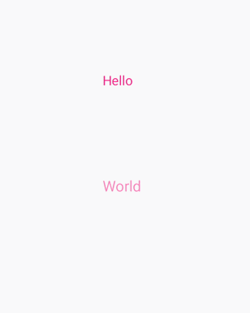
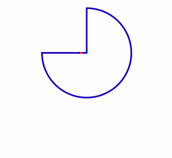
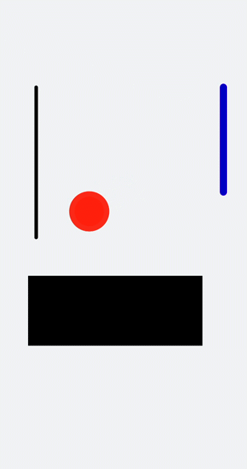

# svg动画

更新时间：2026-03-09 02:50:43

来源：https://developer.huawei.com/consumer/cn/doc/harmonyos-guides/ui-js-animate-svg

为svg组件添加动画效果。


## 属性样式动画

在svg的子组件[animate](https://developer.huawei.com/consumer/cn/doc/harmonyos-references/js-components-svg-animate)中，通过attributeName设置需要进行动效的属性，from设置开始值，to设置结束值。
```text


      Hello


      World


```


> [!NOTE]
> 在设置动画变化值时，如果已经设置了values属性，则from和to都失效。


## 路径动画

在svg的子组件[animateMotion](https://developer.huawei.com/consumer/cn/doc/harmonyos-references/js-components-svg-animatemotion)中，通过path设置动画变化的路径。
```text


```



## animateTransform动画

在svg的子组件[animateTransform](https://developer.huawei.com/consumer/cn/doc/harmonyos-references/js-components-svg-animatetransform)中，通过attributeName绑定transform属性，type设置动画类型，from设置开始值，to设置结束值。
```text


```


```text
/* xxx.css */
.container {
  flex-direction: column;
  align-items: center;
  width: 100%;
  height: 100%;
  background-color: #F1F3F5;
}
```


