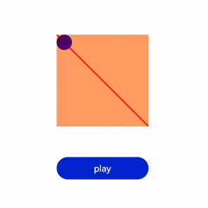
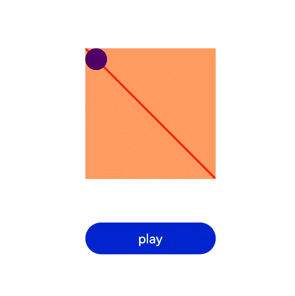

# 动画帧

更新时间：2026-03-09 02:50:43

来源：https://developer.huawei.com/consumer/cn/doc/harmonyos-guides/ui-js-animate-frame

## 请求动画帧

请求动画帧时通过requestAnimationFrame函数逐帧回调，传入一个回调函数。 runframe在调用requestAnimationFrame时传入带有timestamp参数的回调函数step，将step中的timestamp赋予起始的startTime。当timestamp与startTime的差值小于规定的时间时，会再次调用requestAnimationFrame，最终动画将会停止。
```text


```


```text
/* xxx.css */
.container {
  flex-direction: column;
  justify-content: center;
  align-items: center;
  width: 100%;
  height: 100%;
}
button{
  width: 300px;
}
```


```text
// xxx.js
export default {
  data: {
    timer: null,
    left: 0,
    top: 0,
    flag: true,
    animation: null,
    startTime: 0,
  },
  onShow() {
    var test = this.$element("mycanvas");
    var ctx = test.getContext("2d");
    ctx.beginPath();
    ctx.moveTo(0, 0);
    ctx.lineTo(300, 300);
    ctx.lineWidth = 5;
    ctx.strokeStyle = "red";
    ctx.stroke();
  },
  runframe() {
    this.left = 0;
    this.top = 0;
    this.flag = true;
    this.animation = requestAnimationFrame(this.step);
  },
  step(timestamp) {
    if (this.flag) {
      this.left += 5;
      this.top += 5;
      if (this.startTime == 0) {
        this.startTime = timestamp;
      }
      var elapsed = timestamp - this.startTime;
        if (elapsed 
> [!NOTE]
> requestAnimationFrame函数在调用回调函数时在第一个参数位置传入timestamp时间戳，表示requestAnimationFrame开始去执行回调函数的时刻。


## 取消动画帧

通过cancelAnimationFrame函数取消逐帧回调，在调用cancelAnimationFrame函数时取消requestAnimationFrame函数的请求。
```text


```


```text
/* xxx.css */
.container {
flex-direction: column;
justify-content: center;
align-items: center;
width: 100%;
height: 100%;
}
button{
width: 300px;
}
```


```text
// xxx.js
export default {
data: {
timer: null,
left: 0,
top: 0,
flag: true,
animation: null
},
onShow() {
var test = this.\$element("mycanvas");
var ctx = test.getContext("2d");
ctx.beginPath();
ctx.moveTo(0, 0);
ctx.lineTo(300, 300);
ctx.lineWidth = 5;
ctx.strokeStyle = "red";
ctx.stroke();
},
runframe() {
this.left = 0;
this.top = 0;
this.flag = true;
this.animation = requestAnimationFrame(this.step);
},
step(timestamp) {
if (this.flag) {
this.left += 5;
this.top += 5;
this.animation = requestAnimationFrame(this.step);
} else {
this.left -= 5;
this.top -= 5;
this.animation = requestAnimationFrame(this.step);
}
if (this.left == 250 || this.left == 0) {
this.flag = !this.flag;
}
},
onDestroy() {
cancelAnimationFrame(this.animation);
}
}
```

 
> [!NOTE]
> 在调用该函数时需传入一个具有标识id的参数。
