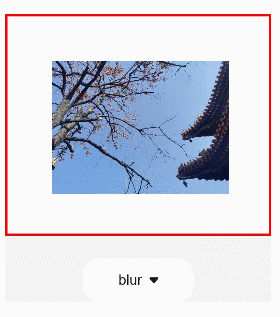
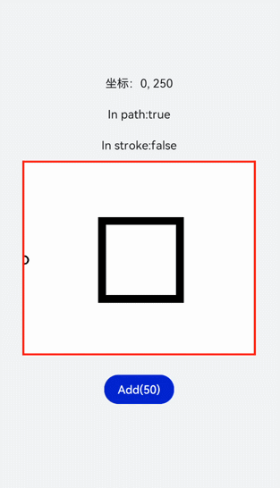

# OffscreenCanvasRenderingContext2D对象

更新时间：2026-03-09 02:50:43

来源：https://developer.huawei.com/consumer/cn/doc/harmonyos-guides/ui-js-components-offscreencanvas

使用OffscreenCanvas在离屏Canvas画布组件上进行绘制，绘制对象可以是矩形、文本、图片等。 离屏，即GPU在当前缓冲区以外新开辟的一个缓冲区。具体请参考[OffscreenCanvasRenderingContext2D对象](https://developer.huawei.com/consumer/cn/doc/harmonyos-references/js-offscreencanvasrenderingcontext2d)。

以下示例创建了一个OffscreenCanvas画布，再在画布上创建一个getContext2d对象，并设置filter属性改变图片样式。


```text


    blur
    grayscale
    hue-rotate
    invert
    drop-shadow
    brightness
    opacity
    saturate
    sepia
    contrast


```


```text
/* xxx.css */
.container {
    width: 100%;
    height: 100%;
    flex-direction: column;
    justify-content: center;
    align-items: center;
    background-color: #F1F3F5;
}

canvas {
    width: 600px;
    height: 500px;
    background-color: #fdfdfd;
    border: 5px solid red;
}

select {
    margin-top: 50px;
    width: 250px;
    height: 100px;
    background-color: white;
}
```


```text
// xxx.js
import promptAction from '@ohos.promptAction';

export default {
    data: {
        el: null,
        ctx: null,
        offscreen: null,
        offCanvas: null,
        img: null,
    },
    onShow() {
        this.ctx = this.$refs.canvas1.getContext('2d');
        this.offscreen = new OffscreenCanvas(600, 500);
        this.offCanvas = this.offscreen.getContext('2d');
        this.img = new Image();
        // "common/images/2.png"需要替换为开发者所需的图像资源文件
        this.img.src = 'common/images/2.png';
        // 图片成功获取触发方法
        let _this = this;
        this.img.onload = function () {
            _this.offCanvas.drawImage(_this.img, 100, 100, 400, 300);
        };
        this.img.onerror = function () {
            promptAction.showToast({ message: 'error', duration: 2000 })
        };
        var bitmap = this.offscreen.transferToImageBitmap();
        this.ctx.transferFromImageBitmap(bitmap);
    },
    change(e) {
        this.offCanvas.filter = e.newValue;
        this.offCanvas.drawImage(this.img, 100, 100, 400, 300);
        var bitmap = this.offscreen.transferToImageBitmap();
        this.ctx.transferFromImageBitmap(bitmap);
    },
}
```




## 判断位置

使用isPointInPath判断坐标点是否在路径的区域内，使用isPointInStroke判断坐标点是否在路径的边缘线上，并在页面上显示返回结果。
```text


    坐标：{{X}}, {{Y}}
    In path:{{textValue}}
    In stroke:{{textValue1}}


  Add(50)

```


```text
/* xxx.css */
.container {
    width: 100%;
    height: 100%;
    flex-direction: column;
    justify-content: center;
    align-items: center;
    background-color: #F1F3F5;
    display: flex;
}

canvas {
    width: 600px;
    height: 500px;
    background-color: #fdfdfd;
    border: 5px solid red;
}

.content {
    flex-direction: column;
    justify-content: center;
    align-items: center;
}

text {
    font-size: 30px;
    width: 300px;
    height: 80px;
    text-align: center;
}

button {
    width: 180px;
    height: 75px;
    margin-top: 50px;
}
```


```text
// xxx.js
export default {
    data: {
        textValue: 0,
        textValue1: 0,
        X: 0,
        Y: 250,
    },
    onShow() {
        let canvas = this.$refs.canvas.getContext('2d');
        let offscreen = new OffscreenCanvas(500, 500);
        let offscreenCanvasCtx = offscreen.getContext('2d');
        let offscreenCanvasCtx1 = offscreen.getContext('2d');
        offscreenCanvasCtx1.arc(this.X, this.Y, 2, 0, 6.28);
        offscreenCanvasCtx.lineWidth = 20;
        offscreenCanvasCtx.rect(200, 150, 200, 200);
        offscreenCanvasCtx.stroke();
        this.textValue1 = offscreenCanvasCtx.isPointInStroke(this.X, this.Y) ? 'true' : 'false';
        this.textValue = offscreenCanvasCtx.isPointInPath(this.X, this.Y) ? 'true' : 'false';
        let bitmap = offscreen.transferToImageBitmap();
        canvas.transferFromImageBitmap(bitmap);
    },
    change() {
        if (this.X 
