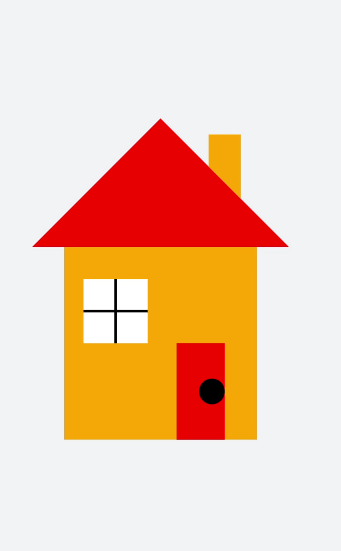

# 绘制图形

更新时间：2026-03-09 02:50:43

来源：https://developer.huawei.com/consumer/cn/doc/harmonyos-guides/ui-js-components-svg-graphics

svg组件可以用来绘制常见图形和线段，如矩形（&lt;rect&gt;）、圆形（&lt;circle&gt;）、线条(&lt;line&gt;）等，具体支持图形样式还请参考[svg](https://developer.huawei.com/consumer/cn/doc/harmonyos-references/js-components-svg)组件。

在本场景中，绘制各种图形拼接成一个小房子。

```text
<!-- xxx.hml -->
<div class="container">
  <svg width="1000" height="1000">
    <polygon points="100,400 300,200 500,400" fill="red"></polygon>     //屋顶
    <polygon points="375,275 375,225 425,225 425,325" fill="orange"></polygon>   //烟囱
    <rect width="300" height="300" x="150" y="400" fill="orange">      //房子
    </rect>
    <rect width="100" height="100" x="180" y="450" fill="white">    //窗户
    </rect>
    <line x1="180" x2="280" y1="500" y2="500" stroke-width="4" fill="white" stroke="black"></line>     //窗框
    <line x1="230" x2="230" y1="450" y2="550" stroke-width="4" fill="white" stroke="black"></line>     //窗框
    <polygon points="325,700 325,550 400,550 400,700" fill="red"></polygon>     //门
    <circle cx="380" cy="625" r="20" fill="black"></circle>      //门把手
  </svg>
</div>
```

```text
/* xxx.css */
.container {
  width: 100%;
  height: 100%;
  flex-direction: column;
  justify-content: center;
  align-items: center;
  background-color: #F1F3F5;
}
```



