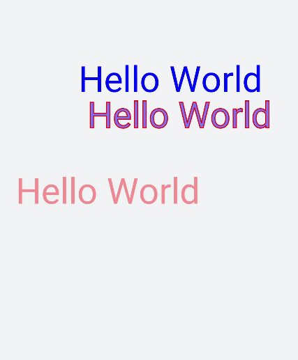

# 绘制文本

更新时间：2026-03-09 02:50:43

来源：https://developer.huawei.com/consumer/cn/doc/harmonyos-guides/ui-js-components-svg-text

svg组件还可以绘制文本。


## 文本


> [!NOTE]
> 文本的展示内容需要写在元素标签text内，可嵌套tspan子元素标签分段。  只支持被父元素标签svg嵌套。  只支持默认字体sans-serif。

 通过设置x（x轴坐标）、y（y轴坐标）、dx（文本x轴偏移）、dy（文本y轴偏移）、fill（字体填充颜色）、stroke（文本边框颜色）、stroke-width（文本边框宽度）等属性实现文本的不同展示样式。
```text


    Hello World    Hello World

      Hello World


```

 

## 沿路径绘制文本

textpath文本内容沿着属性path中的路径绘制文本。
```text


          This is textpath test.


```

 
