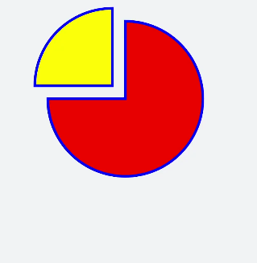

# 绘制路径

更新时间：2026-03-09 02:50:43

来源：https://developer.huawei.com/consumer/cn/doc/harmonyos-guides/ui-js-components-svg-path

[svg](https://developer.huawei.com/consumer/cn/doc/harmonyos-references/js-components-svg)组件绘制路径时，通过Path中的M（起点）、H（水平线）、a（绘制弧形到指定位置）路径控制指令，并填充颜色实现饼状图效果。


```text


```


```text
/* xxx.css */
.container {
  flex-direction: row;
  justify-content: flex-start;
  align-items: flex-start;
  height: 1200px;
  width: 600px;
  background-color: #F1F3F5;
}
```




> [!NOTE]
> M/m = moveto 参数x和y表示需要移动到点的x轴和y轴的坐标。在使用M命令移动画笔后，只会移动画笔，但不会在两点之间画线。所以M命令经常出现在路径的开始处，用来指明从何处开始画。 L/l = lineto 参数x和y表示一个点的x轴和y轴坐标，L命令将会在当前位置和新位置（L前面画笔所在的点）之间画一条线段。 H/h = horizontal lineto 绘制平行线。 V/v = vertical lineto 绘制垂直线。 C/c = curveto 三次贝塞尔曲线 设置三组坐标参数： x1 y1, x2 y2, x y。 S/s = smooth curveto 三次贝塞尔曲线命令 设置两组坐标参数： x2 y2, x y。 Q/q = quadratic Bezier curve 二次贝塞尔曲线 设置两组坐标参数： x1 y1, x y。 T/t = smooth quadratic Bezier curveto 二次贝塞尔曲线命令 设置参数： x y。 A/a = elliptical Arc 弧形命令 设置参数： rx ry x-axis-rotation（旋转角度）large-arc-flag（角度大小） sweep-flag（弧线方向） x y。large-arc-flag决定弧线是大于还是小于180度，0表示小角度弧，1表示大角度弧。sweep-flag表示弧线的方向，0表示从起点到终点沿逆时针画弧，1表示从起点到终点沿顺时针画弧。 Z/z = closepath 从当前点画一条直线到路径的起点。
