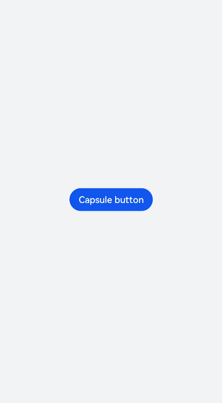
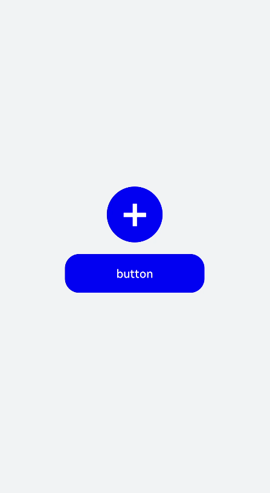
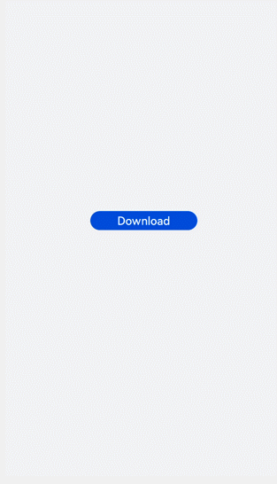
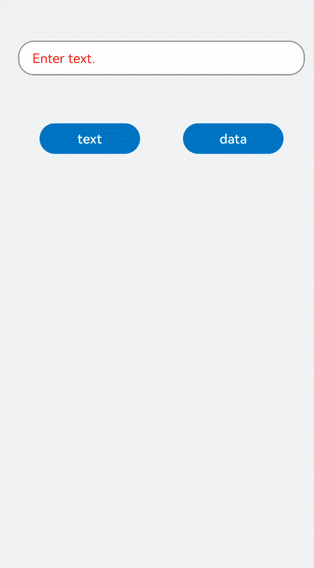

# button开发指导

更新时间：2026-03-09 02:50:43

来源：https://developer.huawei.com/consumer/cn/doc/harmonyos-guides/ui-js-components-button

button是按钮组件，其类型包括胶囊按钮、圆形按钮、文本按钮、弧形按钮、下载按钮。具体用法请参考[button API](https://developer.huawei.com/consumer/cn/doc/harmonyos-references/js-components-basic-button)。


## 创建button组件

在pages/index目录下的hml文件中创建一个button组件。
```text


```


```text
/* xxx.css */
.container {
  width: 100%;
  height: 100%;
  flex-direction: column;
  justify-content: center;
  align-items: center;
  background-color: #F1F3F5;
}
```



## 设置button类型

通过设置button的type属性来选择按钮类型，如定义button为圆形按钮、文本按钮等。
```text


  +
   button

```


```text
/* xxx.css */
.container {
  width: 100%;
  height: 100%;
  background-color: #F1F3F5;
  flex-direction: column;
  align-items: center;
  justify-content: center;
}
.circle {
  font-size: 120px;
  background-color: blue;
  radius: 72px;
}
.text {
  margin-top: 30px;
  text-color: white;
  font-size: 30px;
  font-style: normal;
  background-color: blue;
  width: 50%;
  height: 100px;
}
```


> [!NOTE]
> button组件使用的icon图标如果来自云端路径，需要添加网络访问权限 ohos.permission.INTERNET。

如果需要添加ohos.permission.INTERNET权限，则在resources文件夹下的config.json文件里进行权限配置。
```text

"module": {
  "reqPermissions": [{
    "name": "ohos.permission.INTERNET"
  }],
}
```


## 显示下载进度

为button组件添加setProgress方法，来实时显示下载进度条的进度。
```text


  {{downloadText}}

```


```text
/* xxx.css */
.container {
  width: 100%;
  height: 100%;
  background-color: #F1F3F5;
  flex-direction: column;
  align-items: center;
  justify-content: center;
}
.download {
  width: 280px;
  text-color: white;
  background-color: #007dff;
}
```


```text
// xxx.js
import promptAction from '@ohos.promptAction';
export default {
  data: {
    percent: 0,
    downloadText: "Download",
    isPaused: true,
    intervalId : null,
  },
  start(){
    this.intervalId = setInterval(()=>{
      if(this.percent 
> [!NOTE]
> setProgress方法只支持button的类型为download。


## 场景示例

     在本场景中，开发者可根据输入的文本内容进行button类型切换。
```text


```


```text
/* xxx.css */
.container {
flex-direction: column;
align-items: center;
background-color: #F1F3F5;
}
.input-item {
margin-bottom: 80px;
flex-direction: column;
}
.doc-row {
justify-content: center;
margin-left: 30px;
margin-right: 30px;
}
.input-text {
height: 80px;
line-height: 80px;
padding-left: 30px;
padding-right: 30px;
margin-left: 30px;
margin-right: 30px;
margin-top:100px;
border: 3px solid;
border-color: #999999;
font-size: 30px;
background-color: #ffffff;
font-weight: 400;
}
.select-button {
width: 35%;
text-align: center;
height: 70px;
padding-top: 10px;
padding-bottom: 10px;
margin-top: 30px;
font-size: 30px;
color: #ffffff;
}
.color-3 {
background-color: #0598db;
}
```


```text
// xxx.js
export default {
data: {
myflex: '',
myholder: 'Enter text.',
myname: '',
mystyle1: "#ffffff",
mystyle2: "#ff0000",
mytype: 'text',
myvalue: '',
},
onInit() {
},
changetype3() {
this.myflex = '';
this.myholder = 'Enter text.';
this.myname = '';
this.mystyle1 = "#ffffff";
this.mystyle2 = "#FF0000";
this.mytype = 'text';
this.myvalue = '';
},
changetype4() {
this.myflex = '';
this.myholder = 'Enter a date.';
this.myname = '';
this.mystyle1 = "#ffffff";
this.mystyle2 = "#FF0000";
this.mytype = 'date';
this.myvalue = '';
},
}
```

     
