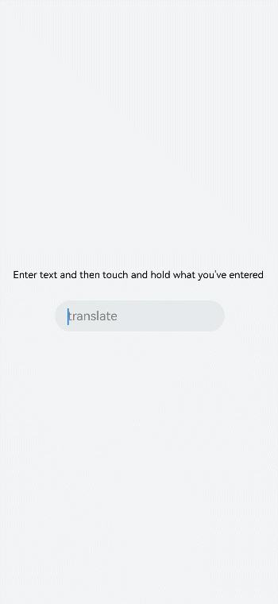

# input开发指导

更新时间：2026-04-13 09:29:20

来源：https://developer.huawei.com/consumer/cn/doc/harmonyos-guides/ui-js-components-input

input是交互式组件，用于接收用户数据。其类型可设置为日期、多选框和按钮等。具体用法请参考[input API](https://developer.huawei.com/consumer/cn/doc/harmonyos-references/js-components-basic-input)。


## 创建input组件

在pages/index目录下的hml文件中创建一个input组件。
```text


     Please enter the content


```


```text
/* xxx.css */
.container {
  width: 100%;
  height: 100%;
  flex-direction: column;
  justify-content: center;
  align-items: center;
  background-color: #F1F3F5;
}
```


## 设置input类型

通过设置type属性来定义input类型，如将input设置为button、date等。
```text


        this is a dialog


```


```text
/* xxx.css */
.container {
  width: 100%;
  height: 100%;
  align-items: center;
  flex-direction: column;
  justify-content: center;
  background-color: #F1F3F5 ;
}
.div-button {
  flex-direction: column;
  align-items: center;
}
.dialogClass{
  width:80%;
  height: 200px;
}
.button {
  margin-top: 30px;
  width: 50%;
}
.content{
  width: 90%;
  height: 150px;
  align-items: center;
  justify-content: center;
}
.flex {
  width: 80%;
  margin-bottom:40px;
}
```


```text
// xxx.js
export default {
  btnclick(){
    this.$element('dialogId').show()
  },
}
```


> [!NOTE]
> 仅当input类型为checkbox或radio时，当前组件选中的属性是checked才生效，默认值为false。


## 事件绑定

向input组件添加translate事件。
```text


        Enter text and then touch and hold what you've entered


```


```text
/* xxx.css */
.content {
  width: 100%;
  height: 100%;
  flex-direction: column;
  align-items: center;
  justify-content: center;
  background-color: #F1F3F5;
}
.input {
  margin-top: 50px;
  width: 60%;
  placeholder-color: gray;
}
text{
  width:100%;
  font-size:25px;
  text-align:center;
}
```


```text
// xxx.js
import promptAction from '@ohos.promptAction'

export default {
    translate(e) {
        promptAction.showToast({
            message: e.value,
            duration: 3000,
        });
    }
}
```



## 设置输入提示

通过对input组件添加showError方法来提示输入的错误原因。
```text


```


```text
/* xxx.css */
.content {
  width: 100%;
  height: 100%;
  flex-direction: column;
  align-items: center;
  justify-content: center;
  background-color: #F1F3F5;
}
.input {
  width: 80%;
  placeholder-color: gray;
}
.button {
  width: 30%;
  margin-top: 50px;
}
```


```text
// xxx.js
import promptAction from '@ohos.promptAction'
 export default {
   data:{
     value:'',
   },
   change(e){
     this.value = e.value;
     promptAction.showToast({
     message: "value: " + this.value,
       duration: 3000,
      });
   },
   buttonClick(e){
     if(this.value.length > 6){
       this.$element("input").showError({
         error:  'Up to 6 characters are allowed.'
       });
      }else if(this.value.length == 0){
        this.$element("input").showError({
          error:this.value + 'This field cannot be left empty.'
        });
      }else{
        promptAction.showToast({
          message: "success "
        });
      }
   },
 }
```


> [!NOTE]
> showError方法仅在input类型为text、email、date、time、number和password时生效。


## 场景示例

根据场景选择不同类型的input输入框，完成信息录入。
```text


    memorandum


    content:


    date:


    time:


    Complete:


```


```text
/* xxx.css */
.container {
  flex-direction: column;
  background-color: #F1F3F5;
}
.label-item {
  align-items: center;
  border-bottom-width: 1px;border-color: #dddddd;
}
.lab {
  width: 400px;}
label {
  padding: 30px;
  font-size: 30px;
  width: 320px;
  font-family: serif;
  color: #9370d8;
  font-weight: bold;
}
.flex {
  flex: 1;
}
.textareaPadding {
  padding-left: 100px;
}
```


```text
// xxx.js
import promptAction from '@ohos.promptAction';
export default {
  data: {
  },
  onInit() {
  },
  btnclick(e) {
    promptAction.showToast({
      message:'Saved successfully!'
    })
  }
}
```


