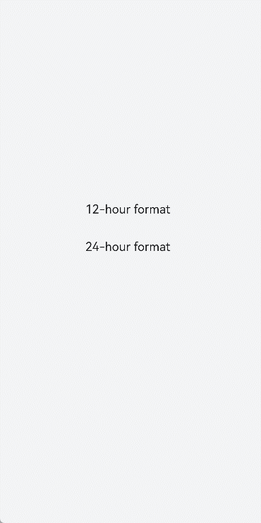
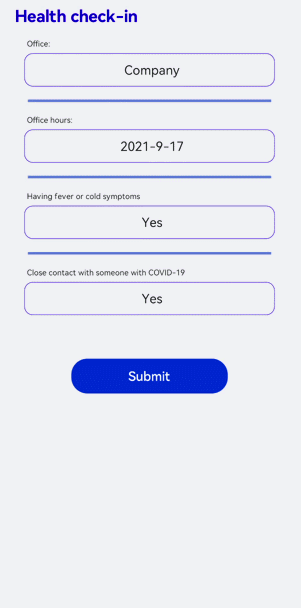

# picker开发指导

更新时间：2026-03-09 02:50:43

来源：https://developer.huawei.com/consumer/cn/doc/harmonyos-guides/ui-js-components-picker

picker是滑动选择器组件，类型支持普通选择器、日期选择器、时间选择器、时间日期选择器和多列文本选择器。具体用法请参考[picker](https://developer.huawei.com/consumer/cn/doc/harmonyos-references/js-components-basic-picker)。


## 创建picker组件

在pages/index目录下的hml文件中创建一个picker组件。
```text


  picker

```


```text
/* xxx.css */
.container {
  width: 100%;
  height: 100%;
  flex-direction: column;
  justify-content: center;
  align-items: center;
  background-color: #F1F3F5;
}
```


## 设置picker类型

通过设置picker的type属性来选择滑动选择器类型，如定义picker为日期选择器。
```text


```


```text
/* xxx.css */
.container {
  width: 100%;
  height: 100%;
  flex-direction: column;
  justify-content: center;
  align-items: center;
  background-color: #F1F3F5;
}
.pickertext{
  margin-bottom: 30px;
}
```


```text
// xxx.js
export default {
  data: {
    rangetext:['15', "20", "25"],
    textvalue:'Select text',
    datevalue:'Select date',
  }
}
```


> [!NOTE]
> 普通选择器设置取值范围时，需要使用数据绑定的方式。


## 设置时间显示格式

picker组件的hours属性用于设置时间显示格式，支持12小时制和24小时制两种模式。
```text


```


```text
/* xxx.css */
.container {
  width: 100%;
  height: 100%;
  flex-direction: column;
  justify-content: center;
  align-items: center;
  background-color: #F1F3F5;
}
.pickertime {
  margin-bottom:50px;
  width: 300px;
  height: 50px;
}
```


> [!NOTE]
> hours属性为12：按照12小时制显示，用上午和下午进行区分。 hours属性为24：按照24小时制显示。


## 添加响应事件

为picker组件添加change和cancel事件，可以处理用户的选择确定和取消操作。
```text


```


```text
/* xxx.css */
.container {
  width: 100%;
  height: 100%;
  flex-direction: column;
  justify-content: center;
  align-items: center;
  background-color: #F1F3F5;
}
.pickermuitl {
  margin-bottom:20px;
  width: 600px;
  height: 50px;
  font-size: 25px;
  letter-spacing:15px;
}
```


```text
// xxx.js
import promptAction from '@ohos.promptAction';
export default {
  data: {
    multitext:[["a", "b", "c"], ["e", "f", "g"], ["h", "i"]],
    multitextvalue:'Select multi-line text',
    multitextselect:[0,0,0],
  },
  multitextonchange(e) {
    this.multitextvalue=e.newValue;
    promptAction.showToast({ message:"Multi-column text changed to:" + e.newValue })
  },
  multitextoncancel() {
    promptAction.showToast({ message:"multitextoncancel" })
  },
}
```


## 场景示例

在本场景中，开发者可以自定义填写健康情况以完成打卡。
```text


  Health check-in

    Office:


    Office hours:


    Having fever or cold symptoms


    Close contact with someone with COVID-19


```


```text
/* xxx.css */
.doc-page {
  flex-direction: column;
  background-color: #F1F3F5;
}
.title {
  margin-top: 30px;
  margin-bottom: 30px;
  margin-left: 50px;
  font-weight: bold;
  color: #0000ff;
  font-size: 38px;
}
.out-container {
  flex-direction: column;
  align-items: center;
}
.pick {
  width: 80%;
  height: 76px;
  border: 1px solid #0000ff;
  border-radius: 20px;
  padding-left: 12px;
}
.txt {
  width: 80%;
  font-size: 18px;
  text-align: left;
  margin-bottom: 12px;
  margin-left: 12px;
}
.dvd {
  margin-top: 30px;
  margin-bottom: 30px;
  margin-left: 80px;
  margin-right: 80px;
  color: #6495ED;
  stroke-width: 6px;
}
```


```text
// xxx.js
import promptAction from '@ohos.promptAction'
export default {
  data: {
    yorn1:'No',
    yorn2:'No',
    pos:'Home',
    yesno:['Yes', 'No'],
    posarr:['Home', 'Company'],
    datevalue:'Select time',
    datetimeselect:'2012-5-6-11-25',
    dateselect:'2021-9-17',
    showbuild:true
  },
  onInit() {
  },
  isFever(e) {
    this.yorn1 = e.newValue
  },
  isTouch(e) {
    this.yorn2 = e.newValue
  },
  setPos(e) {
    this.pos = e.newValue
    if (e.newValue === 'Non-research center') {
      this.showbuild = false
    } else {
      this.showbuild = true
    }
  },
  setbuild(e) {
    this.build = e.newValue
  },
  dateonchange(e) {
    e.month=e.month+1;
    this.datevalue = e.year + "-" + e.month + "-" + e.day;
    promptAction.showToast({ message:"date:"+e.year+"-"+e.month+"-"+e.day })
  },
  showtoast() {
    promptAction.showToast({
      message: 'Submitted.',
      duration: 2000,
      gravity: 'center'
    })
  }
}
```


