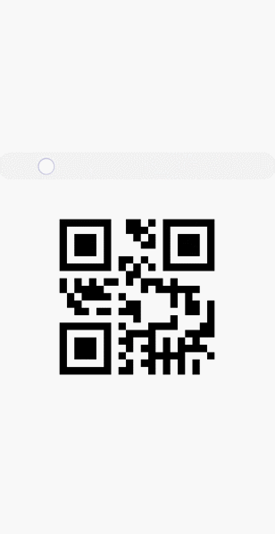

# qrcode开发指导

更新时间：2026-04-20 06:34:33

来源：https://developer.huawei.com/consumer/cn/doc/harmonyos-guides/ui-js-components-qrcode

生成并显示二维码，具体用法请参考[qrcode](https://developer.huawei.com/consumer/cn/doc/harmonyos-references/js-components-basic-qrcode)。


#### 创建qrcode组件

在pages/index目录下的hml文件中创建一个qrcode组件。

```text
<!-- xxx.hml-->
<div class="container">
  <qrcode value="Hello"></qrcode>
</div>
```

```text
/* xxx.css */
.container {
  width: 100%;
  height: 100%;
  flex-direction: column;
  align-items: center;
  justify-content: center;
  background-color: #F1F3F5;
}
```


> [!NOTE]
> qrcode组件在创建的时候value的值为必填项。


#### 设置组件类型

通过设置qrcode的type属性来选择二维码类型，如定义qrcode为矩形二维码、圆形二维码。

```text
<!-- xxx.hml-->
<div class="container">
  <select onchange="settype">
    <option for="{{bcol_list}}" value="{{$item}}">{{$item}}</option>
  </select>
  <qrcode value="Hello" type="{{qr_type}}"></qrcode>
</div>
```

```text
/* xxx.css */
.container {
  width: 100%;
  height: 100%;
  flex-direction: column;
  align-items: center;
  justify-content: center;
  background-color: #F1F3F5;
}
select{
  margin-top: 50px;
  margin-bottom: 50px;
}
```

```text
// index.js
export default {
  data: {
    qr_type: 'rect',
    bcol_list: ['rect','circle']
  },
  settype(e) {
    this.qr_type = e.newValue
  },
}
```


#### 设置样式

通过color和background-color样式为二维码设置显示颜色和背景颜色。

```text
<!-- xxx.hml-->
<div class="container">
  <qrcode value="Hello" type="rect"></qrcode>
</div>
```

```text
/* xxx.css */
.container {
  width: 100%;
  height: 100%;
  flex-direction: column;
  align-items: center;
  justify-content: center;
  background-color: #F1F3F5;
}
qrcode{
  width: 300px;
  height: 300px;
 color: blue;  background-color: #ffffff;
}
```





> [!NOTE]
> width和height不一致时，取二者较小值作为二维码的边长，且最终生成的二维码居中显示。 width和height只设置一个时，取设置的值作为二维码的边长。都不设置时，使用200px作为默认边长。


#### 场景示例

在本场景中将二维码与输入框绑定，通过改变输入框的内容改变二维码。

```text
<!-- xxx.hml-->
<div class="container">
  <input style="margin-bottom: 100px;" onchange="change"></input>
  <qrcode value="{{textVal}}"></qrcode>
</div>
```

```text
/* xxx.css */
.container {
  width: 100%;
  height: 100%;
  flex-direction: column;
  align-items: center;
  justify-content: center;
  background-color: #F1F3F5;
}
qrcode{
  width: 400px;
  height: 400px;
}
```

```text
// index.js
export default{
  data: {
    textVal: ''
  },
  change(e){
    this.textVal = e.value
  }
}
```


