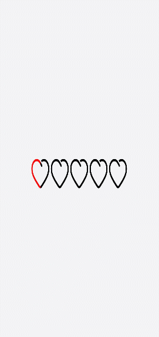
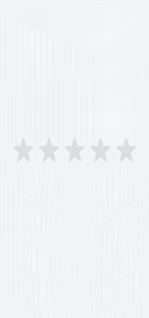
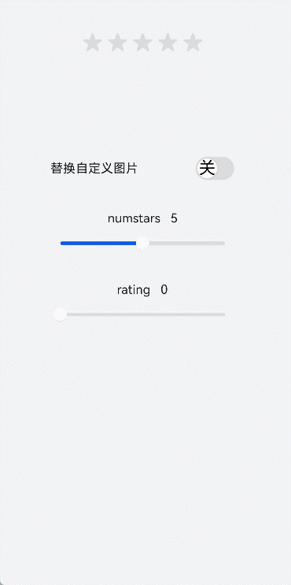

# rating开发指导

更新时间：2026-03-09 02:50:43

来源：https://developer.huawei.com/consumer/cn/doc/harmonyos-guides/ui-js-components-rating

rating是评分组件，用于展示用户对某项内容的评价等级。具体用法请参考[rating](https://developer.huawei.com/consumer/cn/doc/harmonyos-references/js-components-basic-rating)。


## 创建rating组件

在pages/index目录下的hml文件中创建一个rating组件。
```text


```


```text
/* xxx.css */
.container {
  width: 100%;
  height: 100%;
  display: flex;
  justify-content: center;
  align-items: center;
  background-color: #F1F3F5;
}
.rating {
  width: 80%;
  height: 150px;
}
```


## 设置评分星级

rating组件通过设置numstars和rating属性设置评分条的星级总数和当前评星数。
```text


```


```text
/* xxx.css */
.container {
  width: 100%;
  height: 100%;
  display: flex;
  justify-content: center;
  align-items: center;
  background-color: #F1F3F5;
}
.rating {
  width: 80%;
  height: 150px;
}
```


## 设置评分样式

rating组件通过star-background、star-foreground和star-secondary属性设置单个星级未选择、选中和选中的次级背景图片。
```text


```


```text
/* xxx.css */
.container {
  width: 100%;
  height: 100%;
  flex-direction: column;
  align-items: center;
  justify-content: center;
  background-color: #F1F3F5;
}
```


```text
// index.js
export default {
  data: {
    backstar: 'common/love.png',
    secstar: 'common/love.png',
    forestar: 'common/love1.png',
    ratewidth: '400px',
    rateheight: '150px'
  },
  onInit(){
  }
}
```


> [!NOTE]
> star-background、star-secondary、star-foreground属性的星级图源必须全部设置，否则默认的星级颜色为灰色，提示图源设置错误。 star-background、star-secondary、star-foreground属性只支持本地路径图片，图片格式为png和jpg。


## 绑定事件

向rating组件添加change事件，打印当前评分。
```text


```


```text
/* xxx.css */
.container {
  width: 100%;
  height: 100%;
  display: flex;
  justify-content: center;
  align-items: center;
  background-color: #F1F3F5;
}
.rating {
  width: 80%;
  height: 150px;
}
```


```text
// xxx.js
import promptAction from '@ohos.promptAction';
export default {
  showrating(e) {
    promptAction.showToast({
      message: '当前评分' + e.rating
    })
  }
}
```



## 场景示例

开发者可以通过改变开关状态切换星级背景图，通过改变滑动条的值调整星级总数。
```text


            替换自定义图片


            numstars   {{stars}}


            rating   {{rate}}


```


```text
/* xxx.css */
.myrating:active {
    width: 500px;
    height: 100px;
}
.switch{
    font-size: 40px;
}
```


```text
// xxx.js
import promptAction from '@ohos.promptAction';
export default {
    data: {
        backstar: '',
        secstar: '',
        forestar: '',
        stars: 5,
        ratewidth: '300px',
        rateheight: '60px',
        step: 0.5,
        rate: 0
    },
    onInit(){
    },
    setstar(e) {
        if (e.checked == true) {
            this.backstar = '/common/love.png'
            this.secstar = 'common/love.png'
            this.forestar = 'common/love1.png'
        } else {
            this.backstar = ''
            this.secstar = ''
            this.forestar = ''
        }
    },
    setnumstars(e) {
        this.stars = e.progress
        this.ratewidth = 60 * parseInt(this.stars) + 'px'
    },
    setstep(e) {
        this.step = e.progress
    },
    setrating(e){
        this.rate = e.progress
    },
    showrating(e) {
        this.rate = e.rating
        promptAction.showToast({
            message: '当前评分' + e.rating
        })
    }
}
```


