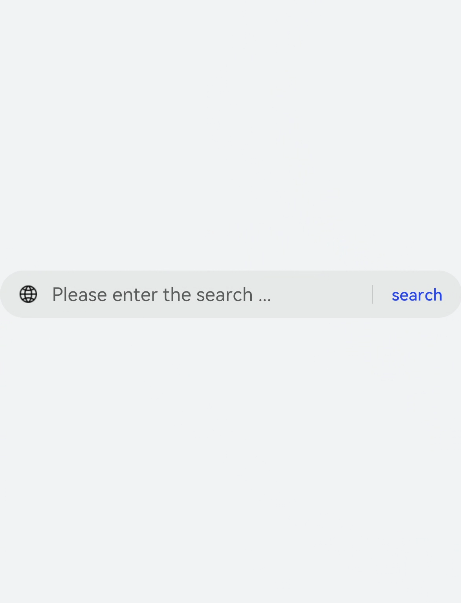
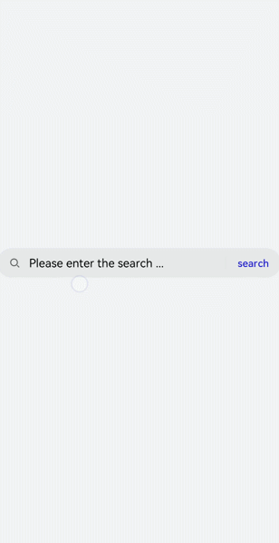
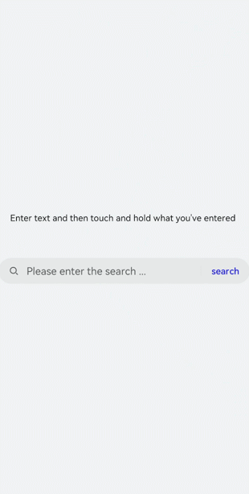
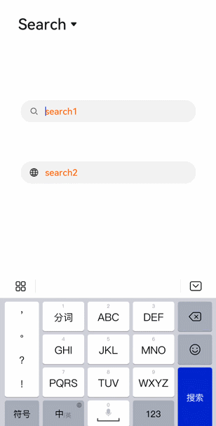

# search开发指导

更新时间：2026-03-09 02:50:43

来源：https://developer.huawei.com/consumer/cn/doc/harmonyos-guides/ui-js-components-search

提供搜索框组件，用于提供用户搜索内容的输入区域，具体用法请参考[search](https://developer.huawei.com/consumer/cn/doc/harmonyos-references/js-components-basic-search)。


## 创建search组件

在pages/index目录下的hml文件中创建一个search组件。
```text


```


```text
/* xxx.css */
.container {
  width: 100%;
  height: 100%;
  flex-direction: column;
  align-items: center;
  justify-content: center;
  background-color: #F1F3F5;
}
```


## 设置属性

通过设置hint、icon和searchbutton属性设置搜索框的提示文字、图标和末尾搜索按钮的内容。
```text


```


```text
/* xxx.css */
.container {
  width: 100%;
  height: 100%;
  flex-direction: column;
  align-items: center;
  justify-content: center;
  background-color: #F1F3F5;
}
```



## 添加样式

通过color、placeholder-color和caret-color样式来设置搜索框的文本颜色、提示文本颜色和光标颜色。
```text


```


```text
/* xxx.css */
.container {
  width: 100%;
  height: 100%;
  flex-direction: column;
  align-items: center;
  justify-content: center;
  background-color: #F1F3F5;
}
search{
  color: black;
  placeholder-color: black;
  caret-color: red;
}
```



## 绑定事件

向search组件添加change、search、submit、share和translate事件，对输入信息进行操作。
```text


    Enter text and then touch and hold what you've entered


```


```text
/* xxx.css */
.container {
  width: 100%;
  height: 100%;
  flex-direction: column;
  align-items: center;
  justify-content: center;
  background-color: #F1F3F5;
}
text{
  width: 100%;
  font-size: 25px;
  text-align: center;
  margin-bottom: 100px;
}
```


```text
// index.js
import promptAction from '@ohos.promptAction';
export default {
  search(e){
    promptAction.showToast({
      message: e.value,
      duration: 3000,
    });
  },
  translate(e){
    promptAction.showToast({
      message:  e.value,
      duration: 3000,
    });
  },
  share(e){
    promptAction.showToast({
      message:  e.value,
      duration: 3000,
    });
  },
  change(e){
    promptAction.showToast({
      message:  e.value,
      duration: 3000,
    });
  },
  submit(e){
    promptAction.showToast({
      message: 'submit',
      duration: 3000,
    });
  }
}
```



## 场景示例

在本场景中通过下拉菜单选择search、Textarea和Input组件来实现搜索和输入效果。
```text


    search
    Textarea
    Input


```


```text
/* xxx.css */
.field {
  width: 80%;
  color: mediumaquamarine;
  font-weight: 600;
  placeholder-color: orangered;
}
.slt1{
  font-size: 50px;
  position: absolute;
  left: 50px;
  top: 50px;
}
```


```text
// index.js
import promptAction from '@ohos.promptAction';
export default {
  data: {
    showsearch: true,
    showtextarea: false,
    showinput: false,
    showsec: true,
  },
  setfield(e) {
    this.field = e.newValue
    if (e.newValue == 'search') {
      this.showsearch = true
      this.showtextarea = false
      this.showinput = false
    } else if (e.newValue == 'textarea') {
      this.showsearch = false
      this.showtextarea = true
      this.showinput = false
    } else {
      this.showsearch = false
      this.showtextarea = false
      this.showinput = true
    }
  },
  submit(e) {
    promptAction.showToast({
      message: '搜索！',
      duration: 2000
    })
  },
  change(e) {
    promptAction.showToast({
      message: '内容:' + e.text,
      duration: 2000
    })
  }
}
```


