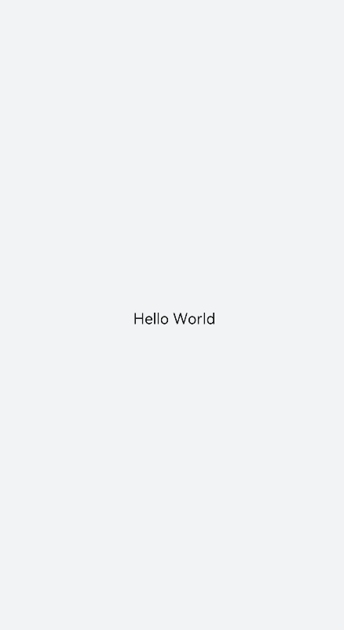
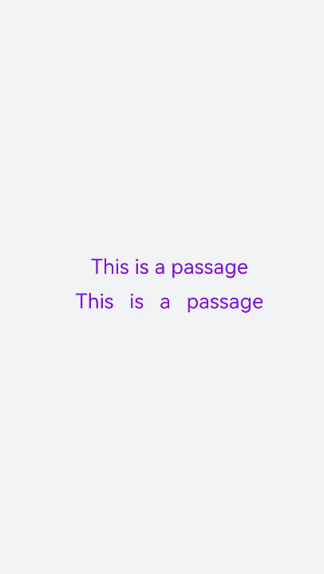
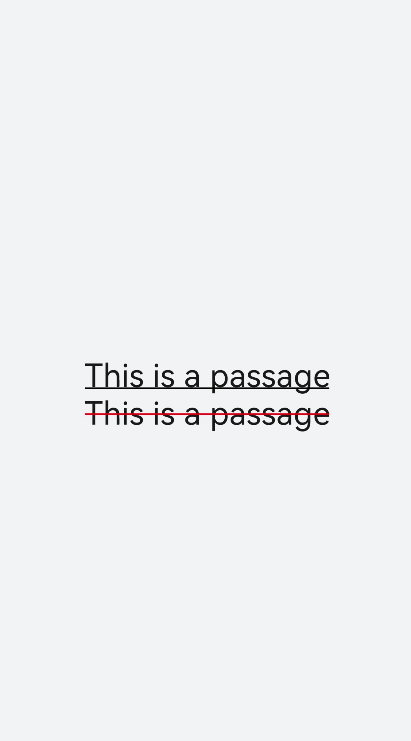
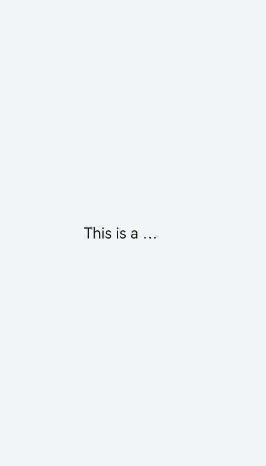
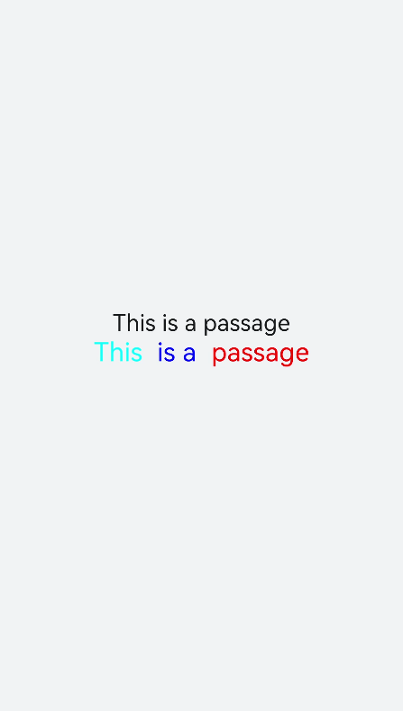
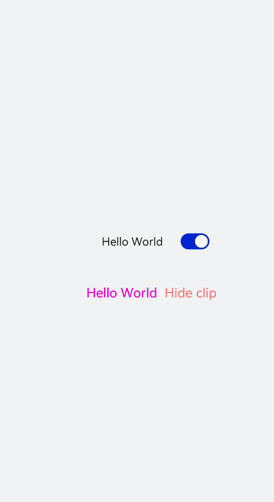

# text开发指导

更新时间：2026-04-13 09:29:20

来源：https://developer.huawei.com/consumer/cn/doc/harmonyos-guides/ui-js-components-text

text是文本组件，用于呈现一段文本信息。具体用法请参考[text](https://developer.huawei.com/consumer/cn/doc/harmonyos-references/js-components-basic-text)的API文档。


## 创建text组件

在pages/index目录下的hml文件中创建一个text组件。
```text


  Hello World

```


```text
/* xxx.css */
.container {
  width: 100%;
  height: 100%;
  flex-direction: column;
  align-items: center;
  justify-content: center;
  background-color: #F1F3F5;
}
```



## 设置text组件样式和属性

添加文本样式 设置color、font-size、allow-scale、word-spacing、text-align属性分别为文本添加颜色、大小、缩放、文本之间的间距和文本在水平方向的对齐方式。
```text


    This is a passage


    This is a passage


```


```text
/* xxx.css */
.container {
  display: flex;
  width: 100%;
  height: 100%;
  flex-direction: column;
  align-items: center;
  justify-content: center;
  background-color: #F1F3F5;
}
```


添加划线 设置text-decoration和text-decoration-color属性为文本添加划线和划线颜色，text-decoration枚举值请参考 text自有样式。
```text


    This is a passage


    This is a passage


```


```text
/* xxx.css */
.container {
  width: 100%;
  height: 100%;
  flex-direction: column;
  align-items: center;
  justify-content: center;
}
text{
  font-size: 50px;
}
```


隐藏文本内容 当文本内容过多而显示不全时，添加text-overflow属性将隐藏内容以省略号的形式展现。
```text


    This is a passage


```


```text
/* xxx.css */
.container {
  width: 100%;
  height: 100%;
  flex-direction: column;
  align-items: center;
  background-color: #F1F3F5;
  justify-content: center;
}
.text{
  width: 200px;
  max-lines: 1;
  text-overflow:ellipsis;
}
```


> [!NOTE]
> text-overflow样式需配合max-lines样式使用，在设置了最大行数的情况下才会生效。 max-lines属性设置文本最多可以展示的行数。

​

text组件支持[span](https://developer.huawei.com/consumer/cn/doc/harmonyos-references/js-components-basic-span)子组件
```text


    This is a passage


    This       1

     is a           1
      passage


```


> [!NOTE]
> 当使用span子组件组成文本段落时，如果span属性样式异常（例如：font-weight设置为1000），将导致文本段落显示异常。 在使用span子组件时，注意text组件内不能存在文本内容，如果在text组件同时包含文本内容和span子组件，则仅会显示子组件span中的内容。


## 场景示例

text组件通过数据绑定展示文本内容，span组件通过设置show属性来实现文本内容的隐藏和显示。
```text


      {{ content }}


      {{ content  }}

        1

    Hide clip


```


```text
/* xxx.css */
.container {
  width: 100%;
  height: 100%;
  align-items: center;
  flex-direction: column;
  justify-content: center;
  background-color: #F1F3F5;
}
.title {
  font-size: 26px;
  text-align:center;
  width: 200px;
  height: 200px;
}
```


```text
// xxx.js
export default {
  data: {
    isShow:true,
    content: 'Hello World'
  },
  onInit(){    },
  test(e) {
    this.isShow = e.checked
  }
}
```


