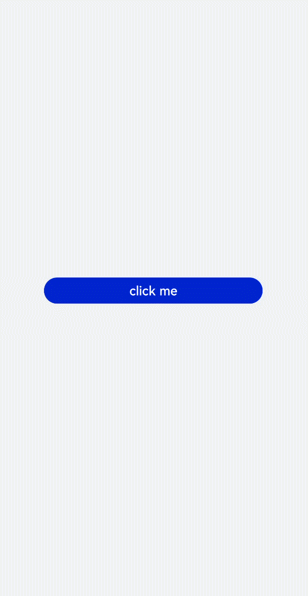
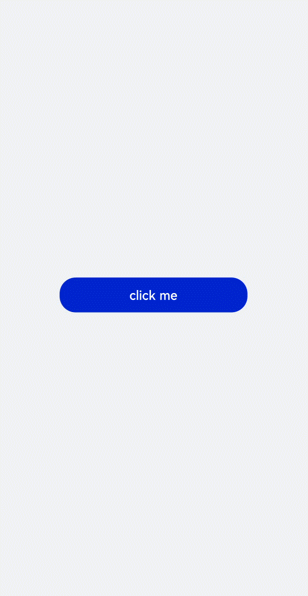

# dialog开发指导

更新时间：2026-03-09 02:50:43

来源：https://developer.huawei.com/consumer/cn/doc/harmonyos-guides/ui-js-components-dialog

dialog组件用于创建自定义弹窗，通常用来展示用户当前需要或用户必须关注的信息或操作。具体用法请参考[dialog API](https://developer.huawei.com/consumer/cn/doc/harmonyos-references/js-components-container-dialog)。


#### 创建dialog组件

在pages/index目录下的hml文件中创建一个dialog组件，并添加Button组件来触发dialog。dialog组件仅支持width、height、margin、margin-[left|top|right|bottom]、margin-[start|end]样式。

```text
<!-- xxx.hml -->
<div class="doc-page">
  <dialog class="dialogClass" id="dialogId" dragable="true">
    <div class="content">
      <text>this is a dialog</text>
    </div>
  </dialog>
  <button value="click me" onclick="openDialog"></button>
</div>
```

```text
/* xxx.css */
.doc-page {
  width:100%;
  height:100%;
  flex-direction: column;
  align-items: center;
  justify-content: center;
  background-color: #F1F3F5;
}
.dialogClass{
  width: 80%;
  height: 250px;
  margin-start: 1%;
}
.content{
  width: 100%;
  height: 250px;
  justify-content: center;
  background-color: #e8ebec;
  border-radius: 20px;
}
text{
  width: 100%;
  height: 100%;
  text-align: center;
}
button{
  width: 70%;
  height: 60px;
}
```

```text
// xxx.js
export default {
  //Touch to open the dialog box.
  openDialog(){
    this.$element('dialogId').show()
  },
}
```





#### 设置弹窗响应

开发者点击页面上非dialog的区域时，将触发cancel事件而关闭弹窗。同时也可以通过对dialog添加show和close方法来显示和关闭弹窗。

```text
<!-- xxx.hml -->
<div class="doc-page">
  <dialog class="dialogClass" id="dialogId" oncancel="cancelDialog">
    <div class="dialogDiv">
      <text>dialog</text>
      <button value="confirm" onclick="confirmClick"></button>
    </div>
  </dialog>
  <button value="click me" onclick="openDialog"></button>
</div>
```

```text
/* xxx.css */
.doc-page {
  width:100%;
  height:100%;
  flex-direction: column;
  align-items: center;
  justify-content: center;
  background-color: #F1F3F5;
}
.dialogClass{
  width: 80%;
  height: 300px;
  margin-start: 1%;
}
.dialogDiv{
  width: 100%;
  flex-direction: column;
  justify-content: center;
  align-self: center;
}
text{
  height: 100px;
  align-self: center;
}
button{
  align-self: center;
  margin-top: 20px;
  width: 60%;
  height: 80px;
}
```

```text
// xxx.js
import promptAction from '@ohos.promptAction';
export default {
  cancelDialog(e){
    promptAction.showToast({
      message: 'dialogCancel'
    })
  },
  openDialog(){
    this.$element('dialogId').show()
     promptAction.showToast({
      message: 'dialogShow'
    })
  },
  confirmClick(e) {
    this.$element('dialogId').close()
    promptAction.showToast({
      message: 'dialogClose'
    })
  },
}
```





> [!NOTE]
> 仅支持单个子组件。 dialog属性、样式均不支持动态更新。 dialog组件不支持focusable、click-effect属性。


#### 场景示例

在本场景中，开发者可以通过dialog组件实现一个日程表。弹窗在打开状态下，利用[textarea](https://developer.huawei.com/consumer/cn/doc/harmonyos-references/js-components-basic-textarea)组件输入当前日程，点击确认按钮后获取当前时间并保存输入文本。最后以列表形式将各日程进行展示。

```text
<!-- xxx.hml -->
<div class="doc-page">
  <text style="margin-top: 60px;margin-left: 30px;">
    <span>{{date}} events</span>
  </text>
  <div class="btnDiv">
    <button type="circle" class="btn" onclick="addSchedule">+</button>
  </div>
<!--  for Render events data  -->
  <list style="width: 100%;">
    <list-item type="item" for="scheduleList" style="width:100%;height: 200px;">
      <div class="scheduleDiv">
        <text class="text1">{{date}}  event</text>
        <text class="text2">{{$item.schedule}}</text>
      </div>
    </list-item>
  </list>
  <dialog id="dateDialog" oncancel="cancelDialog" >
    <div class="dialogDiv">
      <div class="innerTxt">
        <text class="text3">{{date}}</text>
        <text class="text4">New event</text>
      </div>
      <textarea placeholder="Event information" onchange="getSchedule" class="area" extend="true"></textarea>
      <div class="innerBtn">
        <button type="text" value="Cancel" onclick="cancelSchedule" class="innerBtn"></button>
        <button type="text" value="OK" onclick="setSchedule" class="innerBtn"></button>
      </div>
    </div>
  </dialog>
</div>
```

```text
/* xxx.css */
.doc-page {
  flex-direction: column;
  background-color: #F1F3F5;
}
.btnDiv {
  width: 100%;
  height: 200px;
  flex-direction: column;
  align-items: center;
  justify-content: center;
}
.btn {
  radius:60px;
  font-size: 100px;
  background-color: #1E90FF;
}
.scheduleDiv {
  width: 100%;
  height: 200px;
  flex-direction: column;
  justify-content: space-around;
  padding-left: 55px;
}
.text1 {
  color: #000000;
  font-weight: bold;
  font-size: 39px;
}
.text2 {
  color: #a9a9a9;
  font-size: 30px;
}
.dialogDiv {
  flex-direction: column;
  align-items: center;
}
.innerTxt {
  width: 320px;
  height: 160px;
  flex-direction: column;
  align-items: center;
  justify-content: space-around;
}
.text3 {
  font-family: serif;
  color: #1E90FF;
  font-size: 38px;
}
.text4 {
  color: #a9a9a9;
  font-size: 33px;
}
.area {
  width: 320px;
  border-bottom: 1px solid #1E90FF;
}
.innerBtn {
  width: 320px;
  height: 120px;
  justify-content: space-around;
  text-color: #1E90FF;
}
```

```text
// xxx.js
var info = null;
import promptAction from '@ohos.promptAction';
export default {
  data: {
    curYear:'',
    curMonth:'',
    curDay:'',
    date:'',
    schedule:'',
    scheduleList:[]
  },
  onInit() {
    // Obtain the current date.
    var date = new Date();
    this.curYear = date.getFullYear();
    this.curMonth = date.getMonth() + 1;
    this.curDay = date.getDate();
    this.date = this.curYear + '-' + this.curMonth + '-' + this.curDay;
    this.scheduleList = []
  },
  addSchedule(e) {
    this.$element('dateDialog').show()
  },
  cancelDialog(e) {
    promptAction.showToast({
      message: 'Event setting canceled.'
    })
  },
  getSchedule(e) {
    info = e.value
  },
  cancelSchedule(e) {
    this.$element('dateDialog').close()
    promptAction.showToast({
      message: 'Event setting canceled.'
    })
  },
//    Touch OK to save the data.
  setSchedule(e) {
    if (e.text === '') {
      this.schedule = info
    } else {
      this.schedule = info
      var addItem =  {schedule: this.schedule,}
      this.scheduleList.push(addItem)
    }
    this.$element('dateDialog').close()
  }
}
```


