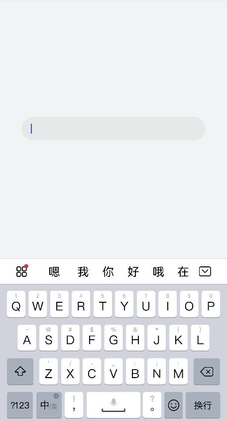
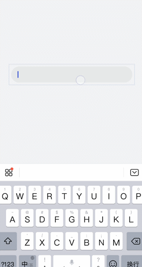
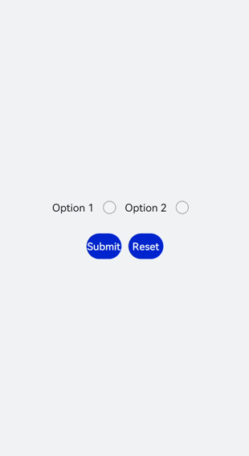
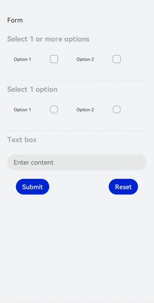

# form开发指导

更新时间：2026-03-09 02:50:43

来源：https://developer.huawei.com/consumer/cn/doc/harmonyos-guides/ui-js-components-form

form是一个表单容器，支持容器内[Input](https://developer.huawei.com/consumer/cn/doc/harmonyos-references/js-components-basic-input)组件内容的提交和重置。具体用法请参考[form API](https://developer.huawei.com/consumer/cn/doc/harmonyos-references/js-components-container-form)。


## 创建form组件

在pages/index目录下的hml文件中创建一个form组件。
```text


```


```text
/* xxx.css */
.container {
  width:100%;
  height:100%;
  flex-direction: column;
  justify-content: center;
  align-items: center;
  background-color: #F1F3F5;
}
```



## 实现表单缩放

为form组件添加click-effect属性，实现点击表单后的缩放效果，click-effect枚举值请参考[通用属性](https://developer.huawei.com/consumer/cn/doc/harmonyos-references/js-components-common-attributes)。
```text


```


## 设置form样式

通过为form添加background-color和border属性，来设置表单的背景颜色和边框。
```text
/* xxx.css */
.container {
  width: 100%;
  height: 100%;
  flex-direction: column;
  align-items: center;
  justify-content: center;
  background-color: #F1F3F5;
}
.formClass{
  width: 80%;
  height: 100px;
  padding: 10px;
  border: 1px solid #cccccc;
}
```



## 添加响应事件

为form组件添加submit和reset事件，来提交表单内容或重置表单选项。
```text


      Option 1

      Option 2


```


```text
/* index.css */
.container{
  width: 100%;
  height: 100%;
  flex-direction: column;
  justify-items: center;
  align-items: center;
  background-color: #F1F3F5;
}
.form{
  width: 100%;
  height: 30%;
  margin-top: 40%;
  flex-direction: column;
  justify-items: center;
  align-items: center;
}
```


```text
// xxx.js
import promptAction from '@ohos.promptAction';
export default{
  onSubmit(result) {
    promptAction.showToast({
      message: result.value.radioGroup
    })
  },
  onReset() {
    promptAction.showToast({
      message: 'Reset All'
    })
  }
}
```



## 场景示例

在本场景中，开发者可以选择相应选项并提交或重置数据。 创建[Input](https://developer.huawei.com/consumer/cn/doc/harmonyos-references/js-components-basic-input)组件，分别设置type属性为checkbox（多选框）和radio（单选框），再使用form组件的onsubmit和onreset事件实现表单数据的提交与重置。
```text


       Form


     Select 1 or more options

        Option 1

        Option 2


       Select 1 option

         Option 1

         Option 2


       Text box


         Submit
         Reset


```


```text
/* index.css */
.container {
  width: 100%;
  height: 100%;
  flex-direction:column;
  align-items:center;
  background-color:#F1F3F5;
}
.txt {
  font-size:33px;
  font-weight:bold;
  color:darkgray;
}
label{
  font-size: 20px;
}
```


```text
// xxx.js
import promptAction from '@ohos.promptAction';
export default {
  formSubmit() {
    promptAction.showToast({
      message: 'Submitted.'
    })
  },
  formReset() {
    promptAction.showToast({
      message: 'Reset.'
    })
  }
}
```


