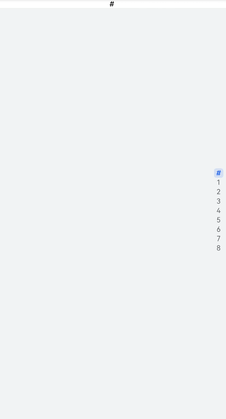
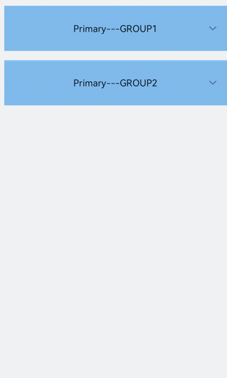

# list开发指导

更新时间：2026-03-09 02:50:43

来源：https://developer.huawei.com/consumer/cn/doc/harmonyos-guides/ui-js-components-list

list是用来显示列表的组件，包含一系列相同宽度的列表项，适合连续、多行地呈现同类数据。具体用法请参考[list API](https://developer.huawei.com/consumer/cn/doc/harmonyos-references/js-components-container-list)。


##### 创建list组件

在pages/index目录下的hml文件中创建一个list组件。

```text
<!-- xxx.hml -->
<div class="container"> 
 <list>    
   <list-item class="listItem"></list-item>
   <list-item class="listItem"></list-item>
   <list-item class="listItem"></list-item>
   <list-item class="listItem"></list-item>
 </list>
</div>
```

```text
/* xxx.css */
.container {
  width:100%;
  height:100%;
  flex-direction: column;
  align-items: center;
  background-color: #F1F3F5;
}
.listItem{
  height: 20%;
  background-color:#d2e0e0;
  margin-top: 20px;
}
```


> [!NOTE]
> <list-item-group>是&lt;list&gt;的子组件，实现列表分组功能，不能再嵌套&lt;list&gt;，可以嵌套<list-item>。 <list-item>是&lt;list&gt;的子组件，展示列表的具体项。


##### 添加滚动条

设置scrollbar属性为on即可在屏幕右侧生成滚动条，实现长列表或者屏幕滚动等效果。

```text
<!-- xxx.hml -->
<div class="container">
  <list class="listCss" scrollbar="on" >
    <list-item class="listItem"></list-item>
    <list-item class="listItem"></list-item>
    <list-item class="listItem"></list-item>
    <list-item class="listItem"></list-item>
    <list-item class="listItem"></list-item>
    <list-item class="listItem"></list-item>
 </list>
</div>
```

```text
/* xxx.css */
.container {
  flex-direction: column;
  background-color: #F1F3F5;
}
.listItem{
  height: 20%;
  background-color:#d2e0e0;
  margin-top: 20px;
}
.listCss{
  height: 100%;
  scrollbar-color: #8e8b8b;
  scrollbar-width: 50px;
}
```





##### 添加侧边索引栏

设置indexer属性为自定义索引时，索引栏会显示在列表右边界处，indexer属性设置为true，默认为字母索引表。

```text
<!-- xxx.hml -->
<div class="container">   
  <list class="listCss"  indexer="{{['#','1','2','3','4','5','6','7','8']}}" >  
    <list-item class="listItem"  section="#" ></list-item>   
  </list>
</div>
```

```text
/* xxx.css */
.container{
  flex-direction: column;
  background-color: #F1F3F5;
 }
.listCss{
  height: 100%;
  flex-direction: column;
  columns: 1
}
```





> [!NOTE]
> indexer属性生效需要flex-direction属性配合设置为column，且columns属性设置为1。 indexer可以自定义索引表，自定义时"#"必须要存在。


##### 实现列表折叠和展开

为list组件添加groupcollapse和groupexpand事件实现列表的折叠和展开。

```text
<!-- xxx.hml -->
<div class="doc-page">
  <list style="width: 100%;" id="mylist">
    <list-item-group for="listgroup in list" id="{{listgroup.value}}" ongroupcollapse="collapse" ongroupexpand="expand">
      <list-item type="item" style="background-color:#FFF0F5;height:95px;">
        <div class="item-group-child">
          <text>One---{{listgroup.value}}</text>
        </div>
      </list-item>
      <list-item type="item" style="background-color: #87CEFA;height:145px;" primary="true">
        <div class="item-group-child">
          <text>Primary---{{listgroup.value}}</text>
        </div>
      </list-item>
    </list-item-group>
  </list>
</div>
```

```text
/* xxx.css */
.doc-page {
  flex-direction: column;
  background-color: #F1F3F5;
}
.list-item {
  margin-top:30px;
}
.top-list-item {
  width:100%;
  background-color:#D4F2E7;
}
.item-group-child {
  justify-content: center;
  align-items: center;
  width:100%;
}
```

```text
// xxx.js
import promptAction from '@ohos.promptAction';
export default {
  data: {
    direction: 'column',
    list: []
  },
  onInit() {
    this.list = []
    this.listAdd = []
    for (var i = 1; i <= 2; i++) {
      var dataItem = {
        value: 'GROUP' + i,
      };
        this.list.push(dataItem);
    }
  },
  collapse(e) {
    promptAction.showToast({
      message: 'Close ' + e.groupid
    })
  },
  expand(e) {
    promptAction.showToast({
    message: 'Open ' + e.groupid
    })
  }
}
```


> [!NOTE]
> groupcollapse和groupexpand事件仅支持list-item-group组件使用。


##### 场景示例

在本场景中，开发者可以根据字母索引表查找对应联系人。

```text
<!-- xxx.hml -->
<div class="doc-page"> 
  <text style="font-size: 35px; font-weight: 500; text-align: center; margin-top: 20px; margin-bottom: 20px;"> 
      <span>Contacts</span> 
  </text> 
  <list class="list" indexer="true"> 
    <list-item class="item" for="{{namelist}}" type="{{$item.section}}" section="{{$item.section}}"> 
      <div class="container"> 
        <div class="in-container"> 
          <text class="name">{{$item.name}}</text> 
          <text class="number">18888888888</text> 
        </div> 
      </div> 
    </list-item> 
    <list-item type="end" class="item"> 
      <div style="align-items:center;justify-content:center;width:750px;"> 
        <text style="text-align: center;">Total: 10</text> 
      </div> 
    </list-item> 
  </list> 
</div>
```

```text
/* xxx.css */
.doc-page {
  width: 100%;
  height: 100%;
  flex-direction: column;
  background-color: #F1F3F5;
}
.list {
  width: 100%;
  height: 90%;
  flex-grow: 1;
}
.item {
  height: 120px;
  padding-left: 10%;
  border-top: 1px solid #dcdcdc;
}
.name {
  color: #000000;
  font-size: 39px;
}
.number {
  color: black;
  font-size: 25px;
}
.container {
  flex-direction: row;
  align-items: center;
}
.in-container {
  flex-direction: column;
  justify-content: space-around;
}
```

```text
// xxx.js
export default {
   data: {
     namelist:[{
       name: 'Zoey',
       section:'Z'
     },{
       name: 'Quin',
       section:'Q'
     },{
       name:'Sam',
       section:'S'
     },{
       name:'Leo',
       section:'L'
     },{
       name:'Zach',
       section:'Z'
     },{
       name:'Wade',
       section:'W'
     },{
       name:'Zoe',
       section:'Z'
     },{
        name:'Warren',
        section:'W'
     },{
        name:'Kyle',
        section:'K'
     },{
       name:'Zaneta',
       section:'Z'
     }]
   },
   onInit() {
   }
 }
```


