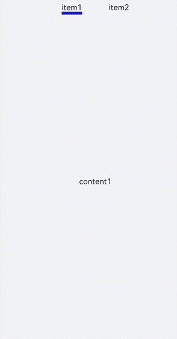
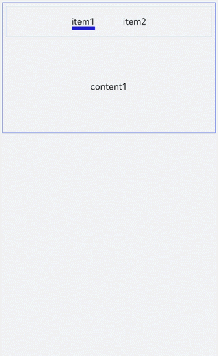
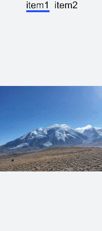
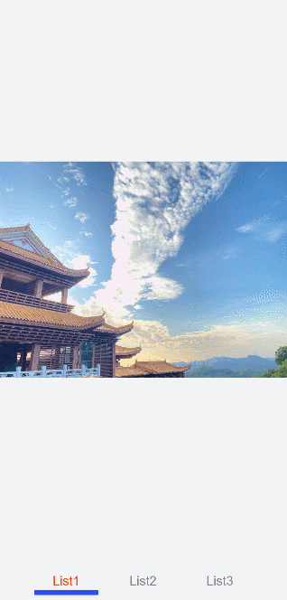

# tabs开发指导

更新时间：2026-03-09 02:50:43

来源：https://developer.huawei.com/consumer/cn/doc/harmonyos-guides/ui-js-component-tabs

tabs是一种常见的界面导航结构。通过页签容器，用户可以快捷地访问应用的不同模块。具体用法请参考[tabs API](https://developer.huawei.com/consumer/cn/doc/harmonyos-references/js-components-container-tabs)。


## 创建tabs

在pages/index目录下的hml文件中创建一个tabs组件。
```text


            item1
            item2


                content1


                content2


```


```text
/* xxx.css */
.container {
  flex-direction: column;
  justify-content: center;
  align-items: center;
  background-color: #F1F3F5;
}
.tabContent{
  width: 100%;
  height: 100%;
}
.text{
  width: 100%;
  height: 100%;
  justify-content: center;
  align-items: center;
}
```



## 设置样式

设置tabs背景色及边框和tab-content布局。
```text


      item1
      item2


        content1


        content2


```


```text
/* xxx.css */
.container {
  flex-direction: column;
  justify-content: flex-start;
  align-items: center;
 background-color:#F1F3F5;
}
.tabs{
  margin-top: 20px;
 border: 1px solid #2262ef;
  width: 99%;
  padding: 10px;
}
.tabBar{
  width: 100%;
  border: 1px solid #78abec;
}
.tabContent{
  width: 100%;
  margin-top: 10px;
  height: 300px;
  color: blue;
  justify-content: center;
  align-items: center;
}
```



## 显示页签索引

开发者可以为tabs添加change事件，实现页签切换后显示当前页签索引的功能。
```text


      item1
      item2


```


```text
// xxx.js
import promptAction from '@ohos.promptAction';
export default {
  tabChange(e){
    promptAction.showToast({
      message: "Tab index: " + e.index
    })
  }
}
```


> [!NOTE]
> tabs子组件仅支持一个和一个。


## 场景示例

在本场景中，开发者可以点击标签切换内容，选中后标签文字颜色变红，并显示下划线。 用tabs、tab-bar和tab-content实现点击切换功能，再定义数组，设置属性。使用change事件改变数组内的属性值实现变色及下划线的显示。
```text


        {{$item.title}}


```


```text
/* xxx.css */
.container{
width: 100%;
height: 100%;
background-color:#F1F3F5;
}
.tab_bar {
  width: 100%;
  height: 150px;
}
.tab_item {
  height: 30%;
  flex-direction: column;
  align-items: center;
}
.tab_item text {
  font-size: 32px;
}
.item-container {
  justify-content: center;
  flex-direction: column;
}
.underline-show {
  height: 2px;
  width: 160px;
  background-color: #FF4500;
  margin-top: 7.5px;
}
.underline-hide {
  height: 2px;
  margin-top: 7.5px;
  width: 160px;
}
```


```text
// xxx.js
export default {
  data() {
    return {
      data: {
        color_normal: '#878787',
        color_active: '#ff4500',
        show: true,
        list: [{
          i: 0,
          color: '#ff4500',
          show: true,
          title: 'List1'
        }, {
          i: 1,
          color: '#878787',
          show: false,
          title: 'List2'
        }, {
           i: 2,
           color: '#878787',
           show: false,
           title: 'List3'
        }]
      }
    }
  },
  changeTabactive (e) {
    for (let i = 0; i 
