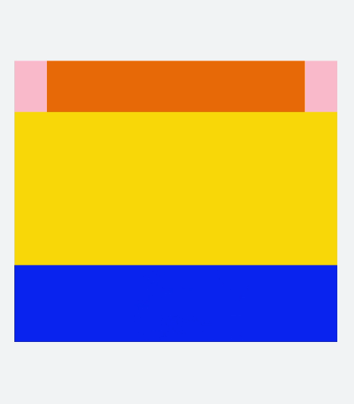
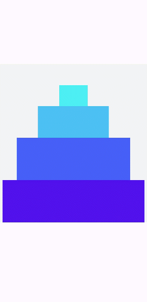
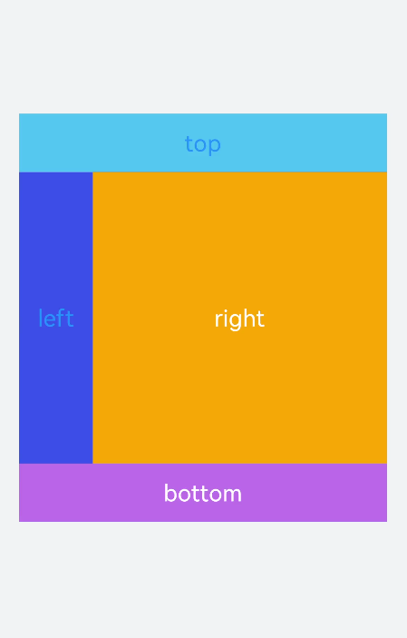
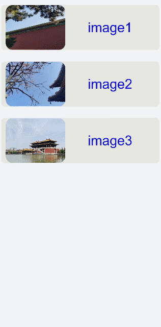

# 栅格布局

更新时间：2026-03-09 02:50:43

来源：https://developer.huawei.com/consumer/cn/doc/harmonyos-guides/ui-js-components-grid

栅格布局容器根节点，使用grid-row与grid-col进行栅格布局。API具体描述请参考[grid-container](https://developer.huawei.com/consumer/cn/doc/harmonyos-references/js-components-grid-container)。


## 创建grid-container组件

在pages/index目录下的hml文件中创建一个grid-container组件，并添加[grid-row](https://developer.huawei.com/consumer/cn/doc/harmonyos-references/js-components-grid-row)子组件。
```text


```


```text
/* xxx.css */
.container{
  flex-direction: column;
  background-color: #F1F3F5;
  margin-top: 500px;
  justify-content: center;
  align-items: center;
}
```


> [!NOTE]
> grid-container仅支持grid-row为子组件。


## 调用方法

以下示例中，通过点击grid-container组件调用getColumns、getColumnWidth、getGutterWidth方法以返回栅格容器列数、column宽度及gutter宽度，通过长按调用getSizeType方法以返回当前容器响应尺寸类型（xs|sm|md|lg）。
```text


```


```text
/* xxx.css */
.container{
  flex-direction: column;
  background-color: #F1F3F5;
  margin-top: 400px;
  justify-content: center;
  align-items: center;
}
```


```text
// index.js
import promptAction from '@ohos.promptAction';
export default {
  data:{
    gutterWidth:'',
    columnWidth:'',
    columns:'',
  },
  getColumns(){
    this.$element('mygrid').getColumnWidth((result)=>{
      this.columnWidth = result;
    })
    this.$element('mygrid').getGutterWidth((result)=>{
      this.gutterWidth = result;
    })
    this.$element('mygrid').getColumns((result)=>{
      this.columns= result;
    })
    setTimeout(()=>{
      promptAction.showToast({duration:5000,message:'columnWidth:'+this.columnWidth+',gutterWidth:'+
      this.gutterWidth+',getColumns:'+this.columns})
    })
  },
  getSizeType(){
      this.$element('mygrid').getSizeType((result)=>{
      promptAction.showToast({duration:2000,message:'get size type:'+result})
    })
  },
}
```



## 添加grid-col

创建grid-container组件并添加grid-row，在grid-row组件内添加[grid-col](https://developer.huawei.com/consumer/cn/doc/harmonyos-references/js-components-grid-col)组件形成布局。
```text


          top


          left


          right


          bottom


```


```text
/* xxx.css */
.container{
  flex-direction: column;
  background-color: #F1F3F5;
  width: 100%;
  height: 100%;
  justify-content: center;
  align-items: center;
}
text{
  color: white;
  font-size: 40px;
}
```


> [!NOTE]
> grid-row仅支持grid-col为子组件，只能在grid-col组件中添加填充的内容。


## 场景示例

本场景中循环输出list中的内容，创建出网格布局。进行下拉操作时触发refresh（刷新页面）方法，这时会向list数组中添加一条数据并设置setTimeout（延迟触发），达到刷新请求数据的效果。
```text


            image{{item.id}}


```


```text
/* xxx.css */
.container{
  flex-direction: column;
  background-color: #F1F3F5;
  width: 100%;
  height: 100%;
}
text{
  color: #0a0aef;
  font-size: 60px;
}
```


```text
// index.js
import promptAction from '@ohos.promptAction';
export default {
  data:{
    list:[
      {src:'common/images/1.png',id:'1'},
      {src:'common/images/2.png',id:'2'},
      {src:'common/images/3.png',id:'3'}
    ],
    fresh:false
  },
  refresh(e) {
    promptAction.showToast({
      message: 'refreshing'
    })
    var that = this;
    that.fresh = e.refreshing;
    setTimeout(function () {
      that.fresh = false;
      that.list.unshift({src: 'common/images/4.png',id:'4'});
      promptAction.showToast({
        message: 'succeed'
      })
    }, 2000)
  }
}
```


