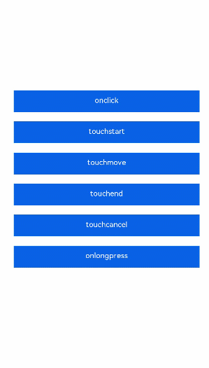

# 手势事件

更新时间：2026-03-09 02:50:43

来源：https://developer.huawei.com/consumer/cn/doc/harmonyos-guides/ui-js-building-ui-event

手势表示由单个或多个事件识别的语义动作（例如：触摸、点击和长按）。一个完整的手势也可能由多个事件组成，对应手势的生命周期。支持的事件有：

 **触摸**


 **点击**

 click：用户快速轻敲屏幕。

 **长按**

 longpress：用户在相同位置长时间保持与屏幕接触。

 具体的使用示例如下：


```text


    {{onClick}}


    {{touchstart}}


    {{touchmove}}


    {{touchend}}


    {{touchcancel}}


    {{onLongPress}}


```


```text
/* xxx.css */
.container {
  width: 100%;
  height: 100%;
  flex-direction: column;
  justify-content: center;
  align-items: center;
}
.text-container {
  margin-top: 30px;
  flex-direction: column;
  width: 600px;
  height: 70px;
  background-color: #0000FF;
}
.text-style {
  width: 100%;
  line-height: 50px;
  text-align: center;
  font-size: 24px;
  color: #ffffff;
}
```


```text
// xxx.js
export default {
    data: {
        touchstart: 'touchstart',
        touchmove: 'touchmove',
        touchend: 'touchend',
        touchcancel: 'touchcancel',
        onClick: 'onclick',
        onLongPress: 'onLongPress',
    },
    touchCancel: function (event) {
        console.info('event is', JSON.stringify(event));
        this.touchcancel = 'canceled';
    },
    touchEnd: function(event) {
        console.info('event is', JSON.stringify(event));
        this.touchend = 'ended';
    },
    touchMove: function(event) {
        console.info('event is', JSON.stringify(event));
        this.touchmove = 'moved';
    },
    touchStart: function(event) {
        console.info('event is', JSON.stringify(event));
        this.touchstart = 'touched';
    },
    longPress: function() {
        this.onLongPress = 'longPressed';
    },
    click: function() {
        this.onClick = 'clicked';
    },
}
```

 
